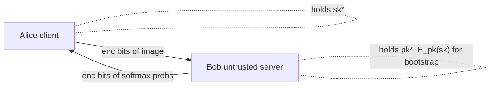

## TL;DR

The paper implements a bootstrappable Gentry-style FHE scheme together with bitwise logic circuits (add, multiply, max, mean, exp) to run a small single-convolution CNN on MNIST under encryption, and quantifies how security parameters and fixed-point precision drive accuracy and (very large) latency [§I, §IV].

## Problem and motivation

Cloud-delegated ML on sensitive inputs (medical images, behavioral, health) needs an untrusted server (Bob) to compute on encrypted client (Alice) data without seeing plaintext [§I]. Prior partially-homomorphic ciphers (Paillier, RSA) support only one operation, and the YASHE-based CryptoNets approach is leveled — its security parameters must be tailored to the network depth and cannot grow without re-tuning [§I]. The authors therefore focus on bootstrapped FHE so arbitrarily complex networks can in principle be evaluated [§I]. Threat model: honest-but-curious server holding ciphertext only; circular security is assumed for the encrypted secret key used in bootstrapping [§II-A].

## Key contributions

- Implementation of a bootstrappable Gentry-extended FHE scheme parameterized by λ, α, β with AGCD- and SSS-based security [§II-B].
- Design of bitwise logic circuits for fixed-point addition, multiplication, max(·,0) (ReLU), mean, and exponentiation, with closed-form bitwise-op counts per circuit [§II-D, §III-C, eqs. (12)–(15)].
- End-to-end CNN inference on MNIST under FHE using these circuits [§IV].
- Metrics — Prediction Rate (PR) and Average Sum of Squared Errors (ASSE) — that compare fixed-point-Q encrypted predictions against the IEEE 754 double-precision reference [§III-A, §III-B].
- Empirical determination that Q12.6 (12 integer + 6 fractional bits) is sufficient for full match with the plaintext-float reference on the tested samples [§V-A].

## FHE setup

- **Scheme(s):** Gentry's extended bootstrappable FHE (the construction of [3], [4]); security rests on Approximate-GCD and Sparse-Subset-Sum hardness [§II-B].
- **Library / implementation:** Custom Python 3.6.5 implementation; source released by the authors [§IV, ref. 16].
- **Parameters:** Security parameters λ, α, β with α < β; minimum used in timing experiments is λ = 9, α = 2, β = 1, giving a 23.4 KB key; "ideal" birthday-resistant values cited as λ = 80, α = 15, β = 10449 from the criterion β choose α ≈ β^α > 2^{2λ} [§II-B, §V-B].
- **Bootstrapping used:** Yes — explicit reencryption c_new = E_pk(D_sk(c_2)) consuming the encrypted secret key [§II-A, eqs. (3)–(5)]. Bootstrap dominates runtime (≈20.66 s per gate at λ=9) [Table I].
- **Packing / encoding strategy:** None — bitwise/binary representation in GF(2); numbers encoded in two's-complement fixed-point Qk.l with k = 12 integer and l = 6 fractional bits selected [§II-D, §V-A].

## ML setup

- **Task:** Image classification inference (handwritten digit recognition) [§IV].
- **Model architecture:** "Small CNN" based on [17]: one convolutional layer with 10 channels and 9×9 kernels producing 20×20 feature maps; ReLU activation; 2×2 mean pooling; densely connected directly to a 10-way softmax output layer (no fully-connected hidden layer); 10,810 trainable weights [§IV]. Counted as 3 weight/operation layers (Conv → Pool → Softmax-FC) — pooling is non-parametric; FCNN width set to 10×20×20 = 4000 post-conv features feeding the 10-class output, so hidden_nodes_min=max=4000.
- **Activation handling:** ReLU implemented exactly bitwise as max(a,0) = a · ¬MSB(a), i.e. n bitwise multiplications [§III-C]. Softmax exponential is realized as the product of intermediates e^{a_i · 2^i} over the bit-decomposition of the input, with n_r = ⌈log2(e^{2^k})⌉ + l bits of working precision [§III-C].
- **Operates on:** Plaintext model weights + encrypted data (the CNN is trained offline in float; only inference is encrypted) [§IV].
- **Training vs inference:** Training in plaintext (≈36 hours, backprop, lr=0.001 halved each epoch). Inference is what runs under FHE [§IV].

## Datasets

| Dataset | Task | Size (train/test) | Modality | Notes |
|---|---|---|---|---|
| MNIST [12] | 10-class digit classification | 60,000 train / 10,000 test (NI=30 used for PR/ASSE plaintext-fixed-point evaluation) | 28×28 grayscale images | Plaintext-float baseline accuracy 91.2% [§IV, §V-A] |

## Pipeline diagram

### Pipeline steps (text)

1. Client trains the CNN in plaintext IEEE-754 double precision and obtains 10,810 weights [§IV].
2. Client encodes each pixel in two's-complement fixed-point Q12.6 (19-bit) [§II-D, §V-A].
3. Client encrypts every bit with the extended scheme Enc(pk*, m) producing c* = (c, z) [Alg. 2].
4. Server runs the bitwise addition circuit (5n−7 XORs, 3n−5 ANDs) for every convolution sum [§III-C, eq. (12)].
5. Server runs the bitwise multiplication circuit for every conv product [eq. (12)].
6. Server applies ReLU as a·¬MSB(a) per feature-map element [§III-C, eq. (14)].
7. Server applies 2×2 mean pooling via the mean circuit f_mean [eq. (15)].
8. Server computes softmax via the exponential circuit f_exp on each of 10 logits [eq. (13)].
9. After every gate the server bootstraps to refresh noise (t_boot ≈ 20.66 s at λ=9) [Table I].
10. Client decrypts the encrypted class-probability bits with Dec(sk*, c*) and takes argmax [Alg. 3, §II-A].

## Architecture diagram

## Results

| Metric | This paper | Baseline | Hardware |
|---|---|---|---|
| Plaintext-float CNN test accuracy | 91.2% on 10,000 MNIST test images | — | Intel i5-3570k @ 3.4 GHz, 8 GB RAM [§IV] |
| Prediction Rate (Q12.6 vs float) | 1.0 — all NI=30 predictions match float | l<6 bits: degraded PR | i5-3570k [§V-A, Fig. 3] |
| ASSE (Q12.6 vs float) | Reaches "satisfactory" minimum at l=6 | larger at l<6 | i5-3570k [§V-A] |
| t_add (bitwise) plaintext | 3.65 × 10⁻⁷ s | — | i5-3570k [Table I] |
| t_mult (bitwise) plaintext | 3.4 × 10⁻⁷ s | — | i5-3570k [Table I] |
| t_add (bitwise) ciphertext | 1.26 × 10⁻³ s | — | i5-3570k, λ=9 [Table I] |
| t_mult (bitwise) ciphertext | 9.54 × 10⁻³ s | — | i5-3570k, λ=9 [Table I] |
| t_boot per gate | 20.66 s | — | i5-3570k, λ=9 [Table I] |
| Predicted single-image inference t_pred | ≈ 10¹² s (n_add·(t_add+t_boot) + n_mult·(t_mult+t_boot)) at λ=9 | CryptoNets [11]: 250 s for batch of 4096 (LFHE/YASHE) | i5-3570k, λ=9 [§V-B] |
| Training time (plaintext) | ≈ 36 hours over 60,000 images | — | i5-3570k [§IV] |
| Key size | 23.4 KB | — | λ=9, α=2, β=1 [§V-B] |

## Limitations and assumptions

- Estimated end-to-end encrypted inference is ≈10¹² seconds even with the *minimum* security parameters (λ=9), which the authors themselves call only "reasonably fast" for analysis — orders of magnitude away from practical [§V-B].
- λ=9 is far below cryptographic norms; the authors acknowledge a birthday-resistant setting would need λ≈80, α=15, β=10449, which would further enlarge runtime [§V-B, Fig. 4].
- The PR/ASSE accuracy evaluation in Section V-A uses NI = 30 images (only those correctly classified by the float baseline), not the full 10,000-image test set [§V-A] — so the "1.0 PR / full match" headline is on a hand-picked micro-sample.
- Bootstrapping after every gate is the dominant cost ("four orders of magnitude" gap between plaintext and ciphertext gate time) [§VI].
- Only one CNN architecture from [17] is tested; the paper offers no benchmark CNN scale-up.
- The baseline plaintext CNN itself only reaches 91.2% on MNIST — well below state-of-the-art — so the FHE evaluation is bounded by a weak underlying model [§IV].
- Authors suggest LFHE, dropping softmax, switching security assumption, or moving to a compiled multi-core language as future mitigations, but none are implemented [§VI].

## Related work it compares against

- CryptoNets (Gilad-Bachrach et al., ICML 2016) — LFHE with YASHE, 250 s for 4096 MNIST images, contrasted as leveled (network-tailored params) vs. this paper's bootstrapped approach [§I, ref. 11, 13].
- Gentry's original FHE [3], [4] and its first implementation by Gentry–Halevi (1860 s bootstrap) [ref. 9].
- BGV [ref. 5], GSW [ref. 6], DM/FHEW (0.69 s NAND) [ref. 7], CGGI/TFHE (52 ms bootstrap) [ref. 8] — surveyed but not benchmarked against.

## Code and artifacts

Source code released by the authors at https://github.com/comsyslab/homomorphic-paper-code (Møller, Hansen, Jacobsen, Hernández Marcano, 2019) [ref. 16]. License not reported.

## Extra diagrams (optional)

### Threat model

## Open questions

- The reported t_pred ≈ 10¹² s — is this an average per image, or a worst-case bound from summing all bitwise ops? The paper writes a single estimator without specifying batch behavior [§V-B].
- How does PR/ASSE behave on the full 10,000-image MNIST test set rather than NI=30 samples? Section V-A leaves this open [§V-A].
- Concrete bit-counts n_add and n_mult for the full CNN are not tabulated, only the per-circuit formulae — making independent recomputation of the 10¹² s figure non-trivial [§III-C, §V-B].
- The "circular security" assumption for using E_pk(sk) inside bootstrap is invoked but not justified beyond a citation [§II-A].
- No accuracy-vs-λ curve is given — only timing-vs-λ in Fig. 4 — so it is unclear whether raising λ alters classification at all [§V-B].

