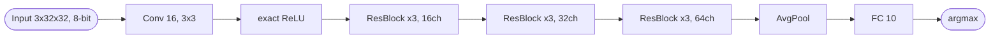

## TL;DR

DOReN proposes a low-depth, SIMD-batched homomorphic ReLU-neuron that evaluates quantized CNN layers under BGV without polynomial approximation, using 3:2 compressors to reduce accumulator depth from O(log m · log n) to O(log m + log n) and achieving roughly 20x amortized speedup over the prior SHE neuron [Abstract, §I].

## Problem and motivation

The authors target MLaaS settings where a client outsources inference on private data to an untrusted cloud, requiring encrypted inputs and encrypted intermediate values [§II "System Model"]. Prior FHE-CNN approaches either approximate ReLU with polynomials (losing accuracy and not scaling to ImageNet) or use TFHE-style circuits with huge ciphertext expansion (e.g. SHE: 7.7 GB per encrypted image) and depth-heavy accumulators [§I]. The threat model is an honest-but-curious server that follows the protocol but may try to infer input data from ciphertexts and intermediate results; security rests on the IND-CPA / RLWE hardness of BGV [§IV "Security Analysis"].

## Key contributions

- A depth-optimized "accumulate-then-activate" homomorphic neuron that uses 3:2 compressors (carry-save) instead of cascaded full adders, lowering accumulator depth to O(log m + log n) for m n-bit summands [§I, §III-A].
- A novel SIMD packing strategy that maximizes amortized neuron throughput (pack neurons-per-channel into slots) rather than minimizing single-neuron latency [§I, §IV-B].
- Inter-layer transformation layers built from Benes permutation networks to repack ciphertexts between layers [§I, §IV-C].
- Empirical 10–20x amortized speedup over SHE [Lou & Jiang, NeurIPS 2019] and ~2.4–8x smaller ciphertext expansion vs TFHE [§VI].
- A constant-depth ReLU circuit that exploits the two's-complement sign bit [§III-A "Evaluating the ReLU Function"].

## FHE setup

- **Scheme(s):** BGV (Brakerski-Gentry-Vaikuntanathan) [§I, §V].
- **Library / implementation:** HElib [§V].
- **Parameters:** plaintext modulus p = 2, m = 21845, capacity 400, polynomial degree < 16384, ciphertext modulus < 412 bits, packs 1024 bits per ciphertext, ciphertext expansion factor ~6600 (reduced to ~2000 with reduced-capacity input encryption, or down to 125 with Tan et al. packing) [§V]. Security ~80 bits (per lwe-estimator) [§V].
- **Bootstrapping used:** Yes — uses Chen & Han thin/slim bootstrapping; ~10–15 s per bootstrap of the set of ciphertexts associated with a single integer; applied dynamically based on HElib's capacity heuristic (threshold ~20) [§III-C, §V].
- **Packing / encoding strategy:** SIMD bit-slice packing — inputs are 8-bit, split across 8 ciphertexts (one per bit), with up to 1024 neurons of one channel packed into the slots of a single ciphertext. Inter-layer Benes networks repack between layers [§V, §IV-B].

## ML setup

- **Task:** Inference (image classification) on encrypted CIFAR-10 inputs [§V-C].
- **Model architecture:** Five CIFAR-10 CNN architectures evaluated: VGG-7, ResNet-20, LoLa, GHE, and SHE [§V-C]. Layer types supported: convolution, fully-connected, max/average pooling, and inter-layer transformation [§IV-D].
- **Activation handling:** Exact ReLU as a Boolean circuit (no polynomial approximation) — uses the two's-complement sign bit so ReLU collapses to multiplying the input by (1 ⊕ MSB), single multiplicative depth. Clamp/truncate folded into ReLU to recover low-bit output [§III-A].
- **Operates on:** Plaintext model (weights) + encrypted data. Weights are 5-bit power-of-two quantized (∈ {0, ±2¹, …, ±2⁴}), applied via bit-shifts; negative weights via two's-complement negation [§V, §III-A].
- **Training vs inference:** Inference only; networks are pre-trained in plaintext and quantized (trained quantized variants supplied by collaborators [Acknowledgment]).

## Datasets

| Dataset | Task | Size (train/test) | Modality | Notes |
|---|---|---|---|---|
| CIFAR-10 | Image classification | Not reported | 3x32x32 RGB images | 8-bit inputs, 5-bit power-of-2 weight/bias quantization [§V-C] |

## Pipeline diagram

```mermaid
flowchart LR
    subgraph Client
        A[Quantize input 8-bit] --> B[Bit-slice to 8 ctxts]
        B --> C[BGV Encrypt with pk]
    end
    subgraph Server
        D[Apply weights bit-shift] --> E[3:2 compressor tree]
        E --> F[Final full adder]
        F --> G[ReLU via sign bit]
        G --> H[Clamp + truncate]
        H --> I[Benes inter-layer repack]
        I --> J[Next layer]
        J --> K[Bootstrap when capacity low]
    end
    subgraph Client_dec [Client]
        L[BGV Decrypt with sk] --> M[Argmax label]
    end
    C -. ciphertexts .-> D
    K -. ciphertexts .-> L
```

### Pipeline steps (text)

1. Client quantizes the input image to 8-bit integers and bit-slices each integer into 8 separate ciphertexts (one per bit) [§V].
2. Client encrypts the bit-slice ciphertexts under BGV using its public key and ships them with evaluation keys to the server [§II, §IV-D].
3. Server applies logarithmic-quantized weights via bit-shifts; negative weights are handled by a two's-complement negation circuit [§III-A].
4. Server accumulates weighted inputs through a 3:2 compressor tree, reducing summands by 2/3 per level until two remain [§III-A, Fig. 2].
5. Server applies one depth-optimized full adder to combine the final two summands [§III-A].
6. Server evaluates ReLU in one multiplicative depth using the MSB-as-sign-bit trick and folds Clamp + Truncate into it [§III-A].
7. Server bootstraps dynamically when HElib capacity drops below ~20 [§V].
8. Server runs a Benes-network inter-layer transform to repack ciphertext slots into the layout expected by the next conv/pool layer [§IV-C].
9. Server iterates layers 3–8 through all conv/FC/pool layers [§IV-D].
10. Server returns encrypted logits to client; client decrypts and applies argmax [§II].

## Architecture diagram

The paper evaluates five quantized CIFAR-10 networks (VGG-7, ResNet-20, LoLa, GHE, SHE) [§V-C]. The actual layer-by-layer widths/strides are not enumerated in the text beyond the names of the published architectures; below is the ResNet-20 view as the deepest reported network.

### ResNet-20 (as adapted for DOReN)

### VGG-7

```mermaid
flowchart LR
    I([Input 3x32x32, 8-bit]) --> C1[Conv 3x3]
    C1 --> R1[exact ReLU]
    R1 --> C2[Conv 3x3]
    C2 --> R2[exact ReLU]
    R2 --> P1[MaxPool 2x2]
    P1 --> C3[Conv 3x3]
    C3 --> R3[exact ReLU]
    R3 --> C4[Conv 3x3]
    C4 --> R4[exact ReLU]
    R4 --> P2[MaxPool 2x2]
    P2 --> F[Flatten]
    F --> FC1[FC]
    FC1 --> R5[exact ReLU]
    R5 --> FC2[FC 10]
    FC2 --> O([argmax])
```

Each `exact ReLU` block internally contains: bit-sliced weight application -> 3:2 compressor tree -> final full adder -> sign-bit ReLU -> Clamp/Truncate -> Benes inter-layer transform when shape changes [§III-A, §IV-C].

## Results

| Metric | This paper | Baseline | Hardware |
|---|---|---|---|
| Amortized neuron time, 300 inputs | ~1.26 s | SHE neuron [Lou & Jiang 2019] | Intel Xeon Platinum 8170, 3.7 GHz turbo, 192 GB RAM, up to 104 threads, OpenMP [Abstract, §V] |
| Amortized neuron time, 10 inputs | < 0.13 s | — | Same as above [Abstract] |
| Amortized speedup over SHE | 10–20x | SHE neuron | Same as above [Abstract, §V-B, Fig. 6] |
| Bootstrap time per integer | ~10–15 s | — | Same as above [§V] |
| Benes permutation amortized (size 1024) | ~1 s as parallelism grows | — | Same as above, multi-threaded [§V-A "Inter-layer Transforms", Fig. 5] |
| Ciphertext expansion | ~2000x (with reduced-capacity input encryption) | TFHE/SHE: ~16 KB/bit -> 7.7 GB/image | — [§I, §V] |
| Ciphertext expansion improvement | 2.4–8x smaller than TFHE | TFHE [Chillotti et al.] | — [§VI] |
| Encrypted input size | 6x smaller than TFHE | SHE [Lou & Jiang] | Single-threaded run [§V-C, Table III] |
| Security | ~80-bit | — | per lwe-estimator [§V] |
| Accuracy | Not reported | — | — |
| End-to-end network latency on CIFAR-10 | Not reported as an aggregate (Table III gives per-network homomorphic-operation counts and multiplicative depth, single-threaded) | LoLa, GHE, SHE | Single-threaded, Xeon Platinum 8170 [§V-C, Table III] |

## Limitations and assumptions

- No end-to-end network accuracy numbers are reported; the paper focuses on neuron-level latency and operation counts (Table III gives #additions, #multiplications, shifts, multiplicative depth per network, but not classification accuracy) [§V-C].
- Network-level latency is reported single-threaded and "does not fully draw from" the parallel design, which is intended for massively parallel cloud deployment — "we are planning to test in our future works" [§V-C].
- The accumulator (compressor tree) is the bottleneck — 84–97.5% of neuron evaluation time [§V-A].
- Bootstrapping is required and is expensive (~10–15 s per integer), gated by an ad-hoc HElib capacity threshold (~20) [§V].
- Security is downgraded relative to original SHE parameters (those 128-bit parameters were reassessed to ~80-bit; DOReN itself targets ~80-bit) [§V, §V-B].
- Weight quantization is restricted to 5-bit power-of-2 (∈ {0, ±2¹…±2⁴}); accuracy impact of this versus full-precision weights is not quantified in the paper [§V, §V-C].
- Inputs assumed bit-sliced and pre-encrypted with capacity-reduced ciphertexts; extra client-side packing optimization requires an extract step the paper does not benchmark [§V "Reducing Ciphertext Expansion"].

## Related work it compares against

CryptoNets [Gilad-Bachrach et al. 2016], Bourse et al. (discretized NN under TFHE) [Bourse et al. 2017], SHE [Lou & Jiang, NeurIPS 2019] (direct empirical baseline), LoLa [Brutzkus et al. 2019], nGraph-HE / GHE [Boemer et al. 2019], HCNN [Al Badawi et al. 2021], Cheon et al. [2015] and Liu et al. [2020] (encrypted integer addition baselines for the accumulator), Chabanne et al. [Cryptology ePrint 2017/035] [§I, §V-B, §V-C, References].

## Code and artifacts

Not released. The TFHE/SHE comparison implementation uses the public TFHE library (https://github.com/tfhe/tfhe) [§V-B, Ref 35].

## Extra diagrams (optional)

### Threat model

### Activation approximation

DOReN does not approximate ReLU. ReLU is evaluated *exactly* as a Boolean circuit: with two's-complement n_end-bit input s, ReLU(s) = (1 ⊕ s_{n_end-1}) · s, requiring just one multiplicative depth. Clamp/Truncate are folded in for low-bit-width output recovery [§III-A].

## Open questions

- What is the end-to-end encrypted classification accuracy on CIFAR-10 for VGG-7 / ResNet-20 / LoLa / GHE / SHE under DOReN's 5-bit power-of-2 quantization vs the plaintext baseline? The paper does not report it.
- What is the wall-clock latency for a single CIFAR-10 image through, say, ResNet-20 end-to-end in the multi-threaded (104-thread) setting, including all bootstraps and Benes transforms? Only neuron-level and permutation-level amortized timings are given.
- How does the dynamic-bootstrapping capacity threshold (~20) interact with deeper networks where intermediate bit-widths grow — is bootstrapping count linear in layer count?
- The Table III numbers (#HOP, multiplicative depth) are reported single-threaded; how do they translate to multi-threaded wall-clock once the OpenMP parallelization is fully exercised?
