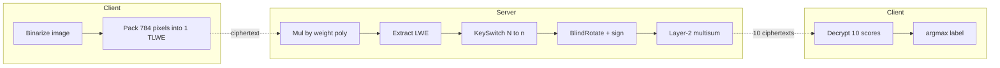
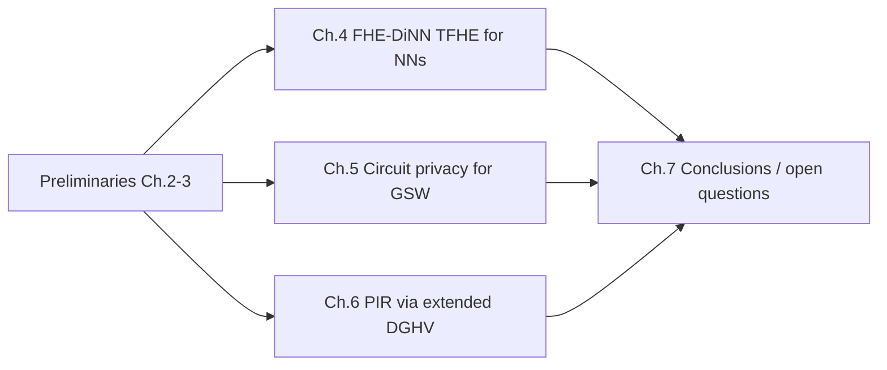
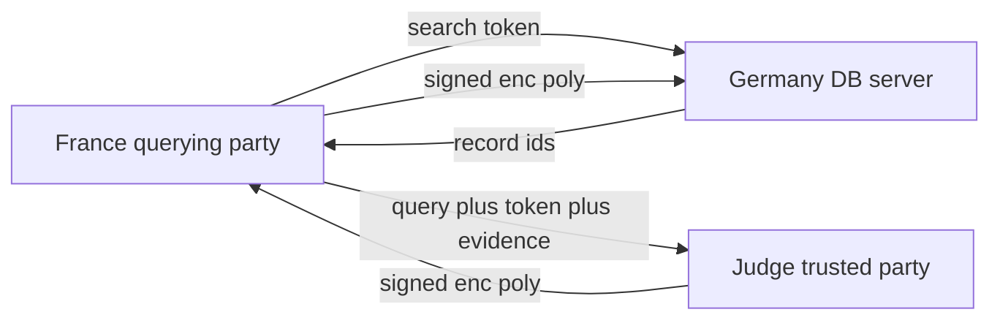
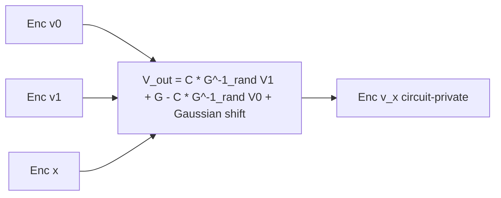

## TL;DR

Minelli's PhD thesis develops FHE techniques motivated by ML applications: a TFHE-based framework (FHE-DiNN) for evaluating discretized neural networks with cost independent of network depth, a Gaussian-leftover-hash-lemma technique for circuit privacy in GSW without noise flooding, and a homomorphic-encryption PIR protocol for cross-border law-enforcement queries [Abstract; §1.4].

## Problem and motivation

The thesis addresses three privacy gaps in the user-server outsourcing scenario [§1.2]:
- The user wants to evaluate predictive models (e.g. medical diagnosis via "RemoteDoc") without revealing inputs to the server [§4.1].
- The server wants to hide its proprietary algorithm/model from the user — *circuit privacy* — beyond what the output already leaks [§5.1].
- Two law-enforcement agencies in different countries want a query/database interaction that hides the query, the database, and discloses records only under a trusted-judge authorization [§6.1].

Threat model is *honest-but-curious* throughout (the thesis explicitly leaves malicious adversaries as an open question) [§7.2.2, Question 7.6].

## Key contributions

- **FHE-DiNN:** a TFHE-based framework to homomorphically evaluate Discretized Neural Networks (DiNNs) where parameters are independent of network depth thanks to a bootstrapping per neuron that also computes the sign activation [§4.5.3; Theorem 4.5.3 scale-invariance].
- **TFHE refinements:** packing 784-pixel inputs into a single TLWE ciphertext (172x bandwidth saving), moving KeySwitch to the start of bootstrapping, dynamic message-space rescaling per layer, and a new unfolded BlindRotate variant that halves external products at 1.5x bootstrapping-key size [§4.5.4].
- **Circuit privacy for GSW** under standard polynomial-modulus-to-noise LWE, avoiding noise flooding and bootstrapping, via a Gaussian leftover hash lemma applied during a randomized G^{-1}(·) [§5.1.1; Table 5.1].
- **PIR protocol (ADOC)** for hit/no-hit + record retrieval over an encrypted inverted database, supporting simple, disjunction, and conjunction queries with a trusted-judge signing step; implemented with an *extended DGHV* scheme supporting a larger message space Z_q [§6.2; §6.3].

## FHE setup

- **Scheme(s):** TFHE (a TLWE/TGSW variant of GSW) for Chapter 4; GSW with randomized G^{-1} for Chapter 5; an extension of DGHV (FHE over the integers, approximate-GCD assumption) for Chapter 6 [§3.4.3; §3.7; §6.3].
- **Library / implementation:** TFHE library by Chillotti et al. (GitHub) extended for FHE-DiNN [§4.5.5]. DGHV protocol implemented as a custom prototype in Python+Flask, JSON-encoded ciphertexts, ~755 KB per encrypted polynomial coefficient [§6.4.3]. Network training uses Keras + TensorFlow [§4.5.5.2].
- **Parameters (FHE-DiNN):** polynomial degree N = 1024, TLWE dimension k = 1, B_g = 1024, decomposition length ℓ = 3, key-switching base 8 length t = 5; α ≈ 2^-30 (input), 2^-17 (KS key), 2^-36 (bootstrapping key); minimum security ≥ 80 bits [§4.5.5, Table 4.3].
- **Parameters (PIR, DGHV-based):** N = 10^4 records, κ = 128, false-positive bound f = 2^-32, k = 3 repetitions, q ≈ 10^7.21, ρ = 256, η = 560, γ = 2,508,800 [§6.4.3].
- **Bootstrapping used:** yes, programmable bootstrapping per neuron (computes sign + refreshes noise + can change message space) for Chapter 4; *no bootstrapping* for the circuit-privacy construction (Chapter 5) or the PIR protocol (Chapter 6, depth-1 SHE only).
- **Packing / encoding strategy:** input image (784 pixels) encoded as one TLWE ciphertext via a polynomial Σ_i x_i X^i; weights stored in FFT form as Σ_i w_i X^{-i} so the multisum becomes a polynomial product, with Extract recovering an LWE encryption of the inner product [§4.5.4.1].

## ML setup

- **Task:** classification (inference only) on MNIST handwritten digits [§4.5.5.1].
- **Model architecture:** two 1-hidden-layer fully-connected DiNNs, 784:30:10 and 784:100:10, both trained with `hard_sigmoid` then swapped to `sign` activation; weights and biases discretized with scaling factor τ = 10 [§4.5.5.2].
- **Activation handling:** activation is the exact `sign(·)` function, evaluated *for free* inside the TFHE bootstrapping by setting the bootstrapping testVector to encode the sign mapping on the "wheel" [§4.5.3.2; Figure 4.6].
- **Operates on:** *plaintext model + encrypted data* — the network weights are public to the server, which uses them as scalars on encrypted inputs [§4.5.3.1, "weights of the network are available in clear"].
- **Training vs inference:** training runs in the clear (Keras/TensorFlow), inference runs under FHE on the server [§4.5.5.2-4.5.5.3].

## Datasets

| Dataset | Task | Size (train/test) | Modality | Notes |
|---|---|---|---|---|
| MNIST | 10-class digit classification | 60,000 / 10,000 (standard split implied by full test-set evaluation) [§4.5.5.3, Table 4.5] | 28x28 grayscale images, binarized to {-1, +1} at threshold 128 | Input shape 784, single-bit per pixel after binarization [§4.5.5.1] |
| Law-enforcement records (synthetic) | PIR / OT | N = 10,000 records [§6.4.3] | Tabular (ID + features such as DNA, fingerprints, car plate) | Encrypted inverted-index database with PRF-tokenized feature keys and DGHV-encrypted ID polynomials [§6.2] |

## Pipeline diagram

### Pipeline steps (text)

1. Client binarizes the MNIST image to {-1, +1} pixels [§4.5.5.1].
2. Client packs all 784 pixels into one TLWE ciphertext encoding the polynomial Σ_i x_i X^i [§4.5.4.1].
3. Server multiplies the TLWE ciphertext by the precomputed FFT representation of the weight polynomial Σ_i w_i X^{-i} for each hidden neuron, producing 30 (or 100) TLWE ciphertexts [§4.5.5.3, step 2].
4. Server runs Extract on each to recover a 1024-LWE ciphertext encoding the multisum [step 3].
5. Server applies KeySwitch to drop the dimension from N = 1024 to n = 450 [step 4].
6. Server runs the sign-bootstrapping: BlindRotate with the testVector encoding sign, then Extract — this both refreshes noise and applies sign(·) for free [§4.5.3.2, step 5].
7. Server takes the 30 (or 100) refreshed ciphertexts, applies the second-layer multisum with the output weights, yielding 10 N-LWE ciphertexts (one per class) [step 6].
8. Server returns the 10 ciphertexts; client decrypts and takes argmax [step 7].

## Architecture diagram

This thesis spans three contributions; a single network-layer diagram does not capture the whole work. We provide one diagram for FHE-DiNN's classifier and a second for the thesis chapter structure.

### FHE-DiNN classifier (784:H:10, H in {30, 100})

### Thesis contribution structure

## Results

| Metric | This paper | Baseline | Hardware |
|---|---|---|---|
| Plaintext accuracy, FCNN-30 (DiNN + sign) | 93.55% [Table 4.2] | 94.76% original real-valued NN | N/A |
| Plaintext accuracy, FCNN-100 (DiNN + sign) | 96.43% [Table 4.2] | 96.75% original real-valued NN | N/A |
| Homomorphic accuracy, FHE-DiNN 30 | 93.71% (273 disagreements vs. clear, of 10,000) [Table 4.5] | Cryptonets 98.95% (deeper net) [Table 4.6] | Intel Core i7-4720HQ @ 2.60GHz, 1 core |
| Homomorphic accuracy, FHE-DiNN 100 | 96.35% (127 disagreements) [Table 4.5] | Cryptonets 98.95% | Same |
| Single-image inference time, FHE-DiNN 30 (orig BlindRotate) | 0.515 s [Table 4.5] | Cryptonets 570 s per batch of 8192 (= 0.07 s amortized) [Table 4.6] | Same |
| Single-image inference time, FHE-DiNN 30 (unfolded BlindRotate) | 0.491 s [Table 4.5] | — | Same |
| Single-image inference time, FHE-DiNN 100 | 1.65–1.68 s [Table 4.5] | — | Same |
| Single bootstrapping | ≈15 ms [§4.5.5] | — | Same |
| Ciphertext size per image | ≈8.2 kB [§4.5.5, Table 4.6] | Cryptonets 586 MB unbatched / 73.3 kB amortized [Table 4.6] | — |
| PIR simple-query bandwidth | ≈1510·d KB (d = polynomial degree) [Table 6.3] | — | DGHV-based prototype, Python/Flask |
| PIR conjunctive-query bandwidth | ≈6795·(d1+d2) KB [Table 6.3] | — | Same |

## Limitations and assumptions

- DiNNs require *discretized* weights, biases, and inputs, plus the `sign` activation; richer activations (ReLU, softmax) and real-valued weights are out of scope and explicitly flagged as an open question [§7.2.1, Question 7.1].
- Only fully-connected one-hidden-layer networks are demonstrated; max-pooling and convolutional layers are not supported because no efficient FHE max is known [§4.5.5.3 future work].
- Accuracy (93.7%/96.3%) on MNIST is well below Cryptonets' 98.95% because of the binarization and discretization, not because of homomorphic noise per se [§4.5.6].
- The wrong-bootstrapping rate is non-zero (e.g. 3,383 / 300,000 for the 30-neuron net) — correctness is probabilistic but does not hurt argmax accuracy in practice [§4.5.5.3, Remark 4.5.6].
- Circuit-privacy construction is restricted to GSW-style FHE for NC^1 / branching programs; extension to second-generation FHE and combination with FHE-DiNN are listed as open [§7.2.2, Question 7.5].
- PIR protocol relies on a trusted Judge and an honest-but-curious server; multiple queries leak more than a single OT execution (the user can in principle exhaust the database over time) [§6.1.3].
- Throughout, threat model is honest-but-curious; malicious-adversary security is open [§7.2.2, Question 7.6].

## Related work it compares against

- **Cryptonets** [DGL+16] — the main neural-network baseline for accuracy, latency and ciphertext size [§4.5.6, Table 4.6].
- TFHE / Chillotti et al. [CGGI16b, CGGI17] — the bootstrapping framework that FHE-DiNN extends and refines [§4.4, §4.5.4.4].
- ZYL+17 [ZYL+17] — the unfolded BlindRotate baseline against which the thesis proposes a 3-element variant [§4.5.4.4, Table 4.1].
- GSW [GSW13], AP14 [AP14], BV14 [BV14] — prior FHE schemes used as the substrate for the circuit-privacy result [§5.1, Table 5.1].
- Noise-flooding [Gen09b] and bootstrapping-for-circuit-privacy [OPP14; GHV10; DS16] — the prior circuit-privacy approaches the new construction supersedes [§5.1].
- BGH+13 — the PIR/conjunctive-query protocol that the thesis builds on [§6.2, §6.4.1].
- DGHV [DGHV10] — base scheme extended to a larger message space for the PIR protocol [§6.3].
- HElib [HS14a, HS14b, HS15], SEAL [CHH+16] — surveyed alongside TFHE in the libraries section [§3.6].

## Code and artifacts

Not released as a single repository in the thesis itself. The FHE-DiNN implementation extends the public TFHE library [CGGI16a] available on GitHub [§4.5.5]; the PIR prototype is a custom Python/Flask implementation, no release URL stated [§6.4.3, ref. [10]]. License: Not reported.

## Extra diagrams (optional)

### Threat model (PIR protocol)

### Circuit-privacy core step (Ch.5)

## Open questions

- Can FHE-DiNN be lifted to convolutional networks, real-valued weights, and arbitrary activations without losing scale-invariance? [§7.2.1, Questions 7.1–7.4].
- Can the Gaussian-leftover-hash-lemma circuit-privacy technique be ported to BGV/BFV/CKKS-style "second-generation" schemes, and combined with the FHE-DiNN pipeline so that both data and model are hidden? [§7.2.2, Question 7.5].
- Can the constructions be made secure against malicious adversaries with malformed inputs? [§7.2.2, Question 7.6].
- Is CCA1-secure FHE achievable without bootstrapping? [§7.2.2, Question 7.7].
- What are the exact legal constraints the PIR protocol must satisfy, and would lattice-based HE (vs. DGHV) make the PIR implementation more efficient? [§7.2.3, Questions 7.8–7.9].
- Can the Cryptonets vs FHE-DiNN gap (98.95% vs 96.35%) be closed by training DiNNs end-to-end (e.g. via [CB16]) rather than discretizing a trained real-valued network? [§4.5.5.3].
