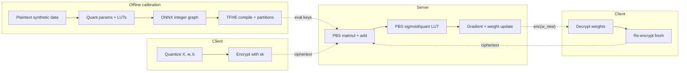
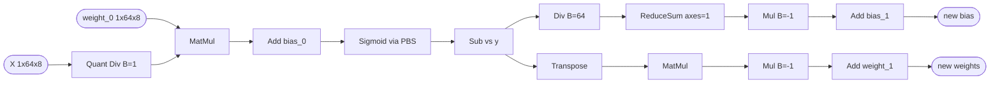
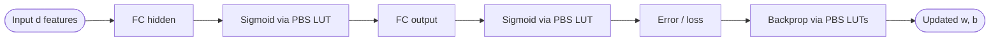
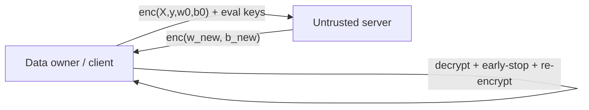

## TL;DR

Montero et al. present a TFHE-based framework that performs SGD training of logistic regression and small one-hidden-layer MLPs directly on encrypted data, using 4-6 bit integer quantization of weights, gradients, activations, and errors plus a recently introduced TFHE rounding operator to keep PBS bit-widths low [§1, §3]. On three tabular datasets (breast-cancer, mortality, heart) encrypted training reaches accuracies within ~1-3% of the fp32 plaintext baselines [§4.2, Table 2].

## Problem and motivation

Training data is expensive and sensitive; collaborative training across multiple parties risks data leakage. Federated learning requires live client participation and is awkward for vertical splits and offline encrypted-at-rest data [§1]. The authors target a setting where data owners outsource training of LR or small NNs to a server that only sees ciphertext, supporting both horizontal and vertical data splits without an explicit alignment step [§1]. The threat model is implicit: the server is malicious/untrusted with respect to data confidentiality; mini-batch interaction with the data owner is allowed for fresh encryption (or replaced by bootstrapping for non-interactive training) [§3.5].

## Key contributions

- A unified TFHE training pipeline for LR and small MLPs where data, gradients, weights, activations, and the error term are all encrypted integers [§3].
- Use of programmable bootstrapping (PBS) to evaluate sigmoid and other activations as look-up tables on encrypted values [§3, §3.3].
- Integration of a TFHE rounding operator with `n_r`-bit removal to bound PBS input bit-widths and accelerate training [§3.4].
- An ONNX-based PyTorch-to-TFHE compilation flow that partitions the graph into multi-sum + PBS sub-circuits with per-partition crypto parameters at 128-bit security [§3.1, §3.3].
- Empirical evaluation on three tabular datasets with batch and epoch latency, plus a WGC/s/T (weight-gradient computations per second per thread) comparison vs. Glyph [12] and Nandakumar et al. [13] [§4.2].

## FHE setup

- **Scheme(s):** TFHE [§1, ref. 5]
- **Library / implementation:** Zama stack implied (Concrete-style compilation via [2, 14]); not named explicitly in text [§3.3]
- **Parameters:** 128-bit security; for LR on heart (13 features), `n_b = n_r = 6`: polynomial size 2048/4096/512 across three partitions, GLWE dim 1/1/4, LWE dim 828/848/524, decomposition levels 3/2/2, base-log 11/15/16, noise variances 9.94e-32 / 4.70e-38 / 9.94e-32 [Table 1]
- **Bootstrapping used:** Yes — programmable bootstrapping (PBS) used for every multiplication, activation, and quantization LUT; also a 1-bit rounded-PBS for bit removal [§3, §3.4]
- **Packing / encoding strategy:** Integer encoding; matrix multiplications computed as sums of PBS-evaluated `f_sq(x) = floor(x^2 / 4)` differences (eq. 1) rather than via SIMD/coefficient packing [§3.3, eq. 1]

## ML setup

- **Task:** Supervised training (binary classification) — produces encrypted trained weights [§3, §4.1]
- **Model architecture:** (1) Logistic Regression with `d` inputs and a sigmoid head; (2) one-hidden-layer MLP. Sizes reported via #params: LR-30 (breast-cancer), LR-10 (mortality), LR-13 (heart), MLP-930 (breast-cancer, 1 hidden), MLP-165 (mortality, 1 hidden) [Table 2]
- **Activation handling:** Sigmoid and any univariate function evaluated as integer LUTs via PBS; quantization functions fused into the same LUT during calibration (no accuracy loss from fusion, per ref. [14]) [§3, §3.2]
- **Operates on:** Both data and model encrypted under TFHE; quantization-calibration is done offline on plaintext synthetic data (`X, w, b ~ Uniform(-1,1)`, `y ~ Bin(0.5)`) [§3.2]
- **Training vs inference:** Training under encryption; SGD with batch size 8 and learning rate 1; weights are decrypted and re-encrypted between mini-batches for fresh ciphertexts (or alternatively bootstrapped to stay non-interactive) [§3.5, §4.1]

## Datasets

| Dataset | Task | Size (train/test) | Modality | Notes |
|---|---|---|---|---|
| mortality [7] | Binary classification | 46582 examples, 20% held-out test | Tabular | 10 features, 2 classes (infant mortality, rural/urban US 2014) |
| breast-cancer [15] | Binary classification | 569 examples, 20% held-out test | Tabular | 30 features (Wisconsin diagnostic, OpenML ID 15) |
| heart [6] | Binary classification | Not stated, 20% held-out test | Tabular | 13 features (coronary artery disease) |

## Pipeline diagram

### Pipeline steps (text)

1. Express the LR/MLP single-batch weight-update graph in PyTorch and export to ONNX [§3.1].
2. Run offline quantization calibration on synthetic uniform data to fix per-tensor `n_b`-bit quantizers and fuse them into LUTs [§3.2].
3. Compile the integer graph into TFHE partitions, each a multi-sum followed by a PBS; generate 128-bit-secure crypto parameters and bootstrap keys per partition [§3.3].
4. Client quantizes data, weights, and biases and encrypts them; sends ciphertexts and evaluation keys to the server [§3.2].
5. Server runs one SGD mini-batch (batch size 8) under TFHE — matmul via PBS-evaluated `f_sq`, sigmoid + quantization via fused LUT, error and gradient via PBS, weight update [§3.3, §4.1].
6. The rounded-PBS operator strips low bits to keep PBS input bit-width small (Figure 3) [§3.4].
7. Server returns encrypted updated weights; client decrypts to evaluate / early-stop and re-encrypts for the next mini-batch (or, alternatively, server bootstraps weights to stay non-interactive) [§3.5].
8. Iterate until convergence (e.g., 20 batches on breast-cancer) [§4.2].

## Architecture diagram

### Logistic Regression (single-batch update graph)

### MLP (one hidden layer)

Note: the paper does not state the hidden width explicitly; #params is 930 for breast-cancer (30 features) and 165 for mortality (10 features), consistent with a hidden width of ~30 / ~14 respectively [Table 2].

## Results

Headline (Table 2): on a held-out 20% test set, FHE-trained accuracies are within ~1-3% of fp32 baselines; latency reported for 16-thread execution on an 8-core processor [§4.2, Table 2].

| Metric | This paper | Baseline | Hardware |
|---|---|---|---|
| Breast-cancer LR (6b) accuracy | 98.25% | fp32: 99.12% | 8-core, 16 threads [Table 2] |
| Breast-cancer LR (6b) batch / epoch latency | 11.8 s / 0.23 h | — | 8-core, 16 threads [Table 2] |
| Breast-cancer MLP-930 (4b) accuracy | 98.25% | fp32: 99.12% | 8-core, 16 threads [Table 2] |
| Breast-cancer MLP-930 (4b) batch / epoch latency | 149 s / 2.94 h | — | 8-core, 16 threads [Table 2] |
| Mortality LR (6b) accuracy | 90.09% | fp32: 90.47% | 8-core, 16 threads [Table 2] |
| Mortality LR (6b) batch / epoch latency | 7.2 s / 11.6 h | — | 8-core, 16 threads [Table 2] |
| Mortality MLP-165 (4b) accuracy | 87.25% | fp32: 90.44% | 8-core, 16 threads [Table 2] |
| Mortality MLP-165 (4b) batch / epoch latency | 45 s / 72.78 h | — | 8-core, 16 threads [Table 2] |
| Heart LR (6b) accuracy | 88.52% | fp32: 89.47% | 8-core, 16 threads [Table 2] |
| Heart LR (6b) batch / epoch latency | 8.02 s / 0.08 h | — | 8-core, 16 threads [Table 2] |
| MLP throughput (WGC/s/T) | 3 (breast-cancer) | Glyph [12]: 24; Nandakumar [13]: 0.4 | 48-thread comparison for [12] [§4.2] |
| Batch-time grid (mortality, varying `n_b`, `n_r`) | 1.49 s (n_b=2,n_r=3) up to 12.36 s (n_b=7,n_r=7) | — | 64-core machine [Figure 5] |

Additional notes: PBS error rate is set to 1% per univariate evaluation; tightening to 2^-40 yields identical accuracy to 2 significant digits but doubles latency [§4.2]. Going from `n_b = 5` to `n_b = 6` roughly doubles latency [§4.2]. On breast-cancer, mini-batch convergence is reached in ~20 batches, ~3 minutes total — similar order to Kim et al. [11] which uses one big batch [§4.2].

## Limitations and assumptions

- Convolutional NNs are out of scope; only LR and one-hidden-layer MLPs are demonstrated [§3].
- All datasets are small tabular binary-classification problems; no MNIST/CIFAR or larger NN comparison from the authors' own runs [§4.1].
- Calibration assumes user-supplied training data has the same min/max as the synthetic `Uniform(-1,1)` calibration distribution — production data must be normalized accordingly [§3.2].
- Quantization scale `n_r` is set experimentally; choice of `n_b = n_r = 6` is justified mainly by stability and not by an automatic procedure [§4.2].
- Default mini-batch protocol requires the data owner to decrypt and re-encrypt weights every batch; the fully non-interactive alternative (per-batch bootstrapping) is mentioned but not benchmarked [§3.5].
- Latency numbers mix two hardware setups (8-core / 16-thread for Table 2 vs. 64-core for Figure 5), making cross-table comparisons awkward [Table 2, Figure 5].
- Reported WGC/s/T comparison to [12, 13] is by the authors' own definition; direct latency-to-convergence is not given for all baselines [§4.2].
- The "comparable to state-of-the-art" claim rests on a 2% accuracy gap on the hardest dataset (mortality MLP) and a throughput that is ~8x below Glyph [12] (3 vs. 24 WGC/s/T) [§4.2, Abstract].

## Related work it compares against

Encrypted LR training: Bergamaschi et al. [1], Bonte & Vercauteren [3] (FV with fixed-Hessian), Han et al. [9] (CKKS, mini-batch packing + periodic bootstrapping), Kim et al. [11] (CKKS + Nesterov). Encrypted NN training: Glyph (Lou et al.) [12] (BGV + scheme-switching to TFHE for ReLU/SoftMax) and Nandakumar et al. [13] (BGV, two-layer MLP on MNIST/transfer-learning). Integer-arithmetic quantized training: WAGE [17], NITI [16], SWALP [18]. Quantization-aware integer inference: Jacob et al. [10]. TFHE compilation and parameter optimization: Bergerat et al. [2]; Stoian et al. [14] (which is the inference companion of this training framework).

## Code and artifacts

Not released (no repository URL is mentioned in the paper).

## Extra diagrams (optional)

### Threat model

The client holds the secret key and quantization params; the server holds only ciphertexts and bootstrapping keys [§3.2, §3.3, §3.5].

### Activation approximation

Sigmoid is not approximated by a polynomial; it is implemented as an integer LUT evaluated through PBS, fused with the surrounding quantization functions during calibration [§3, §3.2]. The TFHE rounding operator (Figure 3) is the key mechanism: to remove the LSB of a 5-bit accumulator it (i) shifts the LSB to the MSB, (ii) applies a 1-bit PBS to move it back, and (iii) subtracts the result from the original value [§3.4, Figure 3].

## Open questions

- Hidden width of the MLP is not stated directly — inferred from #params (930 for 30-feature input, 165 for 10-feature input). What is the exact hidden layer size and output dim?
- How is the sigmoid LUT range chosen, and does it interact with the `Uniform(-1,1)` calibration assumption for out-of-distribution features?
- Why does the same dataset/configuration use different hardware between Table 2 (8-core, 16 threads) and Figure 5 (64 cores)? Are the Figure 5 numbers a re-run at higher parallelism, or are different stages benchmarked?
- The non-interactive variant (per-batch weight bootstrapping) is only sketched — what is its latency overhead vs. the interactive flow used in Table 2?
- Is there a released Concrete-ML / Zama artifact that reproduces these numbers? The text leans on refs [2, 14] but does not cite a repo.
