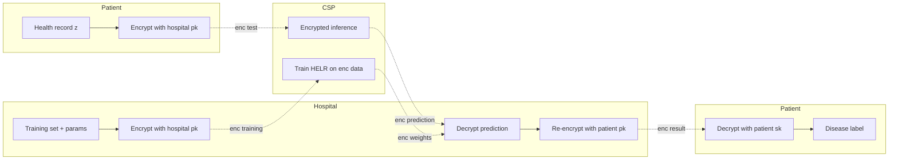
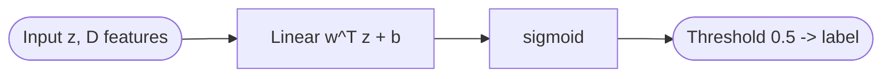
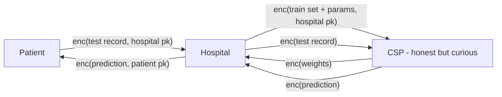

## TL;DR

Naresh and Reddi build a CKKS-based logistic regression framework (HELR) that trains and infers on encrypted heart-disease records using TenSEAL/PyTorch on Google Colab, achieving 84% accuracy versus 85% for the plaintext baseline while preserving patient privacy across patient / hospital / cloud-service-provider roles [Abstract][§Experimentation and results].

## Problem and motivation

The paper targets privacy-preserving heart disease prediction in cloud settings where hospitals want to outsource training/inference of logistic regression to a Cloud Service Provider (CSP) without exposing sensitive patient records [§Introduction][§Proposed system]. Traditional privacy techniques (anonymization, perturbation, differential privacy) either degrade utility or inject accuracy-harming noise; the authors motivate full HE as a way to avoid this trade-off [§Introduction]. Threat model: the CSP is treated as "authentic and curious" (honest-but-curious) and must perform model training and prediction over encrypted data; patients hold their own private keys and the hospital holds keys for the training pipeline [§Proposed system / System architecture]. The security analysis additionally considers active adversaries mounting poisoning, evasion, membership inference, model inversion, and model extraction attacks [§Security analysis].

## Key contributions

- HE-driven logistic regression model built on CKKS for binary classification on encrypted healthcare data [§Contributions].
- Security analysis arguing resilience to poisoning, evasion, membership inference, model inversion, and model extraction attacks [§Contributions][§Security analysis].
- Empirical evaluation on Kaggle heart datasets with TenSEAL, comparing HELR to plaintext LR and to a homomorphic-encryption SVM baseline (HESVM) across three datasets and two CKKS parameter settings [§Contributions][§Experimentation and results].

## FHE setup

- **Scheme(s):** CKKS (Cheon-Kim-Kim-Song) approximate-arithmetic FHE [§Background knowledge / Cheon-Kim-Kim-Song].
- **Library / implementation:** TenSEAL and PyTorch, run on Google Colab [§Experimentation and results].
- **Parameters:** Two configurations reported in Table 2 [§Experimentation and results, Table 2]:
  - `poly_modulus_degree = 4096`, `coeff_mod_bit_sizes = [40, 20, 40]`, `global_scale = 2^20`.
  - `poly_modulus_degree = 8192`, `coeff_mod_bit_sizes = [40, 21, 21, 21, 21, 21, 21, 40]`, `global_scale = 2^21`.
  - Security level: Not reported (no explicit bits-of-security statement).
- **Bootstrapping used:** Not reported (the paper does not mention bootstrapping; training is performed for a small number of epochs which is consistent with a leveled scheme).
- **Packing / encoding strategy:** Standard CKKS encoding of real-valued message vectors in C^(N/2) via canonical embedding and a global scaling factor; Galois keys generated via `ctx_eval.generate_galois_keys()` to support dot-product (rotation) operations [§Experimentation and results][§Background knowledge].

## ML setup

- **Task:** Binary classification (heart disease present / absent) [§Logistic regression].
- **Model architecture:** Single-layer logistic regression: linear combination `w^T z + b` followed by sigmoid; binary cross-entropy loss with L2-style weight regularization, weight update `W_j ← W_j − α (1/P) Σ_i (σ(F_i) − Y_i) F_{ij} + 0.059 W_j` [§Proposed model][§Logistic regression over encrypted data].
- **Activation handling:** Sigmoid is used in the formulation; the paper does not explicitly describe a polynomial approximation degree or training-aware approximation — it states only that gradients and the sigmoid are evaluated under HE [§Logistic regression over encrypted data][§Security analysis]. (This is a notable gap — see Open questions.)
- **Operates on:** Encrypted training data + encrypted weights on the CSP; patient encrypts test data, hospital decrypts predictions [§Proposed model][§Proposed system].
- **Training vs inference:** Both — gradient-descent training is performed on encrypted data on the CSP, then encrypted inference is run on the same trained model [§Proposed model][§Experimentation and results].

## Datasets

| Dataset | Task | Size (train/test) | Modality | Notes |
|---|---|---|---|---|
| Kaggle Heart Disease (johnsmith88) | Binary heart-disease classification | Not reported | Tabular EHR features | Primary dataset; used for the headline 84%/85% accuracy comparison [§Experimentation and results, ref 27] |
| Statlog Heart | Binary heart-disease classification | Not reported | Tabular | Used in HELR vs HESVM comparison [§Experimentation and results, ref 36] |
| Framingham Heart Study | Binary CHD risk classification | Not reported | Tabular EHR | Used in HELR vs HESVM comparison [§Experimentation and results, ref 35] |

## Pipeline diagram

### Pipeline steps (text)

1. Patient and hospital each generate CKKS key pairs via `Keygen()` [§Proposed model, Alg. 1].
2. Hospital encrypts the training dataset and initial model parameters with its public key and ships them to the CSP [§Proposed system].
3. CSP runs gradient-descent logistic regression on the encrypted data, updating an encrypted weight vector each epoch [§Logistic regression over encrypted data, Alg. 3].
4. CSP returns the encrypted updated weights to the hospital [§Proposed system].
5. Patient encrypts their record (test sample) with the hospital public key and sends it to the hospital, which forwards it to the CSP [§Proposed model].
6. CSP computes the encrypted prediction `σ(Enc(z)·Enc(w))` and returns it [§Security analysis, Eq. 24].
7. Hospital decrypts the prediction, re-encrypts it under the patient's public key, and sends it to the patient [§Proposed model].
8. Patient decrypts to learn the disease status [§Proposed model].

## Architecture diagram

The model is a single-layer logistic regression with D input features, one sigmoid output unit, and a 0.5 (or tuned 0.8 for ROC) decision threshold [§Logistic regression][§Experimentation and results].

## Results

Headline numbers, taken directly from the paper [§Experimentation and results, Figs. 4-8]:

| Metric | This paper (HELR) | Baseline | Hardware |
|---|---|---|---|
| Accuracy on Heart (Kaggle) | 84% (HELR_4096), 84% (HELR_8192) | LR plaintext: 85% | Google Colab (CPU) |
| Accuracy delta vs plaintext | "between 0.01 and 0.03" | n/a | Google Colab |
| Training-set encryption time, HELR_4096 | 1061 / 1093 / 1301 / 1731 ms at 5 / 10 / 20 / 50 epochs | n/a | Google Colab |
| Training-set encryption time, HELR_8192 | 4550 / 5242 / 5542 / 12225 ms at 5 / 10 / 20 / 50 epochs | n/a | Google Colab |
| Test-set encryption time, HELR_4096 | 219 / 220 / 222 / 229 ms | n/a | Google Colab |
| Test-set encryption time, HELR_8192 | 1013 / 1019 / 1033 / 1059 ms | n/a | Google Colab |
| HELR vs HESVM on Heart | HELR 81.7 (4096), 85 (8192) | HESVM 67 (4096), 79 (8192) | Google Colab |
| HELR vs HESVM on Statlog | HELR 100 (both configs) | HESVM 69 (4096), 88 (8192) | Google Colab |
| HELR vs HESVM on Framingham | HELR 62 (4096), 65 (8192) | HESVM 63 (4096), 61 (8192) | Google Colab |
| Best ROC threshold | 0.8 (HELR_4096 has higher AUC than HELR_8192) | n/a | Google Colab |

Single-encrypted-sample inference latency is not separately reported, so `single_inference_seconds` is set to N/A in the comparison block; the test-set encryption times above are dataset-level, not per-sample [§Experimentation and results].

## Limitations and assumptions

- Authors flag computational overhead of HE and scalability concerns for large healthcare datasets [§Abstract][§Conclusion][Table 4].
- Sigmoid is treated as if directly evaluable under CKKS but the paper does not specify a polynomial approximation, degree, or training-aware fitting — a load-bearing omission for reproducibility.
- No security level (in bits) is stated for the CKKS parameters in Table 2; only `poly_modulus_degree`, coefficient moduli, and global scale are given [§Experimentation and results, Table 2].
- Training dataset size, train/test split, and feature dimensionality (D) are not reported; "computation time" plots are dataset-level rather than per-sample [§Experimentation and results].
- Hardware is only described as "Google Colab"; the specific CPU/GPU, RAM, and thread count are not given, so latency numbers are hard to compare against other systems.
- Communication cost is explicitly excluded ("Only the computation time for the different operations, excluding the communication cost, was considered") [§Experimentation and results].
- The security analysis is qualitative/argumentative rather than experimentally evaluated against actual poisoning, MIA, inversion, or extraction adversaries [§Security analysis].

## Related work it compares against

- X. Zhao et al. (2022) — BFV-based privacy-preserving federated learning on COVID-19 X-ray data [§Comparative analysis, Table 4].
- Wei et al. [24] — CKKS + logistic regression on vertically partitioned MNIST via asynchronous gradient sharing [§Comparative analysis, Table 4].
- Internal HESVM baseline — homomorphic-encryption SVM run on the same heart / statlog / Framingham datasets [§Experimentation and results, Fig. 8].
- Also positions against Aono et al. [28] and Chen et al. [29] (logistic regression over FHE in medical genomics) [§Related works].

## Code and artifacts

Not released. The paper states "No datasets were generated or analysed during the current study" and does not provide a repository URL; implementation is described as TenSEAL + PyTorch on Google Colab [§Availability of data and materials][§Experimentation and results].

## Extra diagrams (optional)

### Threat model

Three parties (patient, hospital, CSP); the CSP performs training and inference on ciphertexts and never sees plaintext data, weights, or predictions [§Proposed system / System architecture].

## Open questions

- How is the sigmoid actually computed under CKKS — polynomial approximation degree, range, or a Taylor/Chebyshev expansion? The paper writes `σ(Enc(z)·Enc(w))` symbolically without specifying the approximation [§Security analysis, Eq. 24].
- What is the multiplicative depth budget under the reported coefficient-modulus chains, and how many gradient-descent epochs can actually run before noise exhausts the budget (especially for `poly_modulus_degree = 4096`)?
- What CKKS security level (in bits) do the Table 2 parameters target? With `[40, 20, 40]` at N=4096 this is plausibly below the 128-bit HE standard, but the paper does not confirm.
- What are the dataset sizes (n, D, train/test split)? Without this, the encryption times in milliseconds are hard to normalize.
- Is the "HELR_8192 has higher AUC threshold but lower at 0.8" claim a robust finding or a single-run artifact? No variance / confidence intervals are reported.
- How is HESVM implemented (kernel, support-vector encoding under CKKS)? The HELR-vs-HESVM comparison drives a major claim but HESVM's construction is not detailed.
