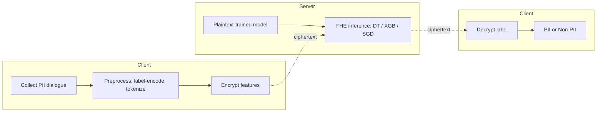
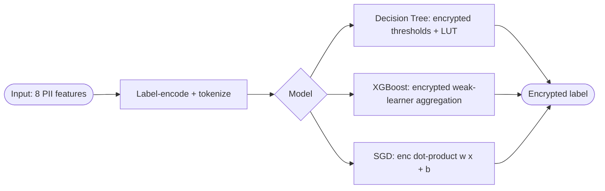

## TL;DR

The paper benchmarks three classical ML models (SGD classifier, XGBoost, Decision Tree) under Fully Homomorphic Encryption using the Concrete-ML library on a GAN-generated medical PII text dataset, showing FHE matches plaintext accuracy but with sharply increased training and inference latency [§Abstract][§V].

## Problem and motivation

Medical data (EHRs, wearables, genomic data) is sensitive under HIPAA/GDPR, yet ML on such data is valuable for diagnosis and personalization [§I]. Privacy-preserving ML via FHE allows computations on encrypted data, but FHE incurs significant computational and implementation costs [§I]. The authors target classifying medical dialogues that may contain personally identifiable information (PII vs. Non-PII) under encryption [§Abstract][§IV]. Threat model is not formally stated; framing is healthcare-style outsourced inference where sensitive PII must not be exposed during processing [§I][§II].

## Key contributions

- Introduces an FHE-based method to improve existing PPML for medical data [§I].
- Integrates privacy-preserving techniques into ML workflows to process data without exposing raw PII [§I].
- Develops and implements six FHE-enabled ML model variants (Decision Tree, XGBoost, SGD — each in plaintext and FHE form) and benchmarks training/inference cost vs. plaintext baselines [§I][§IV-C][§V].

## FHE setup

- **Scheme(s):** Fully Homomorphic Encryption via the Concrete-ML library (TFHE-based) [§IV-B]. The paper also discusses CKKS as a suitable scheme for ML but does not state which scheme Concrete-ML uses in the experiments [§II-C].
- **Library / implementation:** Concrete-ML (Python framework based on FHE) [§IV-B].
- **Parameters:** Not reported.
- **Bootstrapping used:** Not reported.
- **Packing / encoding strategy:** Not reported. Categorical features are label-encoded; text is tokenized prior to encryption [§IV-B].

## ML setup

- **Task:** Binary text classification — label dialogue as PII or Non-PII [§IV-B].
- **Model architecture:** Three classical models, each implemented in plaintext and under FHE [§IV-C]:
  - Decision Tree — trained on plaintext to set decision boundaries; encrypted inference evaluates encrypted data against encrypted thresholds with approximations and look-up tables [§IV-C-1].
  - XGBoost — plaintext training; encrypted inference securely aggregates outcomes of multiple weak learners with approximate arithmetic [§IV-C-2].
  - SGD classifier — plaintext training; encrypted inference computes dot products between encrypted parameters and encrypted feature vectors via homomorphic multiply/add [§IV-C-3].
- **Activation handling:** Not applicable (no neural-network nonlinearities); secure branching in trees handled via approximations and look-up tables [§IV-C-1].
- **Operates on:** Plaintext-trained model + encrypted inputs at inference (with encrypted model parameters/thresholds where applicable) [§IV-C].
- **Training vs inference:** Training performed in plaintext; inference performed under FHE [§IV-C].

## Datasets

| Dataset | Task | Size (train/test) | Modality | Notes |
|---|---|---|---|---|
| GAN-generated medical PII dataset | Binary text classification (PII vs. Non-PII) | 100,000 records; 80/20 train/test split | Tabular + text dialogue | 8 features: dialogue ID, text, subject (PII fields), user_type, region, issue_priority, agent_experience, Label; label-encoded categoricals; tokenized text; balanced classes [§IV-B] |

## Pipeline diagram

### Pipeline steps (text)

1. Collect medical dialogues containing potential PII [§IV-A].
2. Preprocess: label-encode categorical fields and tokenize text [§IV-B].
3. Split into 80% train / 20% test [§IV-B].
4. Train Decision Tree, XGBoost, and SGD models on plaintext to establish parameters/decision boundaries [§IV-C].
5. Encrypt test inputs (and model parameters/thresholds where applicable) using Concrete-ML [§IV-B][§IV-C].
6. Run encrypted inference: homomorphic dot products for SGD, encrypted tree evaluation with look-up tables for DT, encrypted aggregation of weak learners for XGBoost [§IV-C].
7. Return encrypted prediction; client decrypts to obtain PII / Non-PII label [§IV-D][§V].

## Architecture diagram

## Results

All three models match their plaintext accuracy under FHE; SGD and XGBoost reach 100% on the synthetic dataset, DT reaches 91.7% [§V, Tables I–II]. Latency and memory grow substantially, especially for Decision Tree inference [§V].

| Metric | This paper (FHE) | Baseline (plaintext) | Hardware |
|---|---|---|---|
| SGD accuracy | 100.0% | 100.0% | Not reported |
| XGB accuracy | 100.0% | 100.0% | Not reported |
| DT accuracy | 91.7% | 91.7% | Not reported |
| SGD training time | 44.40 s | 0.300 s | Not reported |
| XGB training time | 5.05 s | 24.540 s | Not reported |
| DT training time | 91.20 s | 0.310 s | Not reported |
| SGD prediction time | 270.39 s | 0.05 s | Not reported |
| XGB prediction time | 0.410 s | 0.03 s | Not reported |
| DT prediction time | 20459.98 s | 0.004 s | Not reported |
| SGD precision / recall / F1 / ROC-AUC | 100% / 100% / 100% / 100% | 100% / 100% / 100% / 100% | Not reported |
| XGB precision / recall / F1 / ROC-AUC | 100% / 100% / 100% / 100% | 100% / 100% / 100% / 100% | Not reported |
| DT precision / recall / F1 / ROC-AUC | 85.7% / 100% / 92.3% / 91.8% | 85.7% / 100% / 92.3% / 91.8% | Not reported |

Note: Prediction times in Table II appear to be reported over the test set (not per-sample); the `single_inference_seconds` field uses XGB+FHE's 0.410 s figure as the fastest reported prediction time. Per-sample latency is not explicitly stated [§V, Table II].

## Limitations and assumptions

- FHE incurs large overhead in training and prediction time and memory; authors call this out as a research direction [§V][§VI].
- Decision Tree under FHE is impractically slow (20459.98 s prediction time) [§V, Table II].
- Dataset is synthetic (GAN-generated), so accuracy figures (100% for SGD/XGB) likely reflect easy class separability rather than real-world performance [§IV-B][§V].
- Hardware (CPU, RAM, threads) is not reported, so latency numbers are not interpretable across systems [§V].
- FHE parameters (polynomial degree, modulus, security level) are not reported [§IV-B].
- Threat model is not formally specified.
- Concrete-ML's underlying scheme (TFHE) is not stated in the paper.

## Related work it compares against

No direct system-level comparison. Positions against the FHE/PPML literature in general — including surveys and applications of FHE in healthcare, bioinformatics, and cloud computing [§II][§III], referencing Gentry's FHE [8], CKKS [10], SHE [9], and Wood et al.'s HE-for-medicine survey [17]. The plaintext models serve as the in-paper baseline [§V].

## Code and artifacts

Not released. Built on the Concrete-ML library [§IV-B].

## Extra diagrams (optional)

### Threat model

Not formally defined in the paper; implied client-server outsourced inference where the server runs encrypted classification on PII dialogues without seeing plaintext.

## Open questions

- Which FHE scheme/parameters does Concrete-ML use here (TFHE? CKKS? security level)? Not stated [§IV-B].
- Are the reported prediction times in Table II per-sample or over the full 20% test set (≈20,000 samples)? Unclear [§V].
- What hardware (CPU, RAM, threads) produced the latency numbers? Not reported [§V].
- How realistic is the GAN-generated PII dataset relative to true medical dialogues? Not validated against real data [§IV-B].
- Why does XGB+FHE train faster (5.05 s) than XGB plaintext (24.540 s)? Likely a Concrete-ML pipeline artifact, not analyzed in the paper [§V, Tables I–II].
