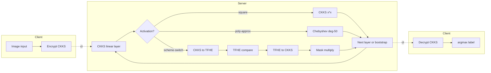
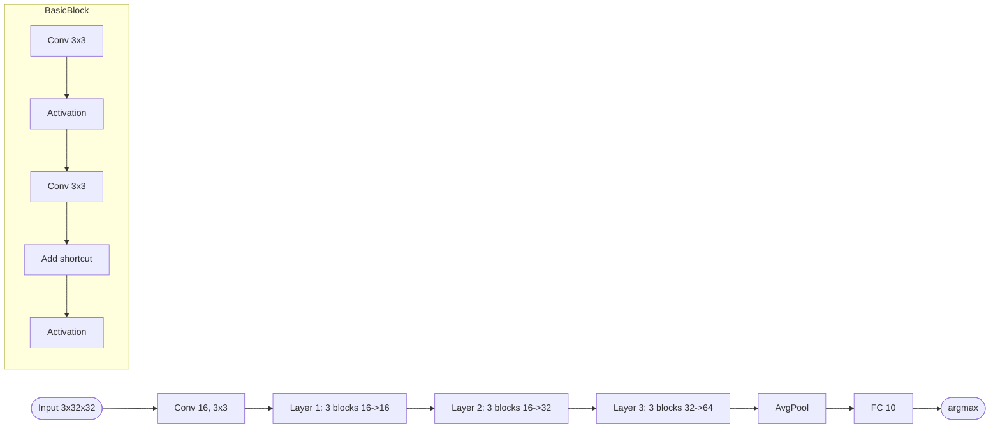
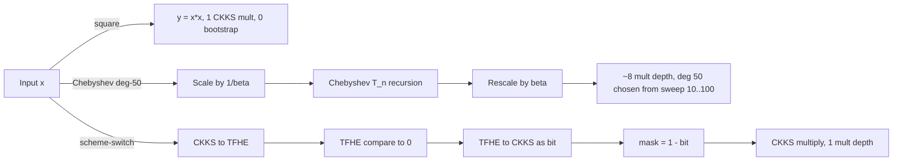

## TL;DR

The paper designs and benchmarks three FHE-friendly activation strategies — square, degree-50 Chebyshev polynomial approximation of ReLU, and a novel CKKS<->TFHE scheme-switching ReLU — across LeNet-5/MNIST and ResNet-20/CIFAR-10, showing that scheme-switching recovers 6 percentage points of accuracy over poly-approx on ResNet-20 at roughly 1.5x the inference latency [Abstract, §5.2].

## Problem and motivation

FHE natively supports only linear operations, which forces practitioners to either replace nonlinear activations (ReLU, sigmoid, tanh) with low-degree polynomial proxies (e.g. `x^2`) or approximate them with higher-degree polynomials, both of which trade accuracy for cost [§1, §4]. There has been "little systematic investigation regarding the contexts and model architectures where different activation functions perform best under FHE constraints" [§1]. Threat model: standard privacy-preserving outsourced inference — a user encrypts inputs under their public key, the cloud runs FHE inference on a (model-provider) model, and only the user can decrypt; an honest-but-curious server is assumed and "even in the event of a cloud breach, the user data and model stay protected" [§3.1, Fig. 1].

## Key contributions

- Design and implementation of the square activation and ReLU activation under FHE for ML inference [§1].
- A novel scheme-switching algorithm (Algorithm 3) that evaluates ReLU by switching CKKS ciphertexts to TFHE for the sign comparison, building a binary mask in CKKS, then masking the original ciphertext — consuming only one CKKS multiplicative depth [§4.3].
- Comprehensive evaluation of the three activations (square, Chebyshev poly-approx ReLU, scheme-switching ReLU) on LeNet-5 (MNIST) and ResNet-20 (CIFAR-10), quantifying the accuracy/latency trade-off and giving guidance on when each is appropriate [§1, §5.2].

## FHE setup

- **Scheme(s):** CKKS for linear layers; FHEW/TFHE used inside the scheme-switching ReLU for the comparison gate [§4.3, §5].
- **Library / implementation:** OpenFHE v1.2.3 (chosen because it is "the only FHE library that supports implementations for both CKKS and FHEW/TFHE gates") [§5].
- **Parameters:** ~128-bit security [§5.1]. CKKS polynomial degree 16384 with 8192 slots for LeNet-5; 32768 with 16384 slots for ResNet-20; 10 multiplications after bootstrap in both cases [Table 2].
- **Bootstrapping used:** Yes (CKKS bootstrapping). Bootstraps used per model: LeNet-5/square 0, LeNet-5/approx 4, LeNet-5/scheme-switch 0, ResNet-20/approx 18, ResNet-20/scheme-switch 8 [Table 1].
- **Packing / encoding strategy:** CKKS SIMD slot packing for parallel data processing on linear layers [§3.2, §4.3].

## ML setup

- **Task:** Encrypted image classification inference (LeNet-5/MNIST and ResNet-20/CIFAR-10) [§5.1].
- **Model architecture:**
  - LeNet-5: Conv(1->6, 5x5, pad 0, stride 1) -> Activation -> AvgPool -> Conv(6->16, 5x5) -> Activation -> AvgPool -> FC(256->120) -> Activation -> FC(120->84) -> Activation -> FC(84->10) [Fig. 2].
  - ResNet-20: Conv(3->16, 3x3, pad 1, stride 1) -> Layer 1 (3 BasicBlocks, 16->16) -> Layer 2 (3 BasicBlocks, 16->32, stride 2,1 with shortcut conv) -> Layer 3 (3 BasicBlocks, 32->64, stride 2,1 with shortcut conv) -> AvgPool -> FC [Fig. 3]. `nn_layers=20` follows the ResNet-20 naming convention (weight-bearing layers).
- **Activation handling:** Three variants under FHE:
  1. **Square**: `f(x)=x^2`, one CKKS multiplication, no bootstrap; smooth/differentiable but unbounded derivative `2x` causes exploding gradients in deep nets, so ResNet-20 training with square "was proved infeasible" [§4.1, Algorithm 1].
  2. **Chebyshev polynomial approximation of ReLU**: degree `D=50`, input scaled by `1/beta` so values lie in `[-1, 1]`, output rescaled by `beta` (Algorithm 2). Authors swept `D` from 10 to 100 and picked `D=50` as the best accuracy/cost trade-off; "consumes a noise budget equivalent to that of eight multiplications" [§4.2].
  3. **Scheme-switching ReLU** (Algorithm 3, novel): switch ciphertext from CKKS to TFHE, run a TFHE comparison to derive the sign, switch back to CKKS, build a `{0,1}` mask from `1 - sign-comp`, multiply by the original CKKS ciphertext — costs only one CKKS multiplicative depth and is enabled by both schemes sharing an LWE/RLWE base (CHIMERA-style switching, [BGGJ18]) [§4.3].
- **Operates on:** Plaintext model weights + encrypted data. Training is done in plaintext (PyTorch); weights are exported as CSV and loaded into the encrypted inference engine [§5.1].
- **Training vs inference:** Inference under encryption only.

## Datasets

| Dataset | Task | Size (train/test) | Modality | Notes |
|---|---|---|---|---|
| MNIST | Handwritten digit classification | Trained in PyTorch on full set; encrypted eval on 750 images from the MNIST validation set | 28x28 grayscale images | Two LeNet-5 variants trained — one with ReLU, one with square; weights exported as CSV [§5.1] |
| CIFAR-10 | 10-class image classification | Trained on full set; encrypted eval on 250 images from the CIFAR-10 validation set | 3x32x32 RGB images | Only ReLU training was feasible; square training "infeasible due to instability during backpropagation" [§5.1] |

## Pipeline diagram

### Pipeline steps (text)

1. Client encrypts the image under CKKS with their public key [§3.1, Fig. 1].
2. Server runs the convolution / FC layer on the CKKS ciphertext using SIMD slot packing [§3.2].
3. Server picks the activation strategy: (a) one CKKS multiplication for square, (b) degree-50 Chebyshev poly-approx of ReLU (after `1/beta` scaling), or (c) scheme-switch CKKS->TFHE for sign, switch back, build mask, multiply [§4.1, §4.2, §4.3].
4. Server bootstraps the CKKS ciphertext at planned points to refresh the noise budget (counts in Table 1) [§5.1, Table 1].
5. Server iterates layers (LeNet-5 conv-pool-FC stack, or 9 ResNet-20 BasicBlocks plus shortcut convs in Layer 2 and Layer 3) [Fig. 2, Fig. 3].
6. Server returns the encrypted logits to the client.
7. Client decrypts with their secret key and takes argmax [§3.1].

## Architecture diagram

### LeNet-5 (MNIST)

```mermaid
flowchart LR
    I([Input 1x28x28]) --> C1[Conv 6, 5x5]
    C1 --> A1[Activation]
    A1 --> P1[AvgPool]
    P1 --> C2[Conv 16, 5x5]
    C2 --> A2[Activation]
    A2 --> P2[AvgPool]
    P2 --> F[Flatten 256]
    F --> FC1[FC 120]
    FC1 --> A3[Activation]
    A3 --> FC2[FC 84]
    FC2 --> A4[Activation]
    A4 --> FC3[FC 10]
    FC3 --> O([argmax])
```

### ResNet-20 (CIFAR-10)

## Results

Reported on 750 MNIST validation images for LeNet-5 and 250 CIFAR-10 validation images for ResNet-20; latency was measured on the local AMD Ryzen 9 5900X (12-core, 64 GB RAM); the SOL supercomputer at ASU was used to speed up accuracy sweeps but not the reported latency [§5.1, §5.2].

| Metric | This paper | Baseline | Hardware |
|---|---|---|---|
| LeNet-5 / Square accuracy | 99.4% encrypted (-0.2 vs 99.6% plaintext) | -- | AMD Ryzen 9 5900X [§5.1, Table 3] |
| LeNet-5 / Square latency | 128 s / image | -- | AMD Ryzen 9 5900X [Table 3] |
| LeNet-5 / Poly-approx ReLU accuracy | 98.9% encrypted (-0.3 vs 99.2% plaintext) | -- | AMD Ryzen 9 5900X [Table 3] |
| LeNet-5 / Poly-approx ReLU latency | 95 s / image (best of the three) | -- | AMD Ryzen 9 5900X [Table 3] |
| LeNet-5 / Scheme-switch ReLU accuracy | 98.9% encrypted (-0.3 vs 99.2% plaintext) | -- | AMD Ryzen 9 5900X [Table 3] |
| LeNet-5 / Scheme-switch ReLU latency | 168 s / image (~1.7x poly-approx) | -- | AMD Ryzen 9 5900X [§5.2, Table 3] |
| ResNet-20 / Poly-approx ReLU accuracy | 83.8% encrypted (-8.4 vs 92.2% plaintext) | Lee et al. 2022 91.31% in 2,271 s; Kim & Guyot 2023 92.04% in 255 s; Rovida & Leporati 2024 91.53% in 260 s [§2] | AMD Ryzen 9 5900X [Table 3] |
| ResNet-20 / Poly-approx ReLU latency | 1,145 s / image | (see prior row) | AMD Ryzen 9 5900X [Table 3] |
| ResNet-20 / Scheme-switch ReLU accuracy | 89.8% encrypted (-2.4 vs 99.2% plaintext reported; ResNet-20 plaintext is listed as 99.2% in Table 3 row "ResNet Scheme Switch", likely a typo for the same ResNet-20 reference) | -- | AMD Ryzen 9 5900X [Table 3, §5.2] |
| ResNet-20 / Scheme-switch ReLU latency | 1,697 s / image (~1.5x poly-approx) | -- | AMD Ryzen 9 5900X [Table 3, §5.2] |

Headline: scheme-switching recovers ~6 percentage points of accuracy over Chebyshev poly-approx on ResNet-20 (89.8% vs 83.8%) at the cost of ~1.5x more inference latency [§5.2, Table 3].

## Limitations and assumptions

- The square activation cannot train ResNet-20 — exploding gradients during backprop make it "infeasible" for deep architectures [§4.1, §5.1].
- The Chebyshev poly-approx requires careful per-dataset/per-network selection of the scaling factor `beta` and consumes a noise budget "equivalent to eight multiplications" at degree 50, demanding ample multiplicative depth between bootstraps [§4.2].
- Scheme-switching ReLU still introduces some error (the TFHE comparison is not exact when fed back into CKKS), though "much smaller than those incur in the approximation when using low-degree polynomials" [§4.3].
- Encrypted evaluation uses only 750 MNIST and 250 CIFAR-10 images — accuracy figures rest on a small validation subset [§5.1].
- ResNet-20 plaintext accuracy in Table 3 row "ResNet Scheme Switch" is listed as 99.2% (apparent typo — the poly-approx row gives 92.2% for the same ResNet-20 plaintext model) [Table 3].
- Reported numbers are single-image, single-threaded on a consumer 12-core CPU; throughput / amortized cost across batches is not reported.

## Related work it compares against

CryptoNets [GBDL+16], CryptoDL [HTG17], HCNN/AlexNet-on-FHE [ABJL+20], E2DM [JKLS18], DiNN [BMMP17], Benamira et al. TFHE-CNN [BP23], Lee et al. 2022 [LKL+22], Kim & Guyot 2023 [KG23], Rovida & Leporati 2024 [RL24]; hybrid FHE+MPC systems Gazelle, MiniONN, XONN are mentioned but considered out of scope [§2].

## Code and artifacts

Not released.

## Extra diagrams

### Activation approximation

Key approximation details from the paper:

- **Square**: `f(x) = x^2`; one CKKS multiplication; smooth, differentiable; derivative `2x` is unbounded so deep nets explode [§4.1, Eq. 2, Algorithm 1].
- **Chebyshev poly-approx of ReLU**: uses the orthogonal Chebyshev family `T_0(x)=1`, `T_1(x)=x`, `T_n(x) = 2 x T_{n-1}(x) - T_{n-2}(x)` on `[-1,1]`; ReLU is approximated as a weighted sum of `T_n`; data is pre-scaled by `1/beta` and rescaled by `beta` after evaluation (Algorithm 2); the chosen degree is `D = 50`, picked from a sweep of `D in [10, 100]` as the best accuracy-vs-noise-budget trade-off; the deg-50 evaluation "consumes a noise budget equivalent to that of eight multiplications" [§4.2, Eqs. 4-8].
- **Scheme-switching ReLU** (Algorithm 3): given encrypted `c_enc` and a zero-reference `c_sec`, both are switched to TFHE, `TFHECompare` produces a `{0,1}` indicator of sign, the result is switched back to CKKS, a plaintext `1`-mask is built with `vector_size` slots, `c_sign = mask - c_comp`, then `c_result = c_sign * c_enc`. The whole operation consumes a single CKKS multiplicative depth [§4.3].

See Figures 2 and 3 in the paper for the LeNet-5 and ResNet-20 layer-level diagrams.

## Open questions

- Was bootstrapping latency itself measured separately from layer compute, and how much of the 1,145 s / 1,697 s ResNet-20 figures is bootstrap overhead? The bootstrap counts (18 vs 8) in Table 1 suggest scheme-switching actually does fewer bootstraps, which is interesting given its higher latency.
- The Table 3 plaintext accuracy for ResNet-20 in the "Scheme Switch" row (99.2%) is inconsistent with the poly-approx row's 92.2% for the same ResNet-20 architecture — assumed typo.
- No code or artifact release is mentioned, so reproducing the scheme-switching `beta` choices and bootstrap placements requires reimplementation against OpenFHE v1.2.3.
- The paper does not report ciphertext sizes, communication cost, or memory footprint, so direct comparison to Rovida & Leporati's 15.1 GB memory figure [RL24] is not possible.
