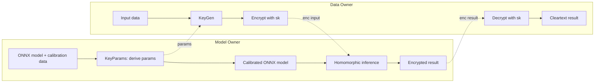
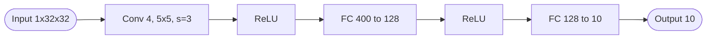
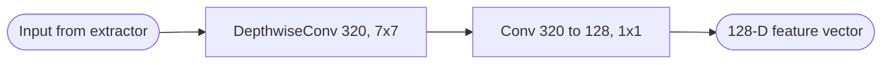
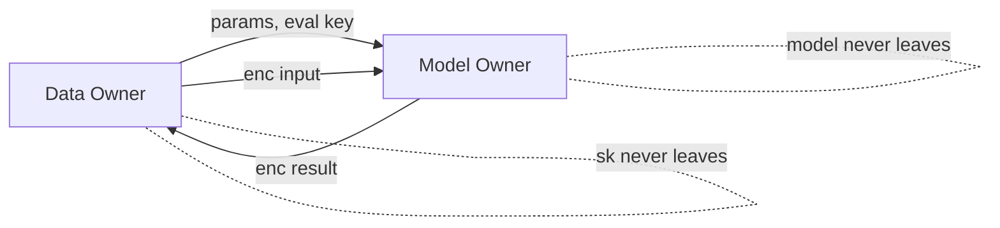

## TL;DR

HE-MAN is an open-source two-party toolset (HE-MAN-Concrete + HE-MAN-TenSEAL) for homomorphic inference of ONNX models, automating encryption-parameter selection so that non-FHE-experts can perform privacy-preserving inference with on-par accuracy versus plaintext, at the cost of several-orders-of-magnitude latency [Abstract][§1].

## Problem and motivation

MLaaS providers want to keep their model weights/architecture private while clients want to keep input data private. FHE addresses both, but is rarely integrated because existing tools require FHE expertise, lack ML-framework integration, or force polynomial-only activations [Abstract][§1]. Threat model: semi-honest (honest-but-curious) model owner and data owner; if a cloud server is used it is also semi-honest. Model inversion and model-extraction attacks are out of scope [§3].

## Key contributions

- First framework to unify Concrete (TFHE) and TenSEAL (CKKS) under one ONNX-driven interface [§1].
- Supports arbitrary ONNX-format pretrained models out of the box [§1].
- User-friendly CLI requiring no FHE expertise from either party [§1, §5.1].
- HE-MAN-Concrete enables exact (non-approximated) nonlinear activations such as ReLU via programmable bootstrapping [§1, §2.2].
- HE-MAN-TenSEAL supports an arbitrary number of convolutions at arbitrary positions (lifting the TenSEAL "single first-layer conv" restriction) [§1, §5.6].
- Automatic derivation of cryptographic parameters from the model + calibration data [§4.2, §5.3].

## FHE setup

- **Scheme(s):** TFHE/CGGI (via Concrete) and CKKS (via TenSEAL) — selected per tool [§2.2].
- **Library / implementation:** Concrete v0.1 [18] and TenSEAL v0.3.12 (Python wrapper over Microsoft SEAL v4.0) [§2.2].
- **Parameters:** Concrete λ=128: RLWE N=4096, σ=2^-62, LWE k=938, σ=2^-23 (also λ=80 set provided) [Table 2]. TenSEAL CKKS at λ=128 with (log₂N, log₂q) pairs (12,109), (13,218), (14,438), (15,881) [Table 2]. Per-network: CryptoNets uses log₂N=13, log₂q=218, d_m=7; LeNet-5 uses log₂N=14, log₂q=437, d_m=15; MobileFaceNets-classifier uses log₂N=15, log₂q=228, d_m=2 [Table 5].
- **Bootstrapping used:** Yes — programmable bootstrapping (PBS) in HE-MAN-Concrete (frequent, with a "bootstrap folding" optimization). HE-MAN-TenSEAL uses leveled CKKS, no bootstrapping [§2.2, §5.5].
- **Packing / encoding strategy:** TenSEAL/CKKS uses SIMD batching with one ciphertext holding all values of an ONNX edge (a whole layer's tensor) [§5.6]. Concrete operates per-value with bootstrap stack folding [§5.5].

## ML setup

- **Task:** Inference (forward pass only). Classification (MNIST digits) and face verification (LFW) [§6].
- **Model architecture:** CryptoNets (1 Conv + 2 FC, ReLU, 52,722 params); LeNet-5 (3 Conv + 2 FC with AvgPool layers, ReLU, 61,706 params); MobileFaceNets-classifier (1 DepthwiseConv 320→320 7x7 + 1 Conv 320→128 1x1, no activation, 56,960 params) [Table 4, Table 7]. PReLU replaced by ReLU in MobileFaceNets and 2nd-to-last conv channel count reduced to fit N=2^15 CKKS ciphertext [§6.1].
- **Activation handling:** HE-MAN-Concrete computes ReLU exactly via PBS [§1]. HE-MAN-TenSEAL approximates ReLU with OLS polynomials of degree 1/3/7; chosen default is OLS3 with mean±3σ interval calibration (multiplicative depth 2, log₂N=14) [§5.6, Table 3].
- **Operates on:** plaintext (calibrated) model + encrypted data; the model is never sent to the data owner [§3, §4.3].
- **Training vs inference:** Inference only; pretrained models are required [§8].

## Datasets

| Dataset | Task | Size (train/test) | Modality | Notes |
|---|---|---|---|---|
| MNIST | Handwritten-digit classification | Standard split; full 10,000 test for cleartext, 1,000 samples for FHE eval | 28x28 grayscale images, zero-padded to 32x32 | Used for CryptoNets and LeNet-5 [§6, §6.1, §6.2] |
| CASIA Webface | Face-recognition training | ~490k cropped+aligned RGB faces 112x112x3 | Images | Training set for MobileFaceNets [§6.1] |
| LFW (Labeled Faces in the Wild) | Face verification | 6,000 pairs cleartext, 1,000 samples for FHE eval | RGB images | Test set; cosine similarity threshold for same-person decision [§6.1] |

## Pipeline diagram

### Pipeline steps (text)

1. Model owner runs `keyparams` on the ONNX model plus a calibration dataset and chosen security level (λ=128 by default) to derive encryption parameters and a calibrated ONNX model annotated with per-edge value-domain bounds [§4.2, §5.1].
2. Parameters are sent to the data owner, who runs `keygen` to produce a secret key and an evaluation key [§4.2].
3. Data owner encrypts the input with the secret key and sends the ciphertext (plus the evaluation key, once) to the model owner [§4.3].
4. Model owner performs the homomorphic forward pass over the calibrated ONNX model using the evaluation key, executing batched/contracted ops and (for Concrete) folded bootstraps [§4.3, §5.4, §5.5].
5. The encrypted result is returned to the data owner, who decrypts it with the secret key [§4.3].

## Architecture diagram

### CryptoNets (MNIST)

### LeNet-5 (MNIST)

```mermaid
flowchart LR
    I([Input 1x32x32]) --> C1[Conv 6, 5x5]
    C1 --> A1[ReLU]
    A1 --> P1[AvgPool 2x2]
    P1 --> C2[Conv 16, 5x5]
    C2 --> A2[ReLU]
    A2 --> P2[AvgPool 2x2]
    P2 --> C3[Conv 120, 5x5]
    C3 --> A3[ReLU]
    A3 --> FC1[FC 120 to 84]
    FC1 --> A4[ReLU]
    A4 --> FC2[FC 84 to 10]
    FC2 --> O([Output 10])
```

### MobileFaceNets classifier (LFW, FHE portion only)

## Results

Latencies are mean per-sample inference times measured on 1,000 samples; cleartext accuracy and architecture sizes are taken from Table 4; HE accuracies/latencies from Table 6 [§6.2].

| Metric | This paper | Baseline (cleartext) | Hardware |
|---|---|---|---|
| MNIST CryptoNets acc., HE-MAN-Concrete | 0.968 | 0.975 | AMD Ryzen 7 2700X 8-core, 64 GB RAM |
| MNIST CryptoNets acc., HE-MAN-TenSEAL | 0.924 | 0.975 | AMD Ryzen 7 2700X 8-core, 64 GB RAM |
| MNIST CryptoNets latency, Concrete | 112 s | N/A | AMD Ryzen 7 2700X |
| MNIST CryptoNets latency, TenSEAL | 8 s | N/A | AMD Ryzen 7 2700X |
| MNIST LeNet-5 acc., Concrete | 0.984 | 0.991 | AMD Ryzen 7 2700X |
| MNIST LeNet-5 acc., TenSEAL | 0.789 | 0.991 | AMD Ryzen 7 2700X |
| MNIST LeNet-5 latency, Concrete | 1672 s | N/A | AMD Ryzen 7 2700X |
| MNIST LeNet-5 latency, TenSEAL | 236 s | N/A | AMD Ryzen 7 2700X |
| LFW MobileFaceNets-cls acc., Concrete | 0.970 | 0.990 | AMD Ryzen 7 2700X |
| LFW MobileFaceNets-cls acc., TenSEAL | 0.972 | 0.990 | AMD Ryzen 7 2700X |
| LFW MobileFaceNets-cls latency, Concrete | 68 s (also stated 69 s) | N/A | AMD Ryzen 7 2700X |
| LFW MobileFaceNets-cls latency, TenSEAL | 196 s (also stated 208 s) | N/A | AMD Ryzen 7 2700X |
| Per-MNIST-sample communication | 8 MB (Concrete), 2 MB (TenSEAL) | N/A | excludes one-time eval-key transfer |

Comparison data points cited in-paper: Cheetah (SMPC) evaluates a MiniONN-sized network in 3.55 s and ResNet50 in 80.3 s, but with 30 MB and 2.3 GB communication respectively [§7.1].

## Limitations and assumptions

- Inference is several orders of magnitude slower than plaintext [Abstract].
- HE-MAN-TenSEAL's auto-selected parameters cause a substantial LeNet-5 accuracy drop (0.991 → 0.789); the authors note accuracy could be improved with N=2^15 at the cost of further runtime, or by training with polynomial activations (which they reject as uncommon) [§6.2].
- HE-MAN-TenSEAL's encryption parameters leak max multiplicative depth and intermediate-value domain, partially exposing model complexity [§3, §4.4].
- Training under FHE is not supported; pretrained models are required [§8].
- MobileFaceNets must be split (only the "classifier" runs under FHE; the "extractor" is computed locally by the data owner) because the full network is too complex for FHE; one conv layer's channel count was also reduced [§6.1].
- Evaluation runs use only 1,000 samples per FHE experiment due to long execution times [§6.2].
- Model inversion and model extraction attacks are explicitly out of scope [§3].
- No GPU support evaluated; performance fully bound by backend libraries [§8].

## Related work it compares against

CryptoNets [28], low-latency follow-ups [11], discretized-NN inference [9], SMPC frameworks CrypTFlow2 [46], CrypTen [33], hybrid FHE+SMPC systems Gazelle [32], Delphi [40], Cheetah [31], Muse [37], FHE compilers nGraph-HE / nGraph-HE2 [7,8], SEALion [53], CHET [21] and EVA [22], HeLayers [2], PlaidML-HE [14], and HECO [54] [§7].

## Code and artifacts

Open-source. HE-MAN-Concrete: https://github.com/smile-ffg/he-man-concrete. HE-MAN-TenSEAL: https://github.com/smile-ffg/he-man-tenseal [Appendix B]. License not explicitly stated in the text (paper itself is CC BY 4.0).

## Extra diagrams (optional)

### Threat model

### Activation approximation

See Figure 3 and Table 3 in paper. HE-MAN-TenSEAL approximates ReLU with ordinary-least-squares polynomials of degree 1 (OLS1, depth 1), 3 (OLS3, depth 2) and 7 (OLS7, depth 3) over either [min,max] or [μ−3σ, μ+3σ] intervals derived from calibration data. OLS3 with mean-std calibration is selected as the default trade-off; OLS7 with min-max gives best accuracy at log₂N=15. OLS1 is unusable [§5.6, Table 3].

## Open questions

- Exact license of the released repositories is not stated in the paper.
- The MobileFaceNets HE latency figures differ between text (69 s / 208 s) and Table 6 (68 s / 196 s); the table values are taken as canonical here.
- Wall-clock cost of `KeyParams`/`KeyGen` (one-time setup) is not reported.
- Memory footprint and ciphertext sizes per network are not given (only per-sample communication for MNIST).
