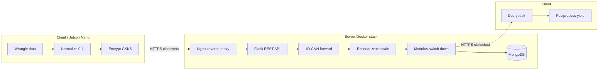
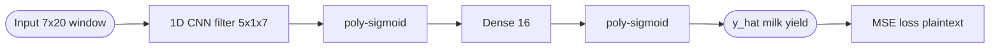
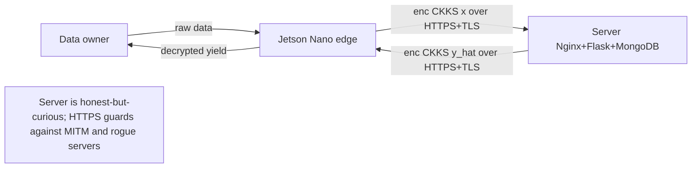

## TL;DR

The paper presents EDLaaS, a Dockerized client-server system that runs encrypted inference of a 1D CNN under CKKS to forecast dairy milk yields, achieving an MAPE of 12.4% (87.6% accuracy) on a 30-year dataset from the Langhill Dairy herd while keeping data private end-to-end [Abstract][§3]. It is one of the first encrypted-deep-learning works to target *sequence* data and a real-world agri-food problem rather than image classification [§1].

## Problem and motivation

Agri-food stakeholders are hesitant to share commercially sensitive data (genetics, feed composition, yields) needed to train ML models, blocking collaborations on yield forecasting and sustainability [§1.1]. FHE removes the need to trust the data processor: the server computes on ciphertexts without ever holding the secret key [§1.1]. The threat model is an honest-but-curious / potentially malicious data processor — the authors keep HTTPS on top of FHE specifically to defend against application-layer attacks such as MITM and unauthenticated servers that could return purposefully wrong predictions [§2]. Prior FHE-DL work focused on CNNs over images (MNIST, CIFAR) and had not been validated on sequence data or in realistic client-server deployments [§1].

## Key contributions

- Test FHE feasibility on a new agri-food application: dairy milk-yield forecasting [§1.1].
- Evaluate encrypted deep learning *as a service* (EDLaaS) in a containerized client-server pipeline with Nginx, Flask, WSGI, MongoDB [§2, Fig. 1].
- Show that *sequence* models can be built in FHE-compatible form using 1D CNNs (substituting time for space) [§1.1][§2.4.1].
- Open-source Python-ReSeal library that wraps MS-SEAL with first-class serialization and FHE-DL abstractions [§2.3][Ref 22].
- Empirical demonstration that ciphertext loss matches plaintext loss to 3 s.f. on the same network [§3, Table 3].

## FHE setup

- **Scheme(s):** CKKS (Cheon-Kim-Kim-Song), leveled (treated as FHE but no bootstrapping) [§2.3][§4].
- **Library / implementation:** Microsoft SEAL (MS-SEAL) via authors' own Python-ReSeal bindings [§2.3][Ref 22].
- **Parameters:** Polynomial modulus degree 8192 (length 4096) and 16,384 (length 8192) reported [§3, Table 4]; security level, scale, and full coefficient-modulus chain not reported.
- **Bootstrapping used:** No — MS-SEAL did not support it; authors stay within noise budget and call it leveled-FHE (LFHE) [§2.3][§4].
- **Packing / encoding strategy:** CKKS SIMD batching; vector slots are largely empty (one sample per ciphertext), authors note multi-example packing as future optimization [§2.1.1].

## ML setup

- **Task:** Time-series regression — predict the next (21st) weekly milk yield from a rolling window of 20 prior time-points [§2.1.1].
- **Model architecture:** 1D CNN with filter shape (5, 1, 7), bias 0 → sigmoid (poly) → Dense with weight shape (16), bias 0 → sigmoid (poly) → MSE loss [§2.4][Table 1][Fig. 4]. Batch size 3 [§2.4.1].
- **Activation handling:** Sigmoid replaced by the Chen et al. cubic polynomial approximation σ(x) ≈ 0.5 + 0.197x − 0.004x³, accurate in [−5, 5]; data normalized to [0,1] keeps activations in range [§2.4.1, Eq. 4][Fig. 5].
- **Operates on:** Plaintext model weights + encrypted input data; forward pass on ciphertext, loss/backprop in plaintext [§1][§2.4.2].
- **Training vs inference:** Encryption used for *inference* (and the forward pass during training). Backward pass and weight update (Adam, α=0.001, β₁=0.9, β₂=0.999) are computed in plaintext [§2.4.2][§2.4.3].

## Datasets

| Dataset | Task | Size (train/test) | Modality | Notes |
|---|---|---|---|---|
| Langhill Dairy herd (SRUC, Dumfries) | Milk-yield regression (sequence) | 40,389 train / 17,309 test (further 70-30 train/val split inside training) from 57,698 sequences derived from 93,283 time-points | Tabular time series, 7 numeric/derived features × 21 time-points per cow | 30 years of breeding/feeding/yield data; normalized to [0,1] with z = (x−min)/(max−min); categoricals one-hot; temporal 70-30 split [§2.1.1] |

## Pipeline diagram

### Pipeline steps (text)

1. Owner uploads raw milk-yield data via dashboard to Jetson Nano edge device [§2.2].
2. Edge device wrangles 7 features × 20-week rolling window and normalizes to [0,1] [§2.1.1].
3. Edge device CKKS-encrypts the input with a locally held secret key and serializes the ciphertext [§2.1.2].
4. Ciphertext is sent over HTTPS to the server (Nginx reverse-proxy + load-balanced Flask/WSGI containers) [§2.1.3][Fig. 1].
5. Server runs encrypted forward pass of the 1D CNN, applying relinearization and rescaling after each ciphertext multiplication [Fig. 1].
6. Server modulus-switches down to the smallest ciphertext before storing/returning the result [§2.1.3].
7. Server returns ciphertext over HTTPS to client; client decrypts with secret key and post-processes the predicted yield [§2.1.3].

## Architecture diagram

## Results

| Metric | This paper | Baseline | Hardware |
|---|---|---|---|
| MAPE / accuracy on milk yield | 12.4% MAPE / 87.6% accuracy [§3] | Same architecture in plaintext: identical to 3 s.f. [Table 3] | LAN, MS-SEAL via Python-ReSeal |
| MSE (test) ciphertext vs plaintext | 0.02233 / 0.02233 [Table 3] | — | LAN |
| MAE (test) ciphertext vs plaintext | 0.1241 / 0.1241 [Table 3] | — | LAN |
| Single inference latency | 0.966 s local; 3.13 s remote (incl. transmission) [Table 2] | — | Local LAN; CPU model not reported |
| Encryption | 0.0136 s local; 0.454 s remote [Table 2] | — | LAN |
| Decryption | 0.0330 s local; 1.14 s remote [Table 2] | — | LAN |
| Cipher×Cipher mul | 0.277 s [Table 2] | Cipher×Plain mul: 0.0500 s | LAN |
| Ciphertext size (len 8192, poly-mod 16,384) | 9,600,592 bytes (≈9.60 MB) vs plaintext NumPy 65,648 bytes (≈0.0656 MB) [Table 4] | — | — |

## Limitations and assumptions

- Backpropagation, loss, and weight updates are computed in plaintext — the trained weights may still leak the data distribution, particularly for generative models [§3][§4].
- No bootstrapping (MS-SEAL limitation), so circuit depth is bounded by the chosen modulus chain [§2.3][§4].
- Ciphertext is ~146× larger than the plaintext NumPy array at poly-mod-degree 16,384 [Table 4]; serialization overhead from C++→Python flagged as not yet optimized [§3].
- Specific CKKS security level, scale, and coefficient modulus values are not reported; CPU model used for benchmarks is not reported (only "local LAN") [§3].
- All measurements were taken on a LAN, not a WAN, removing realistic network latency/jitter [§3].
- Argmax / final decisions still require plaintext at the client [§1].
- Dataset is confidential and cannot be shared, limiting reproducibility [Data Availability].
- Ciphertext×ciphertext operations require identical parameters and the same secret key, which blocks naive encrypted-weight training across multiple data owners [§4].

## Related work it compares against

CryptoNets (Gilad-Bachrach et al.) [Ref 1]; Lee et al. 2021 CKKS deep CNN on CIFAR-10 [Ref 5]; GAZELLE (Juvekar et al., BFV via PALISADE) [Ref 6]; DOReN (Meftah et al.) [Ref 4]; Marcano et al. FHE-DL [Ref 3]; Ali et al. polynomial-ReLU [Ref 12]; Chen et al. logistic regression over CKKS (source of the sigmoid approximation) [Ref 23].

## Code and artifacts

Python-ReSeal: https://github.com/DreamingRaven/python-reseal [Ref 22]. License: OSLv3 [§2.3].

## Extra diagrams (optional)

### Threat model

### Activation approximation

Sigmoid is replaced by σ(x) ≈ 0.5 + 0.197x − 0.004x³ (Chen et al., cubic) [Eq. 4]. Approximation is faithful on [−5, 5]; outside this range it diverges. Authors normalize inputs to [0,1] and keep filter/dense weights initialized within [0,1] (and divided by filter size 5·1·7=35) so the sum-of-products stays below 1 and activations remain inside the approximation's "golden range" [§2.4.1][Fig. 5].

## Open questions

- What CKKS scale, security level (128-bit?), and full coefficient-modulus chain were used? Not reported [§2.3].
- Exact server-side CPU specification (cores, frequency, RAM) is omitted, making the 0.966 s inference number hard to compare against other CKKS papers [Table 2].
- How does ciphertext size grow with longer sequence windows, and at what depth does the leveled budget run out without bootstrapping?
- Multi-tenant key management: how would the system scale when many data owners each hold a distinct CKKS secret key, given that ciphertext×ciphertext ops require shared parameters? [§4].
