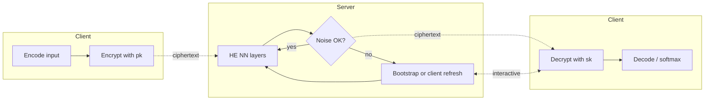
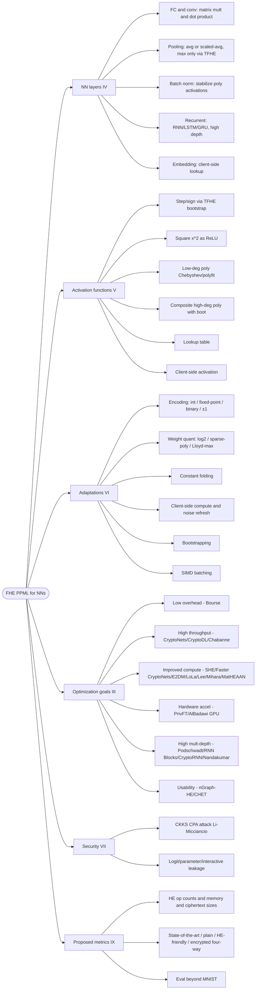
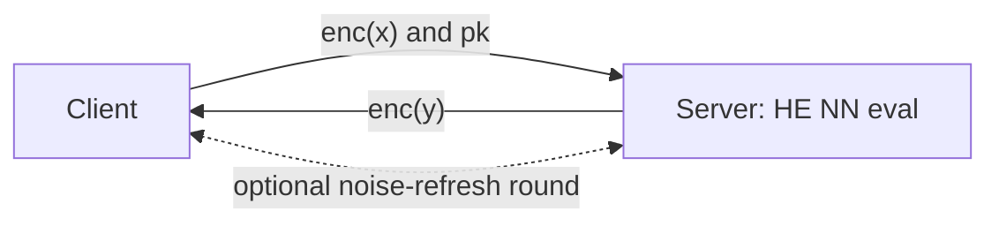

## TL;DR

A survey of FHE-based privacy-preserving deep learning that analyzes how researchers adapt neural networks to HE constraints (layers, activations, encoding, packing, bootstrapping, client-side help) and proposes hardware-independent metrics for fair cross-paper comparison [Abstract, p. 117477; §IX, p. 117494-117496].

## Problem and motivation

Machine Learning as a Service (MLaaS) forces a client to share possibly sensitive data with a server, while the server has its own model-privacy concerns; FHE lets a third party compute on encrypted data without seeing it, but using FHE with NNs introduces multiplicative-depth limits, restricted operations, and large computational overhead [§I, p. 117477-117478]. The survey scopes itself to FHE for neural networks only, excluding broader cryptography surveys, PPML library benchmarks, and FHE compiler SoKs [§I, p. 117478]. Threat model is the standard MLaaS setup: an honest-but-curious server runs encrypted inference (or rarely training) on the client's ciphertexts; the server learns neither input nor output [§II-A, p. 117478-117479].

## Key contributions

- Reviews state-of-the-art deep-learning + FHE works, grouped by what they optimize: low overhead, high throughput, improved computation, hardware acceleration, high-multiplicative-depth handling, and usability [§III, p. 117481-117483].
- Catalogues how each common NN layer (fully-connected, convolutional, pooling, batch-norm, recurrent, embedding) is made HE-friendly, with Table 4 cross-mapping studies to supported layers [§IV, p. 117483-117486].
- Surveys activation-function strategies under FHE: step/sign, square, low-degree polynomial approximations (Chebyshev, minimax, polyfit), high-degree composite poly ReLU with bootstrapping, lookup tables, learned poly coefficients, and client-side activations [§V, p. 117486-117488].
- Catalogues HE-constraint adaptations: data encoding (integer scaling, fixed-point, binary, ±1), weight quantization (log2, Lloyd-max, sparse polynomial), constant folding, client-side computation, bootstrapping, and SIMD batching [§VI, p. 117488-117490].
- Discusses security limits: chosen-plaintext attack on CKKS (Li & Micciancio), 80- vs 128-bit choices, and information leakage from logits / crypto parameters / interactive noise removal [§VII, p. 117490-117492].
- Proposes resource-independent evaluation criteria for PPML papers: HE op counts, max memory, ciphertext/key sizes, communication broken down by object, and a three-way (state-of-the-art / plaintext / HE-friendly / encrypted) performance comparison, plus a call to evaluate beyond MNIST [§IX, p. 117494-117496].

## FHE setup

- **Scheme(s):** Surveys YASHE (insecure under subfield attack [51]), BGV, BFV (integer message space), CKKS / HEAAN (approximate real numbers), and TFHE (single bits over the torus, no SIMD) [§II-C through §II-E, p. 117479-117481; Table 1].
- **Library / implementation:** PALISADE (BFV/BGV/CKKS/TFHE), HElib (BGV/BFV/CKKS, bootstrapping only for BGV/BFV), Microsoft SEAL (CKKS/BFV without bootstrapping), HEAAN (the only library with CKKS bootstrapping), TFHE library [§II-E, p. 117481; Table 6].
- **Parameters:** Not reported at the survey level; the survey notes that 80-bit security is common in surveyed works ([60], [76], [81], [85]) while 128-bit is used in CryptoDL [63], RNN Blocks [83], and Faster CryptoNets [66] [§VII-B, p. 117492].
- **Bootstrapping used:** Discussed as a core trade-off — Bourse et al. bootstrap after every layer [60]; Lee et al. bootstrap during ReLU poly approx and after convolutions for ResNet-20 [70]; Jang et al. bootstrap GRUs after each sequence element [76]; Nandakumar et al. bootstrap after every forward/backward layer during training [85]; most other works avoid it via leveled HE [§VI-E, p. 117489; §IV-D, p. 117486].
- **Packing / encoding strategy:** Survey covers SIMD batching (one feature × many instances per ciphertext, e.g. CryptoNets batch=4096 [61], RNN Blocks up to 32,768 [83]), ciphertext packing schemes (E2DM matrix packing [68], PrivFT vertical embedding packing [78], Brutzkus et al. switchable packings [69], Lee et al. strided-conv packing [70], Mihara et al. diagonal matrix packing [75]), and CRT plaintext decomposition for deeper nets [81]. TFHE-based works (SHE [65]) cannot use SIMD [§IV-A, §VIII-F, p. 117484-117485, 117489].

## ML setup

- **Task:** Mostly NN inference; a small subset covers training on encrypted data (Mihara et al. [75], PrivFT [78], Nandakumar et al. [85]) [§IV-G, p. 117490].
- **Model architecture:** Surveyed architectures include CryptoNets-style shallow CNNs [61], [62], [63], Faster CryptoNets [66], E2DM [68], LoLa-style efficient packing [69], SHE [65] (incl. LSTMs and a model evaluated on ImageNet), ResNet-20 via Lee et al. [70], CNNs on GPU via PrivFT [78] and Al Badawi et al. [81], simple RNNs and parallel RNN Blocks [82], [83], CryptoRNN [84], MatHEAAN GRUs [76], and fully-connected encrypted training networks [85] [§III, §IV, p. 117481-117486]. Layer-count convention: this survey does not impose one; counts are taken from the surveyed papers.
- **Activation handling:** Reviewed in detail in §V (p. 117486-117488): step/sign function under custom TFHE bootstrap [60]; ReLU on TFHE binary gates [65]; square x^2 as ReLU stand-in (Cryptonets and many others [61], [63], [64], [68], [69], [75], [81], [84], [86]); even-degree poly ReLU via numpy polyfit on the normal distribution [62]; Chebyshev-based poly approximations [63] (degree 3 Tanh used in [82], [83]); composite poly sign for ReLU with degrees 7/15/27 [70]; minimax poly softmax `1/8 x^2 + 1/2 x + 1/4` [78]; degree-12 exponential + Goldschmidt division for softmax [70]; learned poly activation coefficients (CHET [87], nGraph-HE [86], Jang et al. [76]); sigmoid lookup table [85]; client-side activation (CryptoRNN [84], Podschwadt and Takabi [82]).
- **Operates on:** Predominantly encrypted-data / plaintext-model inference; PrivFT [78] and Nandakumar et al. [85] additionally evaluate encrypted-data + encrypted-model training [§III-D, p. 117482; §IV-G, p. 117490].
- **Training vs inference:** Both are covered, but the survey concludes "training on encrypted data does not seem very practical at this point" given e.g. 666.7 h (~28 days) per MNIST epoch projected for Nandakumar et al. [85] and 120 h for PrivFT [78] on YouTube spam [§IV-G, p. 117490; §VIII-B, p. 117494].

## Datasets

| Dataset | Task | Size (train/test) | Modality | Notes |
|---|---|---|---|---|
| MNIST | Hand-written digit classification | 60,000 / 10,000, 28×28 grey | Images | Most widely used; survey warns "strategies that work on MNIST do not necessarily work on other datasets" [§VIII-A, p. 117492] |
| CIFAR-10 | Image classification | 50,000 / 10,000, 32×32×3 = 3072 px | Color images | Closer to real-world; used by [63], [65], [66], [81], [87] [§VIII-A, p. 117493] |
| ImageNet | Image classification | ~1M images, 224×224×3 = 150,528 px, 1001 classes | Color images | Only SHE [65] tackles it [§VIII-A, p. 117493] |
| IMDB movie reviews | Text classification | 50,000 reviews, positive/negative | Text | Used by [78], [82], [83] [§VIII-A, p. 117493] |
| YouTube Spam Collection | Spam classification | ~2000 instances; encrypted training set ≈ 550 GB | Text | PrivFT training benchmark [78] [§VIII-B1, p. 117493] |
| iDASH-style / speech / medical sets | Various | Varies | Speech, medical, tabular | Mentioned in passing via [64] (encrypted speech recognition) and Faster CryptoNets [66] medical eval [§III-B, §VIII-B1, p. 117482, 117493] |

## Pipeline diagram

Generic HE-PPML server-side flow, with the optional interactive noise-removal loop that several surveyed works require [§VI-D, p. 117489].

### Pipeline steps (text)

1. Client encodes data (fixed-point, integer-scaled, binary, or ±1) and encrypts with the public key [§VI-A, p. 117488].
2. Server runs HE-compatible NN layers (FC, conv, pooling, batch-norm, recurrent, embedding) over the ciphertext [§IV, p. 117483-117486].
3. As noise accumulates, server either bootstraps locally (Bourse, Lee, Nandakumar, Jang [60], [70], [85], [76]) or interactively asks the client to decrypt-re-encrypt for noise refresh (CryptoRNN, Podschwadt and Takabi [84], [82]) [§VI-D, §VI-E, p. 117489].
4. Server returns the encrypted output (often logits, leaving softmax / beam search to the client) [§VII-B, p. 117491].
5. Client decrypts and post-processes (softmax, beam-search decoding, argmax) [§VIII-C, p. 117494].

## Architecture diagram

The survey is taxonomic rather than a single model; the diagram depicts the survey's classification of design choices (Sections IV-VI) and the major works mapped onto each branch.

## Results

The survey aggregates numbers from the surveyed papers in Table 7. Hardware is rarely normalized; the survey itself flags this as a comparability problem [§VIII-B3, IX-A, p. 117494-117495]. Headline numbers it cites:

| Metric | This paper (cited work) | Baseline | Hardware |
|---|---|---|---|
| CryptoNets [61] MNIST batched | 250 s for a batch; ~0.06 s amortized per instance | First HE-NN baseline | Not reported |
| LoLa / Brutzkus et al. [69] MNIST | 2.2 s for one instance via ciphertext packing (same model as CryptoNets) | CryptoNets 250 s | Not reported |
| nGraph-HE [86] MNIST | 16.7 s batched total, ~0.004 s per instance | CryptoNets | Not reported |
| E2DM [68] MNIST | 17.4 MB ciphertext transfer | 330-410 MB for batched MNIST works [61], [63], [66] | Not reported |
| CHET [87] CIFAR-10 | 164.7 s | Brutzkus et al. 711 s on CIFAR-10 | Not reported |
| Al Badawi et al. [81] CIFAR-10 GPU | 553 s single GPU, 304 s on 4 GPUs | CHET 164.7 s on CPU | NVIDIA GPUs, ≤16 GB each |
| Hesamifard / Faster CryptoNets / SHE on CIFAR-10 (no packing) | 3,300-12,000 s; SHE with bootstrapping projected 42.5M s (492 days) | CHET 164.7 s | Not reported |
| Lee et al. [70] ResNet-20 on CIFAR-10 | ~3 h per image, 92.43% accuracy (best in survey); 31.6% time in inter-layer bootstrap | — | Not reported |
| Jang et al. [76] GRU on MNIST | 90 s per sequence element (28 elements); 94.2% accuracy | — | Not reported |
| Nandakumar et al. [85] MNIST training | 40 min per minibatch of 60; projected 666.7 h (~28 days) per epoch | — | Not reported |
| PrivFT [78] YouTube Spam training | 120 h on 8 GPUs in parallel; 550 GB encrypted training set | — | 8 GPUs |
| Mihara et al. [75] training | 29 h for 400 epochs on a "tiny dataset" | — | Not reported |
| Faster CryptoNets [66] CIFAR-10 memory | 1,433.6 GB | Al Badawi GPU 187 GB total | Commodity vs. GPU |
| SHE [65] ImageNet ciphertext | 7.7 GB per image | — | Not reported |
| RNN Blocks [83] client transfer | 8.75-100 GB depending on input split | Podschwadt and Takabi [82] 15.2 GB incl. interactive | Not reported |

## Limitations and assumptions

- The survey is scoped to NN + FHE; it deliberately excludes broader crypto/PPML library/FHE-compiler SoKs and MPC-only or DP-only work [§I, p. 117478].
- Reported runtimes across works "are too different for a direct comparison" because hardware varies from laptops to ~100-core servers, and source code is released by only ~half of surveyed papers [§IX-A, p. 117495].
- Most surveyed works use the simplest dataset (MNIST); only six in the survey go beyond MNIST, and only SHE [65] reaches ImageNet [§VIII-A, p. 117492-117493].
- The square-activation trick "can not be used to replace ReLU in an already trained network" and fails for RNNs due to its growing derivative [§V, p. 117487].
- Bourse et al.'s ±1 encoding [60] "reduces the information by over 99%"; the survey suspects this only works on MNIST because the images are already high-contrast greyscale [§VI-A, p. 117488].
- CKKS has a chosen-plaintext-attack vulnerability that does not stem from the underlying hardness assumption (Li & Micciancio [97]); HElib's mitigation adds key-independent noise but further hurts accuracy [§VII-A, p. 117490].
- Information leaks to the client (logits, crypto-parameter-implied depth, interactive intermediate states) are an under-studied threat surface — the survey notes no work mitigates client-side leakage in HE-PPML [§VII-B, §X, p. 117491-117492, 117497].
- Training on encrypted data is "almost prohibitively large" in resources and remains impractical at survey time [§VIII-B3, p. 117494].

## Related work it compares against

Positions itself against: Azraoui et al. "SoK: Cryptography for NNs" [8], Papernot et al. "SoK: Security and privacy in ML" [9], Pulido-Gaytan et al. on PPML libraries [10], Mouris et al. on standardized FHE benchmarks [11], and Viand et al. "SoK: FHE compilers" [12]. The survey's contribution relative to those is to focus specifically on NN + FHE design choices and to propose hardware-independent reporting metrics [§I, p. 117478; §IX, p. 117494-117496]. Internally, the survey discusses (among others): CryptoNets [61], CryptoDL [63], Chabanne et al. [62], SHE [65], Faster CryptoNets [66], E2DM [68], LoLa / Brutzkus et al. [69], Lee et al. ResNet-20 [70], Gazelle [71], MatHEAAN / Jang et al. [76], PrivFT [78], Al Badawi et al. [81], Podschwadt and Takabi [82], RNN Blocks [83], CryptoRNN [84], Nandakumar et al. [85], nGraph-HE [86], CHET [87], Bourse et al. [60], Mihara et al. [75], Zhang et al. (encrypted speech) [64].

## Code and artifacts

Not released (this is a survey). The survey notes only about half of the surveyed PPML papers released source code, and refers readers to Table 3 of the paper for per-work implementation links [§IX-A, p. 117495]. Encryption libraries discussed: PALISADE, HElib, SEAL, HEAAN, TFHE library [§II-E, p. 117481].

## Extra diagrams (optional)

### Threat model

Standard MLaaS: honest-but-curious server gets only ciphertexts and the public key; some surveyed works (CryptoRNN [84], Podschwadt and Takabi [82]) add an interactive noise-refresh loop that risks leaking intermediate state to the client [§II-A, §VI-D, §VII-B, p. 117478-117479, 117489, 117491].

### Activation approximation

The survey catalogues, rather than introduces, activation approximations. See Section V (p. 117486-117488) for: step (Bourse et al. [60]), square x^2 (CryptoNets and many others [61], [63], [64], [68], [69], [75], [81], [84], [86]), Chabanne et al.'s even-degree polyfit on the standard normal [62], Chebyshev integration of the derivative (CryptoDL [63], Podschwadt and Takabi [82], RNN Blocks [83]), composite poly sign of degrees 7/15/27 (Lee et al. [70]), minimax softmax `1/8 x^2 + 1/2 x + 1/4` (PrivFT [78]), Goldschmidt-division-based exp/softmax (Lee et al. [70]), learned poly coefficients (CHET [87], nGraph-HE [86], Jang et al. [76]), and sigmoid lookup tables (Nandakumar et al. [85]).

## Open questions

- "The question if there are activation functions that perform well, both on encrypted and plain data, is still open and worth investigating" [§X, p. 117496].
- Practical training on encrypted data: faster bootstrapping or a training algorithm whose hyperparameters fit HE constraints would remove the current 28-days-per-epoch barrier [§X, p. 117497].
- Scaling beyond CIFAR-10 to ImageNet remains "near impossible" without ciphertext packing; new GPU/FPGA-aware packing schemes are needed [§X, p. 117497].
- Server-side model leakage to the client during HE-PPML (logits, crypto-parameter-implied depth, interactive intermediate states) is "to the best of our knowledge" not yet mitigated [§X, p. 117497].
- HE libraries are not interoperable (ciphertext/key formats, parameter semantics differ); a usable ML+HE library jointly built by ML and crypto experts is still missing [§X, p. 117496].
- Standardized, hardware-independent reporting (HE op counts, memory, ciphertext/key sizes, communication broken down by object, four-way performance comparison, evaluation beyond MNIST) is the survey's normative ask but is not yet adopted by the community [§IX, p. 117494-117496].
