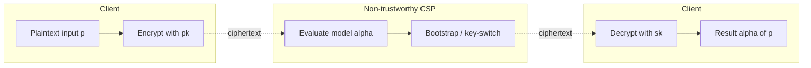
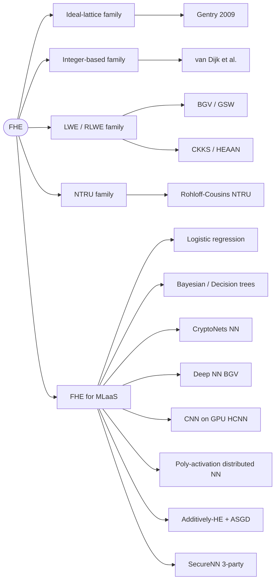
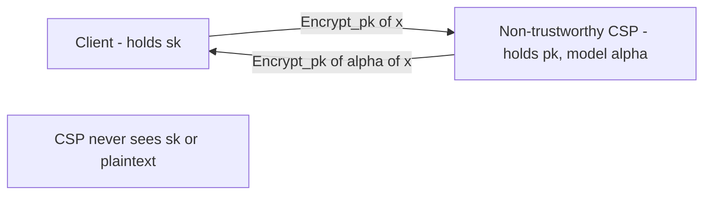

## TL;DR

A 2020 survey reviewing Fully Homomorphic Encryption (FHE) theory, scheme families, and tooling, with explicit focus on the intersection of FHE and Machine Learning as a Service (MLaaS); it argues that no specialized survey existed at this intersection and consolidates contributions for predicting/classifying confidential data under encryption [Abstract][§4.1].

## Problem and motivation

Cloud computing introduces data-breach and trust threats: users delegate processing to a Cloud Service Provider (CSP) and must decrypt to compute, exposing data [§1]. Conventional encryption "cannot support effective ciphertext computing" [§1]. The threat model implicit throughout is a non-trustworthy third-party (honest-but-curious CSP) that should "blindly process encrypted information without disclosing confidential data" and never see the secret key [§1, §3]. FHE is positioned as the "holy grail" enabling computation on encrypted data and as a candidate against future quantum-computer attacks on factoring/discrete-log public-key crypto [§1].

## Key contributions

- Comprehensive review of FHE theoretical concepts (Partially, Somewhat, Fully HE; correctness, compactness) [§2, §3].
- Taxonomy of FHE into four families: Gentry/ideal-lattice, integer-based (A-GCD), (R)LWE, and NTRU [§2].
- Detailed treatment of bootstrapping and key-switching as the load-bearing primitives for FHE [§3.2, §3.3].
- State-of-the-art map of FHE x MLaaS contributions (logistic regression, Bayesian filters, decision trees, NNs, DNNs) with a comparative Table 1 across 24 references [§4.2].
- Three research directions: bootstrapping optimization, expanding operations (comparison, sign), and designing ML primitives for MLaaS [§4.2].
- Catalogue of FHE libraries/tools and application domains [§5].

## FHE setup

- **Scheme(s):** Surveys four families — ideal-lattice (Gentry), integer-based (A-GCD), (R)LWE, NTRU [§2]. Specific schemes named include RSA (PHE) [§2], Paillier/ElGamal-style PHE [§2], BGV [§4.2], and TFHE [§5].
- **Library / implementation:** Reviews SEAL (Microsoft), HElib, TFHE, PALISADE, cuHE (CUDA/GPU), HEAAN (approximate arithmetic), and HE-transformer/nGraph-HE (Intel) [§5].
- **Parameters:** Not reported (the survey is qualitative; security parameter denoted λ in formal definitions [§3.1] but no numeric polynomial degrees/moduli are given).
- **Bootstrapping used:** Discussed as a general technique, including the recryption function Evaluate_ε(pk, D_ε, c) that homomorphically evaluates decryption to refresh noise [§3.2]. Identifies bootstrapping as "the major bottleneck in a FHE implementation" [§4.2].
- **Packing / encoding strategy:** Mentions message packing in PHE-based logistic regression (n bit-encryptions packed into one ciphertext encoding a degree-(n−1) polynomial) [§4.2]. No detailed SIMD/CRT batching analysis.

## ML setup

- **Task:** Survey of inference and training under encryption (logistic regression prediction, Bayesian filters and decision-tree classification, NN/CNN/DNN inference, DNN training via additively-HE + ASGD, 3-party NN training) [§4.2].
- **Model architecture:** Not a single model; reviews CryptoNets-style NN over ciphertexts [§4.2], deeper NNs with batch normalization (Chabanne et al.) [§4.2], an AlexNet-style CNN on GPU (Badawi et al.) [§4.2], BGV-based deep computation for big-data features (Zhang et al.) [§4.2], polynomial-activation NN training across distributed parties (Takabi et al.) [§4.2], and SecureNN-style 3-party protocols (Wagh et al.) [§4.2].
- **Activation handling:** Notes the limitation of replacing sigmoid in CryptoNets [§4.2] and use of polynomial approximations as activation functions in decentralized training [§4.2]. Also flags that HE natively lacks division/comparison/equality, requiring approximate methods (e.g., Babenko et al.'s RNS-based numerical comparison) [§4.2].
- **Operates on:** Primarily encrypted-data + plaintext-model inference for MLaaS [§4.2]; also discusses encrypted-training scenarios [§4.2].
- **Training vs inference:** Both are surveyed [§4.2].

## Datasets

| Dataset | Task | Size (train/test) | Modality | Notes |
|---|---|---|---|---|
| Not applicable | Survey | Not reported | N/A | Survey paper; no experiments of its own. Application domains listed include medical, advertising, financial, genomics, smart cities, spam filtering, image processing [§5]. |

## Pipeline diagram

The survey describes the canonical FHE-MLaaS message flow [§3, §4.2]: given a scheme ε, model α, and encrypted input Encrypt_ε(p), the server returns ciphertext c such that Decrypt_ε(c) = α(p).

### Pipeline steps (text)

1. Client runs KeyGen_ε(λ) to obtain (sk, pk) [§3.1].
2. Client encrypts plaintext p with pk: c = Encrypt_ε(pk, p) [§3.1].
3. Ciphertext c is sent to the non-trustworthy CSP [§1, §4.2].
4. Server runs Evaluate_ε(pk, α, c) to homomorphically evaluate the ML model α [§3.1, §4.2].
5. Server applies bootstrapping/key-switching as needed to manage noise growth [§3.2, §3.3].
6. Server returns the resulting ciphertext to the client [§4.2].
7. Client decrypts with sk to obtain α(p) [§3.1, §4.2].

## Architecture diagram

Survey taxonomy of FHE families and the MLaaS approaches built on them [§2, §4.2].

## Results

The paper presents no numerical experiments. The survey's "result" is Table 1, a comparative matrix of 24 referenced works across operations supported (addition, multiplication, other), ML approach (logistic regression, NN, DNN, decision trees, DFT), scheme family (ideal-lattice, integer-based, (R)LWE, NTRU), party model (two-party / multi-party), and objective (security / efficiency) [§4.2, Table 1].

| Metric | This paper | Baseline | Hardware |
|---|---|---|---|
| Empirical accuracy / latency | Not reported (survey) | Not reported | Not reported |
| Conceptual coverage | 24 prior works tabulated across 4 FHE families and 5+ ML approaches [Table 1] | n/a | n/a |

The authors note that bootstrapping is "the major bottleneck" and that the field's objectives of security and efficiency are "in conflict" [§4.2].

## Limitations and assumptions

- Survey is qualitative; no parameter choices, security levels, or runtime numbers are reported [§4.2, §5].
- Authors flag that FHE schemes "suffer from complicated designs, too large keys, low computing efficiency, and high computing complexity" and "are far from practical applications" for some operations [§2].
- Lack of native division/comparison/equality in HE means "many algorithms appear out of reach without substantial redevelopment" [§4.2].
- Threat model is stated informally (non-trustworthy third-party, no secret-key access) without formal collusion/malicious-party analysis [§1, §3].
- Coverage cutoff is 2019 references; subsequent CKKS/TFHE-era results and GPU-bootstrapping breakthroughs are out of scope [Table 1].
- Application section is breadth-first ("an exhaustive applications list" is explicitly avoided) [§5].

## Related work it compares against

CryptoNets [33], Chabanne et al. (batch-norm NN) [34], Badawi et al. (HCNN/AlexNet on GPU) [35], Zhang et al. (BGV deep computation) [36], Takabi et al. (decentralized poly-activation) [37], Phong et al. (additively-HE + ASGD) [38], Wagh et al. (SecureNN 3-party) [39], Naehrig et al. (logistic regression) [19], Khedr et al. (SHIELD: Bayesian / decision trees) [32], Bost et al. (ML classification over encrypted data) [31], Babenko et al. (RNS comparison) [40]. Compared against prior surveys: Armknecht et al. [18], Acar et al. [21], Martins et al. [22], and domain-specific surveys [27, 28, 29] [§4.1].

## Code and artifacts

Not released (survey paper). Tools surveyed for practitioners: SEAL, HElib, TFHE, PALISADE, cuHE, HEAAN, HE-transformer/nGraph-HE [§5].

## Extra diagrams (optional)

### Threat model

The third-party "does not learn anything about the data, or output of the computation" [§4.2].

### Federated round

Not applicable in detail; the survey references multi-party schemes (Takabi et al. [37], Wagh et al. SecureNN [39], Phong et al. [38]) but does not specify a single federated protocol [§4.2].

### Activation approximation

Not reported in detail. The survey notes that polynomial approximations replace sigmoid/non-polynomial activations (e.g., CryptoNets, Takabi et al.) but does not provide explicit polynomial coefficients or error plots [§4.2].

## Open questions

- Which FHE family is dominant for MLaaS today — the survey is from 2020 and predates much of the CKKS-on-GPU and TFHE-CNN literature.
- Concrete parameter recommendations (polynomial degree, modulus, security bits) for the surveyed ML use-cases are absent [§3.1].
- How the authors weight the "security vs efficiency conflict" [§4.2] is qualitative; no quantitative Pareto frontier is provided.
- The survey identifies "designing and implementing machine learning models" as research direction (iii) [§4.2] but does not prescribe which primitives (activation, pooling, normalization) are most urgent.
