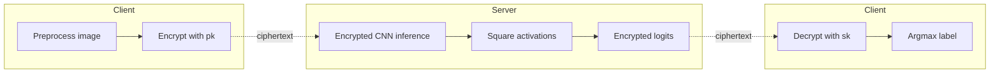
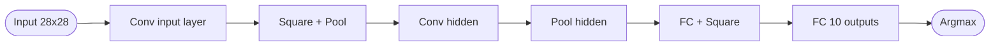
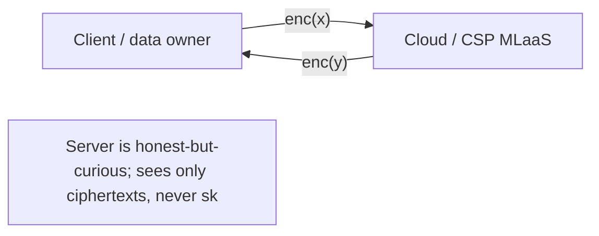

## TL;DR

A 2021 survey of privacy-preserving neural networks with homomorphic encryption (NN-HE), covering FHE scheme families, ML-as-a-Service (MLaaS) approaches, libraries, application areas, and open challenges, complemented by a small empirical comparison of CryptoNets and LoLa implemented in SEAL, PyTorch, and a SEAL+PyTorch combination on MNIST and Fashion-MNIST [§1, §7].

## Problem and motivation

Cloud-hosted machine learning exposes confidential inputs to cloud service providers (CSPs), and conventional encryption protects data at rest and in transit but not "data in use" once decrypted for processing [§1]. FHE promises blind, non-interactive third-party computation over encrypted data without disclosing inputs or outputs [§1]. Threat model is broadly outsourcing to a non-trustworthy third-party / honest-but-curious CSP that sees only ciphertexts and never the secret key [§1, §4.2]. The paper notes the literature so far is dominated by practitioners and lacks comprehensive review of NN-HE specifically [Abstract].

## Key contributions

- Reviews HE scheme evolution: PHE (RSA, ElGamal, GM, Paillier, …), SHE (BGN, SYY, IP), and FHE families — ideal-lattice (Gentry, GH), over integers, LWE/RLWE (BGV, BFV), and NTRU-based, plus CKKS [§2, Fig. 1–2].
- Formalizes FHE (KeyGen, Encrypt, Decrypt, Evaluate; correctness, compactness) and explains bootstrapping and key-switching [§3].
- Surveys MLaaS-HE: logistic regression, decision trees, naive Bayes, and neural nets — CryptoNets, CryptoDL, HCNN/AlexNet on GPU, LoLa, Phong et al., SecureNN, etc. [§4.2, Table 2].
- Identifies three core NN-HE challenges: low efficiency, reduced set of primitives (no division/comparison), and gap to real-world apps [§4.2].
- Compares HE libraries (SEAL, HElib, TFHE, PALISADE, cuHE, HEAAN, HE-transformer) and ML frameworks for HE support [§6.1, Tables 3–4].
- Reports a literature analysis (PQDT, WoS, Google Scholar) of HE publication trends, keywords, and application popularity from 2005–2019 [§6.2, Figs. 4–6].
- Benchmarks three NN-HE implementations (SEAL native CryptoNets/LoLa, PyTorch plaintext, SEAL+PyTorch) on MNIST and F-MNIST [§7, Table 5].
- Enumerates open challenges: overhead, parallelization, polynomial approximation of activations, leveled HE, BNNs, interoperability, automatization, common frameworks [§8].

## FHE setup

- **Scheme(s):** Survey covers Gentry's ideal-lattice FHE, BGV, BFV, CKKS, NTRU-based FHE, TFHE; the empirical comparison uses Microsoft SEAL (which supports BFV and CKKS) [§2, §6.1, §7].
- **Library / implementation:** SEAL for HE; PyTorch as the high-level ML tool; SEAL+PyTorch as a hybrid; the surveyed libraries are SEAL, HElib, TFHE, PALISADE, cuHE, HEAAN, HE-transformer [§6.1, §7].
- **Parameters:** Not reported for the comparison runs; the paper discusses multiplicative depth, level keys (e.g. PALISADE's level-key algorithm), and noise/error trade-offs in general [§5.6].
- **Bootstrapping used:** Discussed conceptually [§3.2]; for the empirical CNNs the paper follows CryptoNets/LoLa-style leveled (no bootstrapping) inference [§5.3, §5.6.1].
- **Packing / encoding strategy:** SIMD via CRT for high-degree polynomials (used by CryptoNets and HCNN/AlexNet) and the LoLa single-message vector encoding requiring O(log d) operations vs O(d) [§5.5].

## ML setup

- **Task:** Inference (private prediction) for the empirical comparison; the survey also covers training [§5.2, §7].
- **Model architecture:** Three instance types are evaluated [§7]:
  - **Native (N):** Original CryptoNets and LoLa specifications from [52, 57].
  - **Small (S):** One convolutional layer.
  - **Large (L):** Six-layer CNN — one convolutional input layer with 28×28 input nodes, four hidden layers (activation+pooling, conv, pooling, FC activation), and one FC output layer with 10 neurons. All neurons use the square activation function.
- **Activation handling:** Square function (x²) for the empirical CNNs, following CryptoNets/LoLa [§5.4, §7]. The survey discusses polynomial approximations of ReLU/sigmoid/tanh via Taylor and Chebyshev series, Stone–Weierstrass uniform approximation, and notes that for a network with l layers using a degree-d activation polynomial the overall approximation degree is d^l, so both d and l must be small [§5.4].
- **Operates on:** Plaintext model + encrypted data (pre-trained NN-HE) [§5.2].
- **Training vs inference:** Inference under encryption for the experiments; the survey also notes the high cost of homomorphic training (e.g. ≈1 hour plaintext vs ≈1 year encrypted for a seven-layer CNN, citing [73]) [§5.2].

## Datasets

| Dataset | Task | Size (train/test) | Modality | Notes |
|---|---|---|---|---|
| MNIST | Handwritten digit classification | Test set 10,000 examples; training split not reported | Grayscale 28×28 images | Used to benchmark CryptoNets and LoLa under SEAL/PyTorch [§7] |
| Fashion-MNIST | Fashion image classification | Test set 10,000 examples; training split not reported | Grayscale 28×28 images | MNIST-like, used as a more challenging benchmark [§7] |

## Pipeline diagram

### Pipeline steps (text)

1. Client preprocesses a 28×28 MNIST or F-MNIST image.
2. Client encrypts the input using the SEAL public key (BFV or CKKS depending on the variant).
3. Server runs the pre-trained CNN homomorphically: conv layers with plaintext weights, square activations, pooling, and a final FC layer.
4. Server returns encrypted class logits to the client.
5. Client decrypts and applies argmax to obtain the predicted digit / class.

## Architecture diagram

Large (L) six-layer CNN used in the benchmark [§7]:

### CryptoNets / LoLa (Native)

Re-implementations of the original CryptoNets [52] and LoLa [57] networks; exact layer widths not restated in this paper — see [52, 57]. Both use square activations and run on MNIST 28×28 inputs [§4.2, §7].

## Results

Performance comparison of three implementations of Convolutional Neural Networks, measured on a single prediction (latency, accuracy, memory) on the test set of 10,000 examples [§7, Table 5]:

| Tool | NN-HE variant | Instance | MNIST Lat. (s) | MNIST Acc. (%) | MNIST Mem (MB) | F-MNIST Lat. (s) | F-MNIST Acc. (%) | F-MNIST Mem (MB) |
|---|---|---|---|---|---|---|---|---|
| PyTorch (plaintext) | – | L | 0.011 | 99.51 | 465.20 | 0.010 | 89.20 | 448.42 |
| SEAL | CryptoNets | N | 283.56 | 98.95 | 4750.21 | 290.01 | 83.74 | 5781.14 |
| SEAL | LoLa | S | 0.34 | 96.92 | 593.70 | 0.34 | 82.02 | 576.32 |
| SEAL | LoLa | N | 3.50 | 98.95 | 2076.40 | 3.45 | 83.74 | 2010.90 |
| SEAL | LoLa | L | 14.43 | 99.20 | 2781.60 | 14.21 | 84.13 | 2430.10 |
| SEAL+PyTorch | – | S | 1.2 | 96.90 | 1543.34 | 1.16 | 82.01 | 1453.21 |
| SEAL+PyTorch | – | N | 12.67 | 98.88 | 7301.92 | 12.52 | 83.71 | 7135.67 |
| SEAL+PyTorch | – | L | 46.92 | 99.16 | 9871.81 | 46.11 | 84.08 | 8869.10 |

Hardware: Windows 10 64-bit, Intel(R) Core(TM) i7-8565U @ 1.8 GHz, 16 GB RAM, 256 GB SSD [§7]. The paper notes LoLa is roughly 80× faster than CryptoNets at the same accuracy (e.g. 3.50 s vs 283.56 s on MNIST native) [§7]. SEAL+PyTorch trades latency/memory for ease of implementation [§7]. Survey-level numbers also include the CRT/SIMD insight that CryptoNets has the same cost for one or 4096 predictions (amortized) [§7].

## Limitations and assumptions

- Survey scope is acknowledged to be biased toward NN-HE; broader MPC, DP, and TEE work is largely out of scope [§1, §4].
- Many HE schemes cannot do division or comparison/equality testing; the paper flags this as a key bottleneck [§4.2].
- Polynomial activations restrict expressiveness: a degree-d activation across l layers gives degree d^l overall, making deep NN-HE expensive [§5.4].
- The empirical comparison runs on a single laptop-class CPU (no GPU); training under HE is reported as infeasible (≈1 year for a 7-layer CNN) [§5.2, §7].
- CryptoNets exhibits high latency for a single image because SIMD packing makes one or 4096 predictions cost the same [§5.5, §7].
- The CKKS encoding can flip the sign of values near zero (e.g. −0.01 → 0.00268), causing algorithmic errors on normalized inputs [§5.6.2].
- The polynomial approximation of sign/ReLU can give running errors (e.g. ReLU(x) > 0 for x < 0) [§5.6.2].
- Library selection involves trade-offs: SEAL is well-documented but inflexible; HElib has poor bootstrapping; TFHE is slow for simple tasks; PALISADE has poor documentation [§6.1, Table 3].
- Most HE-related ML framework extensions are "either insecure or impractical" — based on PHE, simulated, non-multi-party, or only homomorphism-of-training (not HE) [§6.1].

## Related work it compares against

CryptoNets [Dowlin et al., 52]; CryptoDL [Hesamifard et al., 54]; HCNN / AlexNet-on-FHE [Badawi et al., 55]; Low-Latency CryptoNets — LoLa [Brutzkus et al., 57]; Privacy-preserving multi-party ML with HE [Takabi et al., 58]; additively-HE SGD on DNNs [Phong et al., 59]; SecureNN [Wagh et al., 60]; Babenko et al. RNS number comparison [61]; nGraph-HE2 [Boemer et al., 83]; Faster CryptoNets [Chou et al., 78]; CryptoRNN [Bakshi & Last, 80]; Fast Homomorphic evaluation of discretized NNs [Bourse et al., 81]; surveys by Acar et al. [40], Armknecht et al. [37], Naehrig et al. [38], Archer et al. [39], Martins et al. [41], Vaikuntanathan [2], among others [Table 1].

## Code and artifacts

Not released. No public repository for the empirical SEAL/PyTorch/SEAL+PyTorch comparison is mentioned in the paper.

## Extra diagrams (optional)

### Threat model

### Activation approximation

The paper does not introduce a new polynomial activation. It surveys square (used by CryptoNets and the empirical CNNs), low-degree Taylor and Chebyshev approximations of ReLU/sigmoid/tanh, and binary activations (BNN, returning 1 if y>0 else −1) [§5.4, §8]. Square is favoured because it has multiplicative depth 1, but its unbounded derivative destabilizes training beyond two non-linear layers [§5.4]. See [§5.4] in the paper.

## Open questions

- Which exact SEAL parameters (poly modulus, coeff modulus, scale, security level) were used for the CryptoNets and LoLa native runs? — not reported [§7].
- How was the six-layer "Large" instance trained, and on what train/validation split? — not reported [§7].
- Are the F-MNIST accuracies (~84%) limited by the square activation or by the model size? — not analysed [§7].
- For SEAL+PyTorch, how is the boundary between encrypted and plaintext computation drawn? — not specified [§7].
- The 1-year HE-training figure is cited from [73] (a DARPA DPRIVE report) without details — what model and parameters? [§5.2].
