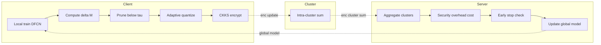
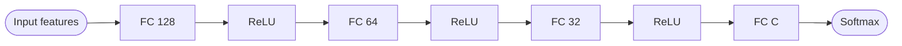
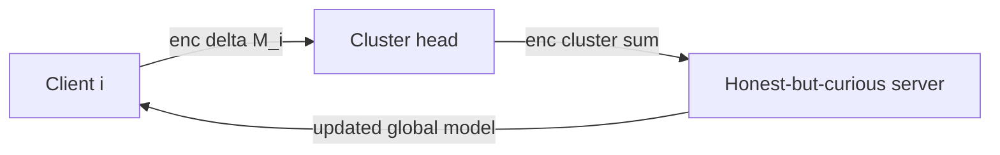
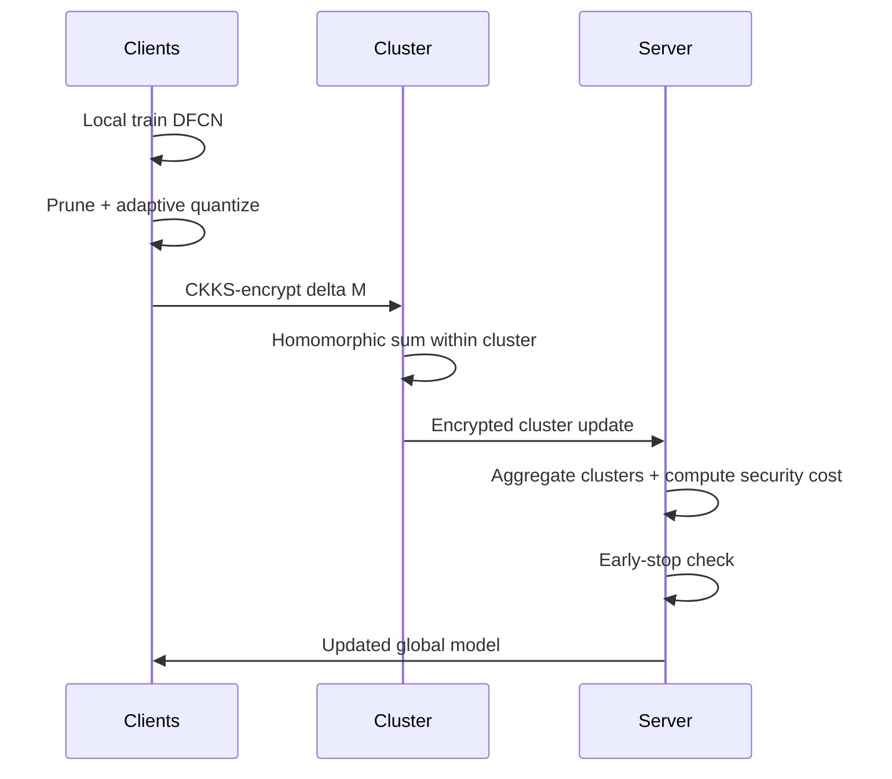

## TL;DR

FLHC-QPR is a federated learning framework for edge AI that combines CKKS homomorphic encryption with client clustering, adaptive quantization, and structured pruning. On the UCI Human Activity Recognition dataset, it improves accuracy by +8.4%, reduces latency by 16.2%, and shrinks memory overhead by 35.1% relative to baseline FLH [Abstract; §VI].

## Problem and motivation

Federated learning on edge devices must protect sensitive data (healthcare, IoT, finance) while coping with bandwidth, memory, and convergence constraints. Adding HE to FL inflates ciphertext size and computation, making naive deployments impractical on resource-limited devices [§I]. The paper targets these communication/computation/security trade-offs without weakening privacy. The threat model is implicit: an honest-but-curious server that should never see plaintext client updates ("the server does not have access to the raw updates") and clients that may have heterogeneous resources [§IV-C]. Formal adversary modeling and attack analyses are explicitly out of scope [§V-F].

## Key contributions

- A unified FL framework (FLHC-QPR) integrating CKKS HE, client clustering, structured pruning, and adaptive quantization for edge AI [§IV].
- Adaptive quantization that dynamically picks bit-width and scaling factor from the update distribution [§III-D].
- Intra-cluster aggregation to reduce client-server bandwidth, with early stopping for convergence control [§IV-C].
- A hybrid "security overhead cost" metric combining memory, latency, communication, and encryption time with weights alpha=beta=gamma=delta=0.25 [§III-I].
- Empirical gains over FLH, FLHC, and FedSafe baselines on UCI HAR [§V-D].

## FHE setup

- **Scheme(s):** CKKS (Cheon-Kim-Kim-Song) approximate arithmetic [§III-E, §V-A].
- **Library / implementation:** Not reported (Python implementation with three classes: clients, server, controller) [§V].
- **Parameters:** polynomial modulus degree = 8192; coefficient modulus chain bit sizes = [60, 40, 60]; scaling factor = 2^40 [§V-A].
- **Bootstrapping used:** Not reported.
- **Packing / encoding strategy:** CKKS SIMD packing into a single ciphertext (per polynomial-modulus degree 8192); quantized updates are scaled by s = max(|delta M|) and packed before encryption [§III-D, §III-E].

## ML setup

- **Task:** Federated training (multi-round) for multi-class classification of human activities; HE protects aggregated updates [§III-H, §IV].
- **Model architecture:** Deep Fully Connected Network (DFCN): Input -> FC 128 (ReLU) -> FC 64 (ReLU) -> FC 32 (ReLU) -> FC C (Softmax), where C is the number of classes [§III-A]. Counted as 4 weight-bearing layers.
- **Activation handling:** ReLU and Softmax are used directly during local plaintext training on each client; HE only operates on encrypted update vectors (sums and scalar multiplications), so no polynomial activation approximation is needed under FHE [§III-A, §III-E].
- **Operates on:** Plaintext local training; only the model updates (delta M, quantized) are encrypted and aggregated under HE. The server aggregates encrypted updates without decrypting them [§IV-C].
- **Training vs inference:** Training (federated rounds); final evaluation done on plaintext after decryption [§IV-D].

## Datasets

| Dataset | Task | Size (train/test) | Modality | Notes |
|---|---|---|---|---|
| UCI Human Activity Recognition [33] | 6-class activity classification (walking, walking upstairs, walking downstairs, sitting, standing, lying) | Not reported (30 volunteers, ages 19–48) | Smartphone IMU (waist-worn) | Features normalized; partitioned across clients [§V-B, §IV-A] |

## Pipeline diagram

### Pipeline steps (text)

1. Preprocess: normalize features and partition training data across clients [§IV-A].
2. Initialize global model with random weights; group clients into C clusters; set up CKKS context [§IV-B].
3. Each client trains its DFCN locally on private data and computes delta M = M_l - M_g [§III-A, §III-B].
4. Prune updates whose absolute value is below threshold tau (set to 0.1) [§III-C, §V-A].
5. Adaptively quantize pruned updates (12 bits for FLHC-QPR), scaling by s = max(|delta M|) [§III-D, §V-A].
6. Encrypt the scaled, quantized update under CKKS and send it (with scaling factor and training loss) to the cluster/server [§III-E, Algorithm 1].
7. Server aggregates encrypted updates per cluster and then across clusters without decrypting them [§III-F, Algorithm 2].
8. Server computes security overhead cost = alpha*M + beta*L + gamma*C + delta*E and evaluates loss/accuracy [§III-I, Algorithm 2].
9. Apply early-stopping: if |L_t - L_prev| < epsilon for k consecutive rounds, halt [§IV-C, Algorithm 2].
10. Update global model M_g^{t+1} = M_g^t + (1/K) * sum_k delta M_k and broadcast back to clients [§III-G].

## Architecture diagram

## Results

Headline metrics (UCI HAR). Baselines: FLH (basic FL+HE), FLHC (FLH with clustering [15]), FedSafe (FE-based, no KDC [21]). Hardware: not reported (Python implementation).

| Metric | This paper (FLHC-QPR) | Baseline | Hardware |
|---|---|---|---|
| Best accuracy (11 rounds) | 89.86% | FLHC 86.89%; FLH 81.39%; FedSafe 81.50% [§V-D, Fig. 3a] | Not reported |
| Peak accuracy (privacy threshold = 5) | 90.09% | FLHC 91.31%; FedSafe 80.82%; FLH 92.89% [§V-D, Fig. 4a] | Not reported |
| Latency (client-count sweep) | 0.62–8.39 s | FLH 0.80–8.86 s; FLHC 0.66–8.69 s; FedSafe 0.80–8.78 s [§V-D, Fig. 2b] | Not reported |
| Latency (rounds sweep) | ~1.65–1.69 s | Comparable to FLH/FLHC [§V-D, Fig. 3b] | Not reported |
| Memory overhead (rounds=11) | -16.4% vs FLHC; -31% vs FLH; -38.6% vs FedSafe [§V-D, Fig. 3c] | — | Not reported |
| Memory overhead (privacy threshold = 5) | -31.5% vs FLH; -24.7% vs FLHC [§V-D, Fig. 4c] | — | Not reported |
| Security overhead cost | 0.4391 (rounds=11); 46.93 (epsilon=5) | FLHC 0.4465; FLH 0.4451; FedSafe 0.4566; FedSafe 47.53 [§V-D] | Not reported |
| Average accuracy gain | +8.4% over FLH; +5.4% over FLHC | — | — |
| Average latency reduction | -16.2% vs FLHC; -11.7% vs FLH | — | — |
| Average memory reduction | -26.5% vs FLHC; -35.1% vs FLH | — | — |
| Average security-overhead reduction | -2.7% vs FLHC; -2.5% vs FLH | — | — |

Optimal hyperparameters from trade-off study: 12-bit quantization (acc 0.9556), pruning threshold 0.1 (acc 0.9233), 4 clusters (acc 0.9070) [§V-E].

## Limitations and assumptions

- Hardware platform for latency/memory measurements is not reported, so absolute numbers are not comparable across systems [§V].
- No formal cryptographic adversary model or attack evaluation; energy consumption and intermittent connectivity are explicitly out of scope [§V-F].
- The "security overhead cost" weights default to 0.25 each — chosen "for simplicity" without justification [§III-I].
- Plaintext data leaves the client only as encrypted *updates*; if clients are malicious the framework does not address poisoning or verifiable aggregation.
- Evaluation uses only one (small, tabular) dataset (UCI HAR with 30 subjects), so generalization to larger models or image data is unverified [§V-B].
- Accuracy at privacy threshold = 5 is actually below FLH (90.09% vs 92.89%) — FLHC-QPR's advantage at that operating point is on memory rather than accuracy [§V-D, Fig. 4a].

## Related work it compares against

- FLH — baseline FL with HE where clients submit encrypted weights directly [§V-C].
- FLHC [15] — Hijazi et al., secure FL with FHE for IoT, clustering-based.
- FedSafe [21] — Ibrahem et al., functional-encryption-based decentralized FL without a KDC.
- Also positioned against MaskCrypt selective HE [13], HalfFedLearn [25], GHPPFL gradient-compression+HE [24], and UEFL [26] in the related-work survey [§II].

## Code and artifacts

Not released. No repository URL given in the paper.

## Extra diagrams (optional)

### Threat model

### Federated round

## Open questions

- What library implements CKKS (TenSEAL / OpenFHE / Microsoft SEAL)? Not stated [§V].
- What CPU/GPU runs the experiments? All latency numbers are uninterpretable without it [§V-D].
- How is "optimal quantization bits q" chosen per round in Algorithm 1 line 9 — is it learned or rule-based? [Algorithm 1].
- The reported 92.89% FLH accuracy at privacy threshold 5 (Fig. 4a) appears to beat FLHC-QPR at the same setting; the text claims FLHC-QPR "significantly outperforms" FLH here, which seems inconsistent with the cited numbers [§V-D].
- Is privacy threshold (epsilon) referring to differential privacy noise? The paper uses "privacy threshold or epsilon" but never formally introduces DP into the protocol [§V-A].
