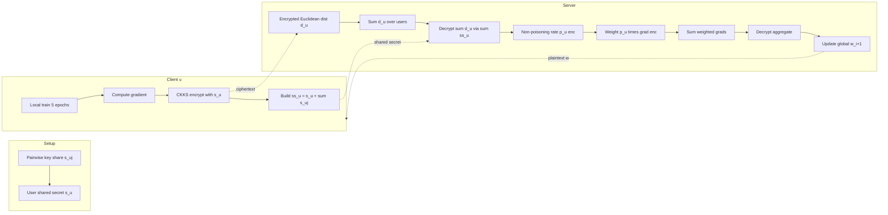
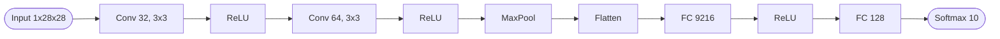
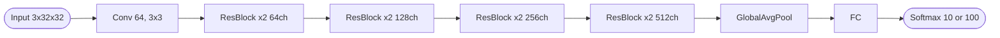
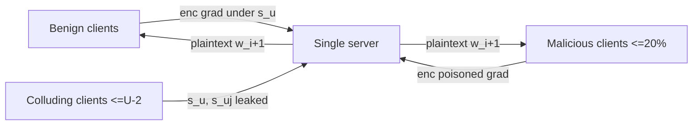
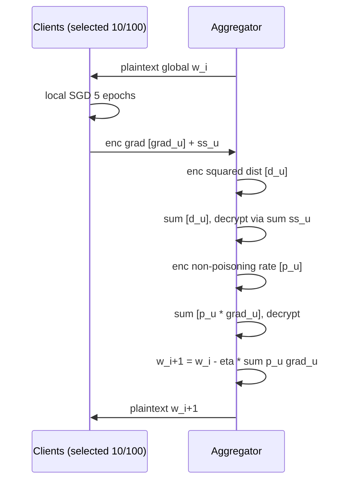

## TL;DR

FheFL is a single-server privacy-preserving federated learning protocol that combines a distributed multi-key CKKS-based additive HE scheme with a non-poisoning-rate weighted aggregation rule, so the aggregator can mitigate data-poisoning Byzantine clients while operating entirely on encrypted gradients [§1, §4]. Across MNIST/CIFAR-10/CIFAR-100 with up to 20% label-flipping attackers, it matches or beats FedAvg, Trimmed Mean, Median, and KRUM in accuracy while keeping individual gradients encrypted [§6.1.2, Table 3].

## Problem and motivation

In federated learning the server can reconstruct private training data from plaintext local gradients (e.g. Deep Leakage from Gradients attacks) [§1, §6.2.1]. Encrypting gradients fixes that privacy leak but creates a new security problem: the aggregator can no longer see the gradients, so malicious clients can submit poisoned updates undetected [§1]. Prior joint-defence works rely on two non-colluding servers, all-pair user-to-user secure computation, or all-or-nothing group exclusion [§1, §2.3, Table 1]. The threat model assumes (i) a semi-honest single aggregator that may collude with up to (U−2) users, requiring at least two non-colluding users for privacy [§5.1], and (ii) up to 20% malicious clients launching data-poisoning (label-flipping) attacks [§5, §6.1.2].

## Key contributions

- A non-poisoning-rate-based weighted aggregation scheme that scales each client's contribution inversely to the squared Euclidean distance between its update and the previous global model, designed to be computable in the encrypted domain [§4.1, eq. (9)].
- A modification of CKKS into a distributed multi-key additive HE scheme using pairwise secret sharing, removing the need for a second non-colluding server or a trusted third party [§1, §4.2, §4.3].
- A single-server FL protocol that simultaneously addresses privacy attacks (DLG/reconstruction) and security attacks (data poisoning) without per-epoch user-to-user interaction [§1, §4].
- Privacy, security, and convergence proofs (Corollaries 1-4), including a convergence bound on the variance Z² of poisoned gradients relative to benign variance G² [§5.1-§5.3].
- Empirical validation on MNIST, CIFAR-10, CIFAR-100 against FedAvg, Trimmed Mean, Median, and KRUM, plus encrypted-domain runtime comparison vs ShieldFL and PEFL [§6].

## FHE setup

- **Scheme(s):** CKKS, extended into a distributed multi-key additive HE scheme where each user u encrypts with a shared secret share s_u such that s = Σ s_u [§4.2, §4.3].
- **Library / implementation:** Modified TenSEAL library, implemented in PyTorch [§6].
- **Parameters:** Two parameter sets at 128-bit security: (N=8192, q=218, Δ=2^25, L=4) and (N=16384, q=438, Δ=2^60, L=4) [§6.2.1].
- **Bootstrapping used:** Not reported (L=4 levels appears to be sufficient for one aggregation round; bootstrapping is not discussed).
- **Packing / encoding strategy:** CKKS SIMD packing — up to 4096 gradients per ciphertext at N=8192 and up to 8192 gradients per ciphertext at N=16384; only the gradients of early (first hidden / first convolutional) layers are encrypted because DLG attacks are most effective on those layers [§6.2.1, Table 4].

## ML setup

- **Task:** Federated training round — encrypted gradient aggregation with Byzantine-robust weighting [§4, §6].
- **Model architecture:** MNIST uses a CNN with two conv layers (32 and 64 kernels of 3x3) + max-pool + two FC layers (9216 and 128 neurons) [§6.1.1]. CIFAR-10 and CIFAR-100 use ResNet-18 [§6.1.1]. Only the first-layer gradients are encrypted in practice: 320 weights (MNIST), 2400 (CIFAR-10), 1728 (CIFAR-100) [Table 4].
- **Activation handling:** Standard ReLU — activations are computed locally by each client on plaintext during local training; only the gradient updates are encrypted before transmission, so no polynomial approximation of activations is needed [§4, §6].
- **Operates on:** Plaintext model on the server side (server holds w_i in plaintext) + encrypted gradients from each client; aggregation is performed homomorphically; the aggregated update is decrypted by the server using the sum of randomised shared keys [§4.3, §4.4, Algorithm 3].
- **Training vs inference:** Federated training (one encrypted aggregation per epoch). The Byzantine-defence step (non-poisoning rate weighting via squared Euclidean distance to the previous global model) is executed in the encrypted domain [§4.4, eqs. (12)-(13)].

## Datasets

| Dataset | Task | Size (train/test) | Modality | Notes |
|---|---|---|---|---|
| MNIST | Digit classification (10 classes) | 60,000 / 10,000 | Grayscale images | Evenly split across 100 users; label-flip "1"↔"7" attack; 200 sync rounds [§6.1.1, §6.1.2] |
| CIFAR-10 | Image classification (10 classes) | 50,000 / 10,000 (paper states 60,000 total balanced) | Color images | ResNet-18; label-flip "Cat"↔"Dog"; 200 rounds [§6.1.1, §6.1.2] |
| CIFAR-100 | Image classification (100 classes) | 60,000 total balanced | Color images | ResNet-18; label-flip "Chair"↔"Couch"; 500 rounds [§6.1.1, §6.1.2] |

## Pipeline diagram

### Pipeline steps (text)

1. Server initialises global model w_0, defines CKKS parameters (N, q, Δ, L), and distributes w_0 to all U users [Algorithm 1, Algorithm 2].
2. At join time, every pair (i, j) of users exchanges a pairwise secret s_{i,j} = −s_{j,i} (e.g. via Diffie-Hellman); each user u also generates its own random share s_u [§4.2].
3. Each selected user u trains locally for 5 epochs, computes gradient ∇L_u(w_i, ζ_u^j), encrypts it under its own share s_u with CKKS, and uploads the ciphertext together with ss_u = s_u + Σ_{j≠u} s_{u,j} to the server [Algorithm 2, lines 6-10].
4. Server homomorphically computes [d_u] = [∇L_u]^T · [∇L_u] for each user, still encrypted under s_u (Byzantine-defence step in ciphertext) [§4.4, eq. (12); Algorithm 3, line 2].
5. Server sums [d_u] across users; the sum is encrypted under Σ s_u = s, which the server can decrypt using Σ ss_u (the s_{u,j} cancel because s_{i,j} = −s_{j,i}) [§4.2 eq. (11); Algorithm 3, lines 3-4].
6. Server computes the encrypted non-poisoning rate [p_u^i] = (1/(U−1)) · (1 − [d_u]/Σ d_j) per user [§4.4, eq. (13); Algorithm 3, line 6].
7. Server multiplies [p_u^i] · [∇L_u] homomorphically (still under s_u), then sums across all users so the aggregate is under Σ s_u and decryptable via Σ ss_u [Algorithm 3, lines 7-9].
8. Server applies w_{i+1} = w_i − η^i · Σ p_u^i · ∇L_u and broadcasts the updated plaintext global model; loop until ||w_{i+1} − w_i|| ≤ ε [Algorithm 2, lines 11-13].

## Architecture diagram

Two architectures are evaluated. The encrypted protocol only protects first-layer gradients; the rest of the model is trained in plaintext locally.

### CNN (MNIST)

### ResNet-18 (CIFAR-10 / CIFAR-100)

## Results

| Metric | This paper | Baseline | Hardware |
|---|---|---|---|
| MNIST accuracy, 100 users, 0% attackers | 98.78% | FedAvg 98.68%, KRUM 96.34%, Median 96.88%, Trimmed Mean 96.48% [Table 2] | Intel i7-4210U @ 4.1GHz, 16GB RAM |
| MNIST accuracy / AASR, 20% attackers | 97.32% / 1.78% | FedAvg 84.54% / 12.21%, KRUM 86.93% / 20.32% [Table 3] | same |
| CIFAR-10 accuracy / AASR, 20% attackers | 84.59% / 4.24% | FedAvg 80.15% / 22.58%, KRUM 69.05% / 26.69% [Table 3] | same |
| CIFAR-100 accuracy / AASR, 20% attackers | 52.85% / 2.34% | FedAvg 46.78% / 62.35%, KRUM 28.65% / 70.32% [Table 3] | same |
| Encrypted vs plain accuracy loss, 100 users | 2.7% (N=16384), 6.5% (N=8192) | [17] ShieldFL ≈4%, [15] PEFL ≈3.5% [Table 5] | same |
| Aggregation time, 10 users, 8192 gradients, N=16384 | ~30 s | ShieldFL [17] >1 hour on similar hardware [§6.3] | Intel i7-4210U @ 4.1GHz |
| Per-user uplink bandwidth | <3 MB / epoch | ShieldFL ≈2× higher; PEFL slightly lower than FheFL; one-time-pad schemes [18][19] much lower [§6.4, Figure 6] | same |

Convergence rounds: ~50 (MNIST), 125-150 (CIFAR-10), 200-220 (CIFAR-100) [§6.1.2].

## Limitations and assumptions

- Security requires at least two non-colluding users; with U−1 colluding users a victim's gradient can be recovered [§5.1, Corollary 1].
- Assumes ≤20% malicious clients and only data-poisoning (label-flipping) attacks — model-poisoning that drives Z² above the corollary-4 bound can break convergence [§5, §5.3, Corollary 4].
- Only gradients of the first hidden / first convolutional layer are encrypted to keep CKKS overhead manageable; later-layer gradients are sent in plaintext on the rationale that DLG attacks succeed mainly on early layers [§6.2.1, Figure 1]. This is a privacy-utility trade-off rather than full encryption.
- Reported aggregation latency (~30 s for 10 users at N=16384) is sequential; the authors note it parallelises across users but do not benchmark a parallel version [§6.3].
- Bandwidth per user is ~1 order of magnitude higher than PEFL's packed Paillier-style scheme [§6.4].
- One-time pairwise key setup (Diffie-Hellman) is required when users join; not optimised in this paper [§4.2].
- L=4 multiplication levels; bootstrapping is not discussed, so deeper in-ciphertext computation is not supported as presented.

## Related work it compares against

So et al. [14] (Byzantine-resilient SFL), Liu et al. PEFL [15], Z. Ma et al. ShieldFL [17] (two-trapdoor Paillier, two servers), H. Ma et al. MUD-PQFed [16], Jebreel et al. Fragmented FL [18], Zhang et al. LSFL [19], J. Ma et al. multi-key FHE FL [6], J. Park et al. third-party-assisted FHE FL [7]. Plain-domain Byzantine baselines: FedAvg [32], Trimmed Mean [33], Median [33], KRUM [12]. DLG attacks [36], [37] are used to probe privacy.

## Code and artifacts

Not released (no repository URL stated in the text). Implementation is described as built on a modified TenSEAL [28] and PyTorch [§6].

## Extra diagrams (optional)

### Threat model

### Federated round

## Open questions

- How is the decryption of [Σ d_u] performed when the per-user [d_u] are each under a different secret s_u? Algorithm 3 line 3 simply "sums" them; the paper relies on the additive multi-key scheme described in §4.3 (ciphertexts with shared `a`) but the consistency of CKKS encoding/scale across users after homomorphic squaring is not detailed.
- What is the per-sample (or per-round) latency on the client side for CKKS encryption of first-layer gradients? Only the server-side aggregation time is reported.
- Bootstrapping is not used; does L=4 strictly suffice for the full pipeline (squaring + scalar multiply + sum), or are rescales managed manually?
- The CIFAR-10/100 plaintext-vs-encrypted gap is reported only for the protected first-layer gradients — what happens if mid- or late-layer gradients are also encrypted?
- No code release: reproducibility of the 30 s aggregation and 11G² tolerated variance numbers is hard to verify.
