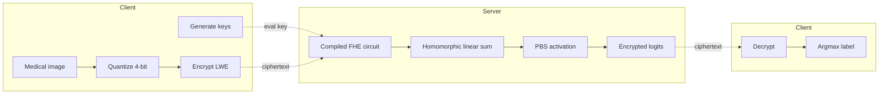
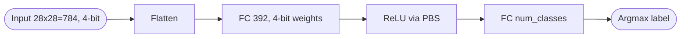
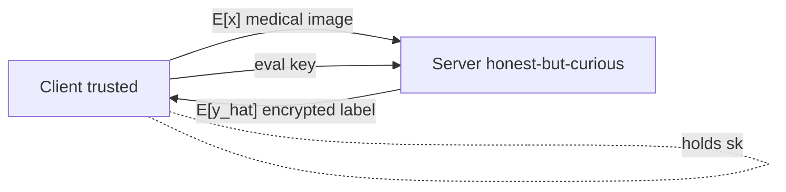

## TL;DR

The authors train a tiny, 4-bit quantized fully connected neural network in plaintext using Quantization-Aware Training, then compile it with Zama Concrete ML into a TFHE circuit so encrypted MedMNIST images can be classified on a server that never sees the plaintext, losing essentially no accuracy versus the unencrypted baseline [Abstract, §6.3].

## Problem and motivation

Hospitals and AI services need to analyse sensitive medical images while complying with HIPAA/GDPR, but raw image sharing risks breach, unauthorized access, and model inversion attacks [§1]. Prior PPML approaches each fail in some way: FL leaks via gradients, DP hurts accuracy, SMPC has high communication overhead, and existing FHE work is too slow for deep CNNs [§1]. The authors target a semi-honest server: the client is trusted and holds the secret key; the server is honest-but-curious and may see encrypted inputs, intermediate ciphertexts, and encrypted outputs but not the secret key [§7]. The framework is designed to mitigate data-privacy leakage, model-privacy leakage, and inference attacks [§7].

## Key contributions

- A quantized FCNN tailored for TFHE-based encrypted inference, trained with Quantization-Aware Training (QAT) [§4].
- An accumulator-aware pruning scheme that prevents accumulator overflow during encrypted operations by enforcing the TFHE 16-bit accumulator constraint [§4.1, §5].
- End-to-end evaluation on three MedMNIST subsets (PneumoniaMNIST, BreastMNIST, BloodMNIST), which the authors note is uncommon in prior FHE-medical work [§6].

## FHE setup

- **Scheme(s):** TFHE (torus-based fully homomorphic encryption) with programmable bootstrapping (PBS) for non-linear activations [§3.4, §3.5].
- **Library / implementation:** Zama Concrete ML, with the model compiled to an MLIR FHE circuit [§4, §5.2].
- **Parameters:** Quantization bit-width = 4 bits for weights and 4 bits for activations/inputs; accumulator bit-width constrained to 16 bits (`0 <= v < 2^16`); LWE-based ciphertexts over the torus; specific polynomial degree and security level not reported [§4.1, §4.2, Table 4].
- **Bootstrapping used:** Yes - programmable bootstrapping (PBS) is invoked per activation to both re-randomize ciphertexts and evaluate the non-linear function [§3.5, §4.1].
- **Packing / encoding strategy:** Not reported beyond Concrete ML's LWE encoding; per-value encryption of inputs, weights, biases, and intermediate activations [§4.1, Eq. 16].

## ML setup

- **Task:** Multi-class / binary medical image classification under encryption (inference only - training is plaintext with QAT) [§4].
- **Model architecture:** Fully Connected Neural Network with `module__n_layers = 2` (input + output with one hidden layer) and `module__n_hidden_neurons_multiplier = 0.5`, so the single hidden layer has 0.5 x input_dim neurons (i.e. 392 for 28x28 MedMNIST inputs) [§4.2, Table 3]. Counting convention: the authors call this a 2-layer network.
- **Activation handling:** ReLU (and optionally Sigmoid) evaluated homomorphically via TFHE programmable bootstrapping - PBS evaluates the univariate non-linearity directly on the ciphertext without polynomial approximation [§3.5, §4.1, Eq. 17].
- **Operates on:** Plaintext model (compiled FHE circuit) running on encrypted data; client holds the secret key, server holds the compiled circuit and the public evaluation key [§5, §7].
- **Training vs inference:** Training is in plaintext with QAT; only inference runs under TFHE [§4, §5].

## Datasets

| Dataset | Task | Size (train/test) | Modality | Notes |
|---|---|---|---|---|
| PneumoniaMNIST | Binary classification (2 classes) | 5,856 total samples | Chest X-ray | 28x28 MedMNIST 2D subset [Table 6] |
| BreastMNIST | Binary classification (2 classes) | 780 total samples | Breast ultrasound | 28x28 MedMNIST 2D subset [Table 6] |
| BloodMNIST | Multi-class (8 classes) | 17,092 total samples | Blood cell microscopy | 28x28 MedMNIST 2D subset [Table 6] |

## Pipeline diagram

### Pipeline steps (text)

1. Client preprocesses and quantizes the medical image to 4-bit integer tensors [§4.1].
2. Client generates the private encryption key and the public evaluation key [§5.3].
3. Client encrypts the quantized image using TFHE's LWE scheme and stores it in a DataFrame for transport [§5.1].
4. Client sends the encrypted image plus the public evaluation key to the server [§5.2].
5. Server runs the pre-compiled FHE circuit: homomorphic weighted-sum per neuron (LWE x constant, LWE + LWE) [§4.1].
6. Server invokes programmable bootstrapping per activation to evaluate ReLU and reset noise [§4.1, Eq. 17].
7. Server returns the encrypted output prediction `y_hat` to the client [§5.4].
8. Client decrypts `y_hat` with the secret key and takes the argmax to obtain the predicted class [§5.4].

## Architecture diagram

Notes: width 392 = 0.5 x 784 from `module__n_hidden_neurons_multiplier = 0.5` [Table 3]. Output width is 2 for Pneumonia/Breast MNIST and 8 for BloodMNIST [Table 6]. Accumulator pruning is applied so that the 16-bit accumulator constraint `0 <= v < 2^16` is never violated [§4.1, Eq. 14].

## Results

Plaintext vs encrypted accuracy is essentially identical; encryption costs five orders of magnitude in latency.

| Metric | This paper | Baseline | Hardware |
|---|---|---|---|
| Accuracy Pneumonia (plaintext, Adam) | 88.89% [Table 7] | CryptoNets 66.57% / MiniONN 84.81% / BFVML 83.34% / Ran et al. 85.89% [Table 12] | 9th gen Intel Core i5, 16 GB RAM [§6.2] |
| Accuracy Pneumonia (encrypted, Adam) | 88.88% [Table 8] | CryptoNets 65.38% / MiniONN 83.95% / BFVML 82.68% / Ran et al. 85.46% [Table 12] | same |
| Accuracy Breast (encrypted) | 81.81% (plaintext 81.82%) [Tables 7, 8] | Not reported | same |
| Accuracy Blood (encrypted) | 84.61% (plaintext 84.74%) [Tables 7, 8] | BFV MedBlindTuner 91.32% [Table 13] | same |
| Latency Pneumonia (encrypted) | 119.55 s / image [Table 11] | 0.31 ms / image plaintext [Table 10] | 9th gen Intel Core i5, 16 GB RAM |
| Latency Breast (encrypted) | 137.68 s / image [Table 11] | 0.62 ms / image plaintext [Table 10] | same |
| Latency Blood (encrypted) | 966.68 s / image [Table 11] | 4.12 ms / image plaintext [Table 10] | same |
| Training time Pneumonia | 39 s (Adam) / 37.89 s (SGD) [Table 9] | n/a | same |

Note: the paper's abstract claims "an average inference time of 150 milliseconds per image" [Abstract], but the detailed experimental tables (Tables 10-11) report 119.55 s, 137.68 s, and 966.68 s per encrypted image. The 150 ms figure is inconsistent with the paper's own results and looks like an error - the comparison block uses the Pneumonia table value (119.55 s).

## Limitations and assumptions

- The encrypted-inference latency per single image is on the order of two minutes (PneumoniaMNIST) to 16 minutes (BloodMNIST), which the authors acknowledge is impractical for real-time use [§6.3, Conclusion].
- The model is a very small 2-layer FCNN with a single hidden layer of 0.5 x input_dim neurons - on 28x28 MedMNIST this fits, but the architecture is far weaker than the CNNs commonly used on these datasets, and BloodMNIST accuracy (84.61%) trails the BFV MedBlindTuner transformer baseline (91.32%) [Tables 8, 13].
- The 16-bit accumulator constraint is enforced by L1 pruning that "triggers" on overflow during training; the authors do not quantify how much sparsity this induces or how it would scale to deeper networks or larger inputs [§4.1, §4.2].
- Evaluation is restricted to three small 28x28 MedMNIST subsets; the authors flag this and defer broader datasets and 3D modalities to future work [Conclusion].
- The abstract reports "150 ms per image" inference, which contradicts the experimental tables (119-967 s per image); this discrepancy is unexplained [Abstract vs Tables 10-11].
- Communication cost, ciphertext size, key size, public-evaluation-key bandwidth, and concrete TFHE security parameters (LWE dimension, noise distribution, polynomial degree) are not reported.
- Threat model is semi-honest only; no defence against malicious servers or model-inversion via repeated queries is claimed [§7].

## Related work it compares against

CryptoNets [Gilad-Bachrach 2016, §6.4 / Table 12], MiniONN [Liu 2017, Table 12], BFVML [Wibawa 2022, Table 12], Ran et al. [2025, Table 12], MedBlindTuner / BlindTuner (BFV transformer on MedMNIST) [Panzade 2024-2025, Table 13], HETAL CKKS DermaMNIST [Lee 2023, Table 13], CryptoDL [Hesamifard 2016], Glyph [Lou 2020], TT-TFHE [Benamira 2023], Concrete ML / Stoian et al. [2023], Chillotti et al. PBS for DNN inference [2021].

## Code and artifacts

Not released. The implementation builds on the open-source Zama Concrete ML library (https://github.com/zama-ai/concrete-ml) [§4, ref. 51] but the authors do not provide their own repository.

## Extra diagrams (optional)

### Threat model

Semi-honest server: sees `E[x]`, intermediate ciphertexts, and `E[y_hat]` but not the secret key `s`; IND-CPA security of TFHE under LWE prevents recovery of the plaintext image or label [§7].

## Open questions

- What TFHE concrete parameters (LWE dimension, polynomial degree N, noise std, claimed bit-security) were used? Concrete ML defaults are mentioned but not pinned down in the paper.
- How is the 28x28 image fed into the network - is it flattened directly to 784 inputs, or are there preprocessing steps (resize, normalization) done on plaintext before encryption? Section 5.1 mentions server-side preprocessing on encrypted data, which would be unusual and is not detailed.
- Why does the abstract say 150 ms while the body reports 119-967 s? Is the 150 ms a per-PBS or per-layer figure that was mislabelled?
- The paper claims "accumulator-aware pruning" as a contribution but the mechanism is just L1 pruning triggered on overflow - how does this differ from prior accelerator-aware pruning work (Kang 2019, ref. 55)?
- No ablation isolates the contribution of pruning vs QAT vs PBS to the final accuracy/latency trade-off.
