## TL;DR

The paper accelerates exact (decryption-error-free) FHE-encrypted CNN/DNN inference over NuFHE (a GPU TFHE port) by combining INT8 quantization with software bitslicing of bootstrapped Boolean gates, packing many parallel bits into single NuFHE gate calls [§I, §IV]. Reported speedup is ~37x over the same non-bitsliced NuFHE baseline, while keeping memory at ~700 MB for a CNN and ~1.9 GB for a DNN on MNIST [§I, §V, Fig. 8].

## Problem and motivation

ML-as-a-Service workloads on public clouds (AWS, Azure, GCP) expose private inputs to untrusted servers; the authors cite recent vulnerabilities in those providers to motivate encrypted analytics [§I, refs 1-3]. Existing FHE-for-ML options each fail one criterion: LHE/SWHE limit depth and force polynomial/square activations; CKKS has known key-recovery attacks on its approximate decryption [§II, refs 12-13]; Zama Concrete (TFHE-based programmable bootstrapping) is shown experimentally to incur decryption errors on integer plaintexts during leveled/FHE compositions [§II, Tables II-III]. The authors keep an exact Boolean-gate TFHE library (NuFHE) intact and instead attack the cost via architecture tricks [§II]. Threat model is honest-but-curious server, public-model / private-data (MLaaS) [§I, "public model private data assumption"].

## Key contributions

- Identification and tabulation of decryption errors in Concrete's leveled/FHE integer computations, motivating an exact-scheme path [§II, Tables II-III].
- INT8 (TFLite) post-training quantization adapted for FHE, with ≤2% accuracy loss on MNIST and a slight accuracy gain on Mendeley [§IV-A, Table VI].
- A bitsliced full adder (BFA) over NuFHE that packs up to 32 ciphertexts per gate via PACK(j) registers, cutting bootstrapping count and memory (5.2 GB to 280 MB for adder) [§IV-B-1].
- FHE building blocks built on BFA: Conv2D, Dense, AvgPool2D (bit-shift divide by 4), MaxPool2D (cascade of FHE-MUX), and an FHE-MUX-based exact ReLU [§IV-B-2].
- End-to-end MNIST CNN inference in ~4.5 h vs ~80 h non-bitsliced (≈37x); DNN in 2.15 h vs 80 h; estimated 140 h for Mendeley 224x224 images, all in ≤2 GB RAM [§V, Tables VII-IX].

## FHE setup

- **Scheme(s):** TFHE (Boolean-gate FHE over the Torus, gate bootstrapping), built on NuFHE [§III, refs 10, 16-17]. PyFHE (CPU TFHE port) used as a comparison baseline [§V, ref 42].
- **Library / implementation:** NuFHE (GPU TFHE in Python) [§III, ref 16]; a software wrapper implements Conv2D / Dense / AvgPool2D / MaxPool2D / ReLU on top, with no modification to NuFHE itself [§IV-B].
- **Parameters:** Not reported explicitly. NuFHE-generated ciphertext is described as 780 bits per plaintext bit [§IV-B]; key-/scheme parameters (λ, N, k) are defined symbolically [§III] but no numeric security level (e.g., 128-bit) is stated. NuFHE caps ciphertext packing at 32 per gate, which forces 7 tiles per row for 224-wide images [§IV-B-2].
- **Bootstrapping used:** Yes — every NuFHE Boolean gate is bootstrapped (TFHE gate bootstrapping in ~13 ms) [§I, §III]. No programmable bootstrapping is used (Concrete's PBS is explicitly rejected for accuracy reasons) [§II].
- **Packing / encoding strategy:** Software *bitslicing*: k registers REG_0..REG_{k-1}, each holding the j-th LSB of N integer operands across N lanes; a single NuFHE bitwise gate then operates on all N lanes simultaneously, with carry propagation handled by N-wide XOR/AND in a ripple-carry BFA [§IV-B-1, Fig. 4, Algorithm 1]. Conv2D packs the (W-M+1) row-stride positions sharing each weight w_ij; Dense packs ciphertexts sharing a common plaintext weight [§IV-B-2, Fig. 5].

## ML setup

- **Task:** Encrypted *inference* only; public plaintext model, private encrypted inputs [§I, §IV].
- **Model architecture:** Reference CNN used for both MNIST and Mendeley [§IV-A, Fig. 2, Table V]: Conv2D (M=3 filter) → AvgPool2D (2x2) → Conv2D → AvgPool2D → Flatten → Dense → Dense. For MNIST: W=H=28, c=1. For Mendeley: W=H=224, c=3. A separate DNN baseline has two hidden layers of 50 neurons and a 10-neuron output [§V]. `nn_layers` counted as weight-bearing Conv+FC layers in the reference CNN.
- **Activation handling:** Exact ReLU via an FHE multiplexer: subtract under FHE, use the result's MSB as the FHE-MUX selector between encrypted-0 and encrypted-x — no polynomial approximation [§IV-B-2]. MaxPool is a cascade of FHE-MUXes selecting the larger of two ciphertexts by sign of the difference [§IV-B-2, Fig. 7]. Softmax/tanh are noted as infeasible without prior bounded-range knowledge [§IV-B-2, ref 41].
- **Operates on:** Plaintext model + encrypted data (MLaaS / public-model private-data) [§I].
- **Training vs inference:** Inference under encryption only. Quantization-aware training and INT8 conversion are done in plaintext via TFLite before deployment [§IV-A, ref 33].

## Datasets

| Dataset | Task | Size (train/test) | Modality | Notes |
|---|---|---|---|---|
| MNIST [§IV-A, ref 35] | Handwritten-digit classification (10 classes) | 60,000 images (28x28), standard split | Greyscale images | INT8 quantized via TFLite; primary timing/memory benchmark [§V, Tables VII-VIII] |
| Mendeley Concrete Crack [§IV-A, ref 36] | Binary classification (crack / no-crack) | 20K per class, 224x224x3 | RGB images of concrete surfaces | Used to stress packing-width limit (224/32 = 7 packings per row) and to show INT8 sometimes raises accuracy [§IV-A, Table VI; §V, Table IX] |

## Pipeline diagram

```mermaid
flowchart LR
    subgraph Client
        A[Input image] --> B[INT8 quantize]
        B --> C[Bit-decompose + PACK]
        C --> D[NuFHE encrypt bits]
    end
    subgraph Server_GPU [Server NuFHE GPU]
        E[Bitsliced Conv2D] --> F[FHE-MUX ReLU]
        F --> G[AvgPool2D bit-shift]
        G --> H[Bitsliced Conv2D]
        H --> I[FHE-MUX ReLU]
        I --> J[AvgPool2D bit-shift]
        J --> K[Flatten + Dense BFA]
        K --> L[Dense logits ct]
    end
    subgraph Client_dec [Client]
        M[NuFHE decrypt] --> N[Unpack + argmax]
    end
    D -. ciphertext bits .-> E
    L -. ciphertext bits .-> M
```

### Pipeline steps (text)

1. Train plaintext CNN in TFLite and post-training quantize weights and activations to INT8 [§IV-A, ref 33].
2. Client bit-decomposes each INT8 input pixel and groups bits across N parallel lanes using PACK(j) into k=8 registers [§IV-B-1, Algorithm 1].
3. Client encrypts each packed bit-register with NuFHE (TFHE secret key) and ships ciphertexts to the GPU server [§III, §V].
4. Server runs bitsliced Conv2D: for each weight w_ij, repeat-add the packed input vector P_{w_ij} using the BFA (w_ij - 1) BFA invocations, then sum product terms via another BFA pass [§IV-B-2, Fig. 5].
5. Server applies FHE-MUX-based ReLU using the MSB of an FHE subtraction as selector between encrypted 0 and encrypted x [§IV-B-2].
6. Server performs AvgPool2D as bit-shift-right-by-2 on the four input ciphertexts (i.e., divide-by-4) [§IV-B-2, Fig. 6].
7. Repeat Conv→ReLU→AvgPool for the second block, then flatten, then bitsliced Dense (group ciphertexts by shared plaintext weight, BFA-add) [§IV-B-2].
8. Server returns final ciphertext logit register to client.
9. Client decrypts with NuFHE secret key, unpacks bits to INT8 logits, takes argmax [§III].

## Architecture diagram

```mermaid
flowchart LR
    I([Input 1x28x28 MNIST]) --> C1[Conv2D 3x3]
    C1 --> A1[Exact ReLU FHE-MUX]
    A1 --> P1[AvgPool2D 2x2 bit-shift]
    P1 --> C2[Conv2D 3x3]
    C2 --> A2[Exact ReLU FHE-MUX]
    A2 --> P2[AvgPool2D 2x2 bit-shift]
    P2 --> F[Flatten]
    F --> FC1[Dense]
    FC1 --> A3[Exact ReLU FHE-MUX]
    A3 --> FC2[Dense logits]
    FC2 --> O([Argmax after decrypt])
```

## Results

Plaintext baselines: INT8-quantized models give ~98% on MNIST and a slight gain on Mendeley vs FP32 (≤2% loss reported as typical) [§IV-A, Table VI]. Bitslicing matches the non-bitsliced NuFHE encrypted accuracy exactly because no approximation is introduced [§II, §IV-B].

| Metric | This paper | Baseline | Hardware |
|---|---|---|---|
| MNIST CNN end-to-end encrypted inference (single image) | ~4.5 h [§V, Table VIII] | ~80 h non-bitsliced NuFHE CNN, same arch [§I, §IV-B] | Ubuntu 18.04, 256 GB RAM, 24 GB GPU (NuFHE) [§V] |
| MNIST DNN (2x50 + 10) encrypted inference | 2.15 h [§V, Table VII] | ~80 h non-bitsliced [§V] | Same |
| Mendeley 224x224x3 CNN inference (estimated) | ~140 h [§V, Table IX] | Not reported | Same |
| Speedup over non-bitsliced NuFHE | ~37x [§I, §V] | 1x | Same |
| Peak memory, CNN inference | ~700 MB [§I, §V, Fig. 8a] | 6.7 GB non-bitsliced NuFHE baseline [§I] | Same |
| Peak memory, DNN inference | ~1.9 GB [§V, Fig. 8b] | Not reported | Same |
| BFA adder memory | 280 MB | 5.2 GB naive | Same [§IV-B-1] |
| Single Conv2D memory (vs SHE [7]) | Bitsliced Conv2D ~180 MB; 50 convolutions ~9 GB for SHE multithreaded baseline | CryptoNets [4] 2-3 GB on MNIST; SHE [7] few GB | Same [§V, Table X, Fig. 9] |
| Accuracy (MNIST, INT8 quantized) | ~98% (≤2% drop vs FP32) | FP32 plaintext baseline [§IV-A, Table VI] | Plaintext eval |

The ~4.5 h single-image MNIST CNN latency (16,200 s) is what populates `single_inference_seconds`. No CIFAR-10 / ImageNet numbers are reported; Mendeley CNN is "estimated", not measured end-to-end [§V].

## Limitations and assumptions

- Latency is still on the order of *hours* per image — the win is over the same exact-scheme baseline, not over LHE/CKKS systems, which the authors concede outperform on raw timing [§V, Table XI: "existing inference models may outperform in terms of timing requirement"].
- NuFHE's packing width caps at 32 ciphertexts per gate, forcing tile-splitting for any image dimension above 32 (e.g., 7 tiles per row for Mendeley 224x224) and capping the parallelism factor [§IV-B-2].
- Softmax, sigmoid and tanh are not supported under exact FHE without prior knowledge of the input range; only ReLU and (Avg/Max)Pool are demonstrated [§IV-B-2].
- Activation accuracy is INT8 quantized; nominal "no accuracy loss" claim is bounded at ≤2% on MNIST, and the Mendeley accuracy uplift is acknowledged as anecdotal [§IV-A, Table VI].
- The "37x" comparison is against the authors' own non-bitsliced NuFHE pipeline (~80 h MNIST), not against an externally reported state-of-the-art [§I, §V].
- Mendeley 224x224 CNN end-to-end timing (~140 h) is an *estimate*, not a measured run [§V, Table IX].
- Hardware is a 256 GB RAM workstation with a 24 GB GPU; the claimed edge-suitability rests on the 700 MB peak working set, not on the host hardware actually used [§V, §V "Memory Profiling"].
- Security parameters (polynomial degree, modulus, λ in bits) are not numerically reported; only the abstract NuFHE/TFHE algorithm tuple is given [§III].
- Threat model is honest-but-curious server with public model — model IP is not protected [§I].

## Related work it compares against

- **CryptoNets** (Dowlin et al., ICML 2016) [§II, §V, ref 4]: LHE + square activations; cited as 2-3 GB memory baseline.
- **LoLa / Brutzkus et al.** (ICML 2019) [§V, ref 5]: low-latency LHE inference, "few GB" memory.
- **CryptoDL / Hesamifard et al.** [§II, ref 24]: polynomial activations over LHE.
- **SHE — Lou & Jiang** (NeurIPS) [§V, ref 7]: log-quantized inference with bit-shifts; used as the open-source memory-growth comparison ([github.com/qianlou/SHE](https://github.com/qianlou/SHE)) [§V, Table X, Fig. 9].
- **Bourse et al.** (CRYPTO 2018) [§II, §V, ref 14]: discretized neural networks over TFHE with sign activations.
- **HCNN — Al Badawi et al.** [§II, ref 23]: GPU homomorphic CNN.
- **Lee et al. (IEEE Access 2022)** [§II, ref 19]: FHE DNN inference.
- **Concrete / Zama** [§II, ref 15]: explicitly criticized for decryption errors in leveled and PBS compositions on integer plaintexts [Tables II-III].
- **Chillotti et al. (PBS)** [§II, ref 26]: programmable bootstrapping; cited as suffering ~80% accuracy drop on deeper nets.

## Code and artifacts

Not released. The paper provides no repository for its NuFHE wrapper or bitsliced building blocks. The only external code link cited is the SHE baseline at https://github.com/qianlou/SHE [§V, footnote 1]. NuFHE itself (the underlying library) is at https://nufhe.readthedocs.io [§V, ref 16].

## Extra diagrams (optional)

### Threat model

## Open questions

- What concrete TFHE security parameters (N, k, noise) does NuFHE use here, and what bit-security level does that imply?
- Is the ~37x speedup robust if NuFHE's per-gate pack width were raised (e.g., 64, 128), or is it bottlenecked by the carry chain length k=8?
- How does the bitsliced FHE-MUX ReLU compare in latency to polynomial-ReLU under CKKS at similar accuracy, end-to-end?
- The Mendeley 4.5h → 140h scaling is estimated; what is the actual measured number, and does AvgPool's exactness still hold for non-power-of-2 pool sizes there?
- Is the ~700 MB CNN memory figure peak resident set, or just NuFHE working buffers? The 24 GB GPU suggests substantial off-figure VRAM usage.
