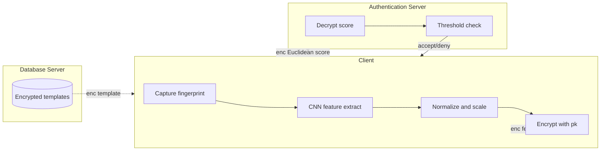
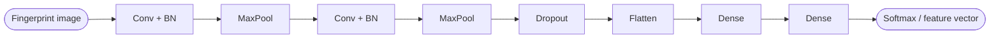

## TL;DR

A privacy-preserving fingerprint authentication pipeline extracts CNN feature vectors in plaintext on the client, encrypts them under CKKS via TenSEAL, and performs encrypted squared-Euclidean matching against stored encrypted templates, achieving 99.06% accuracy with EER 0.40% and a 0.025 s encrypted comparison on a SOCOFing subset of 90 users [Abstract][§IX].

## Problem and motivation

Fingerprints are immutable and sensitive: stolen biometric templates can be inverted to reconstruct images or used for impersonation, and GDPR / ISO/IEC 24745 require irreversibility, unlinkability and renewability for biometric template protection [§I.A, §I.B]. Traditional cancelable biometrics and cryptobiometrics trade accuracy for privacy and often rely on auxiliary data [§I.B]. The work targets cloud-based fingerprint authentication for healthcare, banking and access control, where the server must never see raw fingerprint data [§I, §I.E]. Threat model: honest-but-curious authentication and database servers that follow the protocol but may try to infer information from encrypted data, and assume the two servers do not collude [§III.E, §IV.G].

## Key contributions

- Encrypted fingerprint recognition framework built on Microsoft SEAL / TenSEAL keeping biometric data secure throughout authentication [§I.D].
- CNN-based fingerprint feature extractor whose output is adapted for encrypted-domain matching under CKKS [§I.D, §IV.D].
- Evaluation on SOCOFing showing 99.06% accuracy, EER 0.40%, TAR 99.19%, FAR 0%, TRR 100%, FRR 0.81% with encrypted Euclidean distance [§VI, §IX.B].
- ISO/IEC 24745 compliance argued via FHE-based irreversibility, unlinkability (probabilistic CKKS encryption) and renewability through key-pair rotation and template re-encryption [§VII, §VII.A].
- Practical real-time figures: 0.025 s per encrypted comparison, 0.136 s total processing per fingerprint, 344 KB per stored template, 31 MB for 90 users [§VIII.D, §IX.D].

## FHE setup

- **Scheme(s):** CKKS (Cheon-Kim-Kim-Song, approximate arithmetic on encrypted floating-point) [§III.B, §III.H].
- **Library / implementation:** TenSEAL (Python interface to Microsoft SEAL) [§III, §III.B, §IV.J].
- **Parameters:** Polynomial modulus degree 8192; coefficient modulus bit sizes [60, 40, 40, 60]; 128-bit security [§III.H].
- **Bootstrapping used:** Not reported as part of the deployed pipeline; the paper mentions bootstrapping generically as a noise-management technique [§IV.J.2].
- **Packing / encoding strategy:** CKKS approximate encoding of the CNN feature vector; features are first normalized to [0,1] and then scaled to an integer range [0, 10^3] before encryption to retain precision [§III.C]. No SIMD-batching scheme is described explicitly.

## ML setup

- **Task:** Encrypted 1-to-1 fingerprint verification (similarity-score thresholding) on top of a plaintext CNN classifier trained for fingerprint identification [§IV, §VI.B].
- **Model architecture:** Custom sequential CNN with convolutional layers, batch normalization, max-pooling, dropout, fully connected layers and softmax classifier; per-layer widths summarized in Table 2 but layer counts/sizes are not given as plain text in the extracted file [§IV.G, Table 2 — not extracted]. Feature vector dimensionality is not reported numerically.
- **Activation handling:** Activations are applied in the plaintext CNN stage on the client; the encrypted stage only computes squared Euclidean distance (multiplications and additions), so no polynomial-approximated nonlinearity is needed [§III.C.1, §IV.J].
- **Operates on:** Plaintext model + plaintext feature extraction on the client; only the *feature vector* and the *stored templates* are encrypted, and the encrypted similarity score is what flows server-side [§III.D, §IV.J].
- **Training vs inference:** Training runs in plaintext on GPU; encryption only enters at deployment-time matching [§IV.E, §IV.F].

## Datasets

| Dataset | Task | Size (train/test) | Modality | Notes |
|---|---|---|---|---|
| SOCOFing (subset of 90 individuals) | Fingerprint verification | 7,200 altered images split 80/10/10 (train/val/test); 1 real fingerprint per user enrolled as encrypted template (90 templates) | Fingerprint images, 500 dpi | STRANGE-toolbox alterations at three difficulty levels (easy/medium/hard); min-max normalized to [0,1] then scaled by 10^3 before encryption [§IV.A, §IV.B, §IV.C, §III.C]. |

## Pipeline diagram



### Pipeline steps (text)

1. Client captures fingerprint and runs the CNN locally to obtain a plaintext feature vector FU [§III.D, §IV.D].
2. Client normalizes FU to [0,1] then scales to integer range [0, 10^3] for CKKS numerical stability [§III.C].
3. Client encrypts FU with the public key using TenSEAL CKKS, producing E(FU) [§III.B, §IV.J.1].
4. Database server returns the corresponding encrypted reference template E(TD) to the client [§III.D, §IV.J.1].
5. Client computes the encrypted squared Euclidean distance E(Seuc) homomorphically between E(FU) and E(TD) [§III.C.1, §IV.F].
6. Client sends the encrypted similarity score to the authentication server [§III.D, §IV.F].
7. Authentication server decrypts the score with the secret key, compares against threshold δ=9, and returns accept/deny [§III.D, §IV.F, §VI.A].

## Architecture diagram



Note: exact layer counts, kernel sizes and channel widths are summarized in Table 2 of the paper but are not present in the extracted text [§IV.G, Table 2].

## Results

| Metric | This paper | Baseline | Hardware |
|---|---|---|---|
| Test accuracy | 99.06% [§VI.A, §IX.B] | "nearly identical" plaintext accuracy [§VI.A] | Dell R750XA, 2x A100 80GB, dual Xeon Silver 4314 [§IV.F] |
| EER | 0.40% (threshold 9, Euclidean) [§VI.A, §VI.D] | 0.20% plaintext Euclidean [§VI.D, Table 4] | same |
| TAR | 99.19% [§VI.A] | — | same |
| FAR | 0% [§VI.A, §IX.B] | — | same |
| FRR | 0.81% (encrypted 0.0081 vs 0.0080 plaintext) [§VI.D, §IX.B] | — | same |
| TRR | 100% [§IX.B] | — | same |
| Test loss | 0.1692 [Abstract, §X] | — | same |
| Single encrypted comparison | 0.025 s (Euclidean) [§IX.D] | 0.000162 s plaintext [§VIII.D] | same |
| Total processing per fingerprint | 0.136 s [Abstract, §IX.D] | — | same |
| Encryption overhead vs plaintext | 157.26x [Abstract, §VIII.D] | — | same |
| Encrypted vs plaintext matching | 90x slower [§IX.E] | — | same |
| Storage per template | 344 KB; 31 MB for 90 users [Abstract, §IX.D] | — | same |
| 1M comparisons (identification) | ~8 minutes with parallelization [§VIII.D] | — | same |
| Cosine alternative | 0.028 s encrypted vs 0.00018 s plaintext (156x slower) [§VI.D] | — | same |

## Limitations and assumptions

- CNN feature extraction itself runs in **plaintext on the client**; only the distance computation is encrypted. The 0.025 s figure is therefore a distance-only cost and is not directly comparable to end-to-end encrypted-inference papers [§III.D, §IV.D, §IV.J].
- Closed-world: enrollment uses only 1 fingerprint per user across 90 users, deliberately to "reduce computational complexity"; scalability of EER to larger populations is not measured [§IV.B, §X].
- The honest-but-curious model explicitly assumes the authentication server and database server do **not collude**, even though the authentication server holds the decryption key [§III.E, §III.G].
- The decryption key sits on the authentication server, so a compromise there exposes scores; the client never holds plaintext templates either [§III.D].
- Hardware is a dual-A100 server — the "real-time" claim has not been validated on edge / mobile devices [§IV.F].
- Specific FHE noise budget, multiplicative depth used, and ciphertext sizes are not directly reported beyond the polynomial modulus 8192 and coefficient bits [60,40,40,60] [§III.H].
- Layer-level CNN architecture details (filter counts, kernel sizes, FC widths, feature vector length) live in Table 2 / Figure 4 and are not in the extracted text [§IV.G].

## Related work it compares against

- HE-MAN (Nocker et al., ONNX + Concrete/TenSEAL) [§II, ref. 29].
- UniHENN (Choi et al., im2col-free HE CNN) [§II, ref. 32].
- SLAF / encrypted biometric authentication on UTKFace (Xiong et al.) [§II, ref. 33].
- CryptoNets (cited via the SLAF comparison) [§II].
- EEG biometric HE system (Zhang et al.) [§II, ref. 34].
- Multi-key HE face recognition PUM (Wang et al.) [§II, ref. 36].
- K-means clustered HE face recognition (Nakanishi et al.) [§II, ref. 37].
- Decentralized car-sharing biometric with FHE + IPFS (Vadim et al.) [§II, ref. 38].

The paper does not provide a like-for-like accuracy / latency comparison table against these systems.

## Code and artifacts

Not released. No repository URL or licence is mentioned in the extracted text.

## Extra diagrams (optional)

### Threat model

```mermaid
flowchart LR
    C[Client - holds sk] -- enc feature E(FU) --> A[Auth Server]
    D[DB Server - stores E(TD)] -- enc template E(TD) --> C
    C -- enc score E(S) --> A
    A -- accept / deny --> C
```

The client is the only entity holding both raw biometrics and the secret key. Database server only ever sees encrypted templates; authentication server only ever sees the encrypted similarity score (and decrypts it) [§III.D, §III.E, §IV.G].

## Open questions

- Domain tag: this is a **biometric / fingerprint** paper but the controlled vocabulary does not list "biometric". Tagged as `generic-vision` here as the closest fit since fingerprints are images; a dedicated `biometric` value in the controlled vocabulary would be more honest and worth proposing.
- Exact CNN architecture (layer count, kernel sizes, feature-vector dimension F) is in Table 2 / Figure 4 of the PDF but not in the extracted text — the comparison table's `nn_layers` / `input_nodes` / hidden widths are left as `Not reported` / `N/A`.
- The reported 0.025 s comparison time covers the encrypted distance only; end-to-end encrypted CNN inference is **not** what this paper does.
- Whether bootstrapping is invoked at all under the given CKKS parameters (degree 8192, modulus chain [60,40,40,60]) is not explicitly stated.
- Decryption-key placement on the authentication server is somewhat unusual relative to canonical client-side-decryption FHE deployments — the strict non-collusion assumption is load-bearing.
