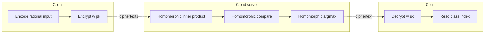
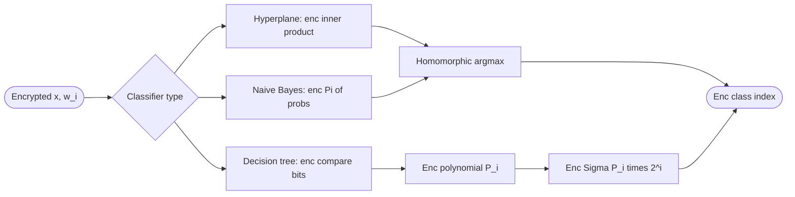
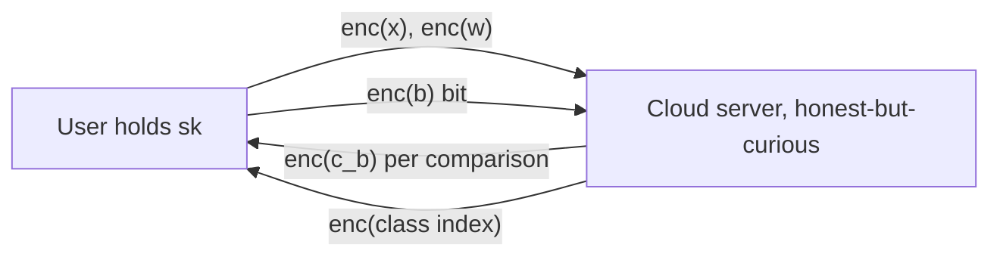

# Sun et al. 2020 — Private Machine Learning Classification Based on FHE

## TL;DR

The authors propose an efficiency-improved BGV-style FHE scheme that swaps the order of relinearization and modulus switching (and skips both when the next operation is additive), then use it to build private hyperplane, Naive Bayes, and decision-tree classifiers with a single-interaction homomorphic comparison protocol [Abstract][§I.A].

## Problem and motivation

Outsourced machine-learning classification on sensitive data (medical, genomic, spam) leaks user privacy if the cloud sees plaintexts [§I]. Prior privacy-preserving classifiers either rely on additive-only cryptosystems (Paillier, Quadratic Residuosity) that need many client/server interactions to emulate multiplications, or on FHE libraries (HElib, Khedr) whose multiplicative-homomorphic step is expensive. The threat model is an honest-but-curious cloud server holding ciphertexts; only the user holds the secret key [§V]. Security target is CPA under RLWE [§III.D].

## Key contributions

- Improved BGV-style FHE: apply relinearization **before** modulus switching (instead of HElib's order), shrinking the modulus-switching work from three ring elements to two [§III.A, §III, comparison with HElib].
- Skip relinearization and modulus switching when the next homomorphic op on a multiplicative ciphertext is additive or absent [§III.A].
- One-round homomorphic comparison protocol that reduces Bost's 3 interactions to 1 by computing `c_b = c_t +_h c_0 -_h c_1` server-side [§IV.C, Fig. 2].
- Homomorphic maximum (argmax) protocol built atop the comparison protocol [§IV.D, Fig. 3].
- Private hyperplane-decision, private Naive Bayes, and private decision-tree classifiers implemented under the new FHE scheme with SIMD packing [§V].
- Empirical demonstration that the proposed scheme with SIMD outperforms HElib-with-SIMD and Khedr's FHE on decision-tree classification across security parameters λ ∈ {5, 50, 53, 55} [§VI, Tables 1–7].

## FHE setup

- **Scheme(s):** Improved BGV12-style FHE (RLWE-based, leveled), with the authors' re-ordered relinearization/modulus-switching pipeline [§III.A].
- **Library / implementation:** Custom C++ implementation using the NTL large-number library; compiled with GCC [§VI].
- **Parameters:** Security parameter λ swept over {5, 50, 53, 55}; phi(m) chosen so that phi(m) > log2(q_j) · (λ+110)/7.2. Example settings: λ=80, phi(m)=1176 → log2(q_j)=44, m=1247, q_j=2^44; phi(m)=2880 → log2(q_j)=109, m=3133, q_j=2^109 [§III.E]. Plaintext modulus t (e.g. t=2 in the comparison example) [§IV.C].
- **Bootstrapping used:** No (leveled scheme; modulus chain q_0 < q_1 < ... < q_{L-1}) [§III.A].
- **Packing / encoding strategy:** SIMD batching via Chinese Remainder Theorem on the cyclotomic ring; reduces multiplicative-homomorphic operations in Naive Bayes from kn to n [§IV.A, §V.B]. Rational inputs handled via Bos's fractional encoder [§IV.B].

## ML setup

- **Task:** Classification (inference only) under three model families.
- **Model architecture:**
  - Hyperplane decision: argmax_i ⟨w_i, x⟩ over k weight vectors w_i ∈ R^n [§II.C.1].
  - Naive Bayes: argmax_i p(C=c_i) · Π_j p(X_j=x_j | C=c_i) [§II.C.2].
  - Decision tree: traversal expressed as polynomial P_i = Σ over root-to-leaf paths of products of comparison bits b_i and class encodings c_{j,i}; classification k* = Σ P_i · 2^i [§II.C.3, §V.C, Fig. 1].
- **Activation handling:** N/A (no neural-network nonlinearity). Comparisons are evaluated homomorphically via the comparison protocol that returns the l-th bit of `b = t + m_0 − m_1` [§IV.C].
- **Operates on:** Encrypted model + encrypted data; cloud server computes, client decrypts [§V].
- **Training vs inference:** Inference only — models are trained in the clear with scikit-learn [§VI].

## Datasets

| Dataset | Task | Size (train/test) | Modality | Notes |
|---|---|---|---|---|
| Wisconsin Breast Cancer (Original), UCI | Binary classification | Not reported | Tabular (clinical features) | Used for all three classifiers; k=4 classes/branches and n=3 features in the experiments [§VI] |

## Pipeline diagram

### Pipeline steps (text)

1. Client encodes rational features using Bos's fractional encoder [§IV.B].
2. Client encrypts inputs (and, depending on the classifier, weights / probabilities / class labels) using the improved BGV scheme and uploads them [§V.A–C].
3. Server computes the model-specific homomorphic sum-of-products (inner product for hyperplane; Π of conditional probabilities for Naive Bayes; comparison-bit polynomial for decision tree) [§V].
4. Server runs the one-round homomorphic comparison protocol `c_b = c_t +_h c_0 -_h c_1` and returns `c_b` for each comparison [§IV.C, Fig. 2].
5. Server runs the homomorphic-maximum loop to obtain the argmax ciphertext c_{k*} [§IV.D, Fig. 3].
6. Client decrypts the returned ciphertext(s) and reads off the class index k* (decision tree: k* = Σ P_i · 2^i) [§V.C].

## Architecture diagram

## Results

All times are microseconds, averaged over 3 runs on the VM described under Hardware [§VI]. There is no plaintext-accuracy comparison — the paper does not report classification accuracy, only runtime.

| Metric | This paper (ours + SIMD) | Baseline | Hardware |
|---|---|---|---|
| 10 hom. ops, mult-depth 1, λ=55 | 0.84 µs | HElib+SIMD: 98.77 µs; Khedr: 790.26 µs | i5-3470 @ 3.2 GHz, 1 core, 3.7 GB RAM [§VI, Tab. 1] |
| 10 hom. ops, mult-depth 2, λ=55 | 23.41 µs | HElib+SIMD: 214.66 µs; Khedr: 2310.10 µs | same [§VI, Tab. 2] |
| 10 hom. ops, mult-depth 3, λ=55 | 132.62 µs | HElib+SIMD: 316.24 µs; Khedr: 3107.92 µs | same [§VI, Tab. 3] |
| Homomorphic comparison, λ=55 | 0.13 µs | Not compared (different primitive) | same [§VI, Tab. 4] |
| Private hyperplane classification, λ=55 | 2.41 µs (SIMD) / 9.22 µs (no SIMD) | — | same [§VI, Tab. 5] |
| Private Naive Bayes, λ=55 | 141.95 µs (SIMD) / 568.07 µs (no SIMD) | — | same [§VI, Tab. 6] |
| Private decision tree, λ=55 | 177.06 µs (SIMD) | HElib+SIMD: 1788.60 µs; Khedr: 2329.26 µs | same [§VI, Tab. 7] |

Single-inference number for the comparison table is taken from private decision tree at λ=55 with SIMD: 177.06 µs = 0.000177 s.

## Limitations and assumptions

- No classification-accuracy numbers reported — only runtime is benchmarked, so we cannot tell if homomorphic encoding (fractional encoder, plaintext modulus) introduces error vs the scikit-learn plaintext model [§VI].
- Experiments use very small parameters: k=4, n=3, security parameter λ ∈ {5, 50, 53, 55}. λ=5 is cryptographically meaningless; even 55 is well below the 80-/128-bit norms used in the FHE literature [§VI].
- Hardware is a single-core VM on a 2012-era desktop CPU [§VI]; numbers do not scale-translate cleanly to modern servers.
- Decryption-noise correctness conditions are stated but no concrete noise budget per classifier is given [§III.B–C, §III.E].
- The "one-round" comparison protocol still requires a client decryption step to recover bit b_l, so the protocol is interactive per comparison [§IV.C].
- Communication cost and ciphertext sizes are not reported [§VI].
- Reliance on Bos's fractional encoder restricts the multiplicative depth before precision blowup; not quantified for the chosen datasets [§IV.B].

## Related work it compares against

- HElib (Halevi & Shoup) with SIMD — BGV12 reference implementation [§III, §VI].
- Khedr et al.'s improved FHE scheme (no SIMD support) on Gentry–Sahai–Waters [§I, §VI].
- Bost et al.'s private classifiers built from Paillier + Quadratic Residuosity (additive-only) — used as the architectural baseline for hyperplane, Naive Bayes, and decision-tree classification [§I, §IV.C, §V].
- Liu et al.'s patient-centric Naive Bayes system based on Paillier + SM protocol [§I].
- Jiang et al.'s BGV-based perceptron / SVM work [§I].

## Code and artifacts

Not released. Implementation is described as custom C++ over NTL, compiled with GCC [§VI]. No repository URL given.

## Extra diagrams (optional)

### Threat model

## Open questions

- What is the actual plaintext-vs-FHE accuracy on Wisconsin Breast Cancer? The paper benchmarks runtime only.
- How do the runtimes scale to realistic security levels (λ ≥ 80) and larger n, k? Tables stop at λ=55, n=3, k=4.
- How many bits of fractional precision does the Bos encoder retain across the multiplicative depth needed for each classifier?
- The "1 interaction" claim for the comparison protocol covers a single compare; the homomorphic-maximum loop and the decision-tree traversal still need per-compare round trips — is the end-to-end interaction count quantified anywhere?
- Is the proposed reordering of relinearization-then-modulus-switching strictly correct in terms of noise growth versus HElib's order, or does it trade off noise budget for speed? The noise bound is stated but not directly compared.

