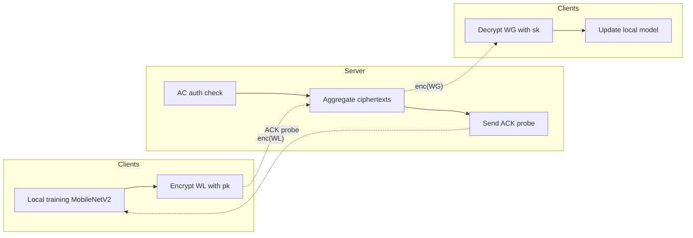
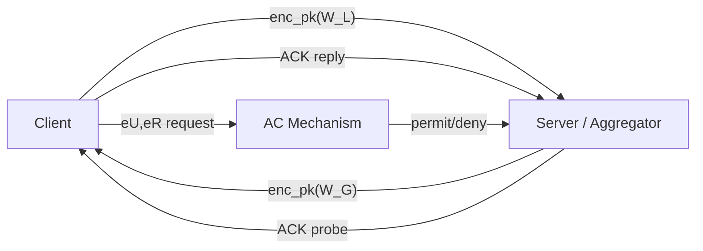
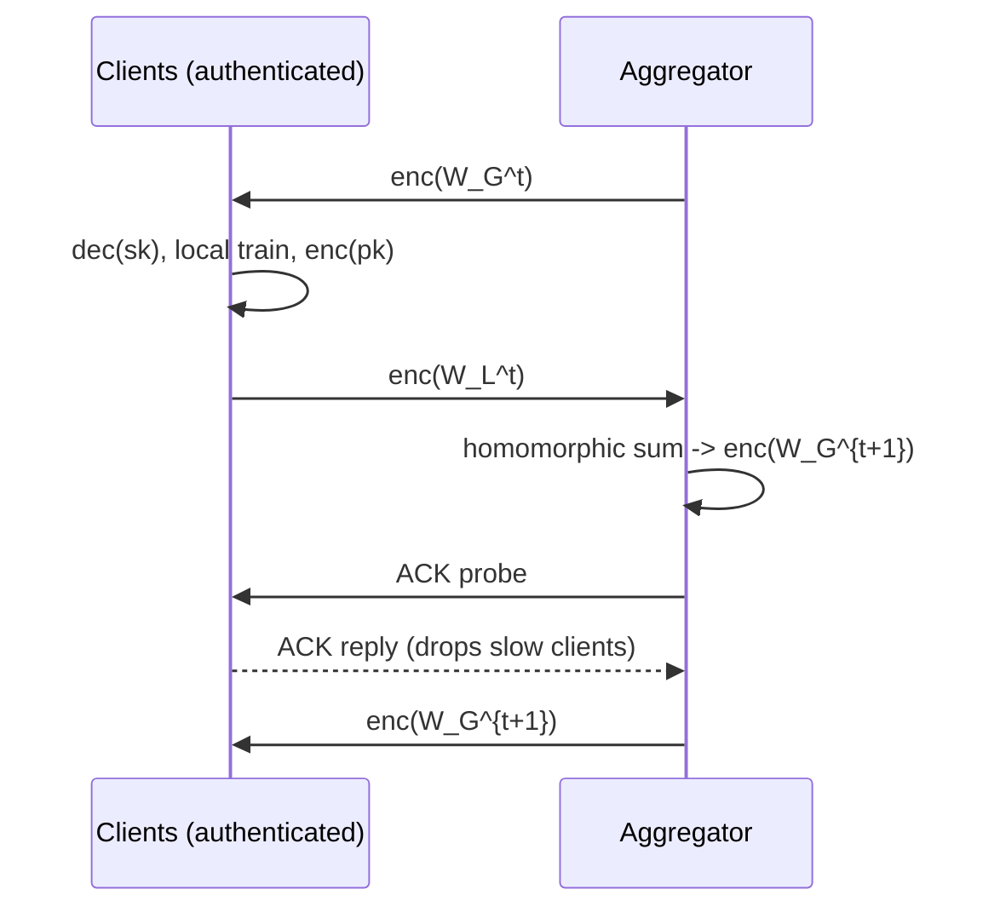

## TL;DR

PPFLHE is a federated learning framework that protects healthcare model updates with Paillier additive homomorphic encryption, combined with an Access Control identity check on clients and an ACK mechanism on the server to drop unresponsive clients. It reports 81.53% classification accuracy on APTOS 2019 Blindness Detection with MobileNetV2 [§5.2, abstract].

## Problem and motivation

Healthcare data is sensitive and siloed, and plain federated learning can still leak private information through exchanged gradients/parameters via reconstruction or membership inference attacks [§1]. The paper considers two issues: (1) protecting user privacy without harming utility, and (2) reducing waiting delay and communication overhead caused by stragglers and dropouts [§1, §3.2]. The threat model assumes honest-but-curious aggregators, possibly malicious internal clients, and non-collusion between client and server [§4.5].

## Key contributions

- A privacy-preserving FL scheme (PPFLHE) using Paillier homomorphic encryption to encrypt model parameters shared between clients and server [§1, §4].
- An Access Control (AC) mechanism with attributes ⟨eU, eR, o, d⟩ and ACLs to authenticate clients and prevent internal attacks [§4.2].
- An Acknowledgment (ACK) mechanism that detects and temporarily eliminates dropped/unresponsive users to cut waiting delay and communication overhead [§4.4].
- Empirical evaluation on APTOS 2019 Blindness Detection and CIFAR-10 showing 81.53% accuracy with MobileNetV2 and lower communication overhead than several baselines [§5.2, §5.5].

## FHE setup

- **Scheme(s):** Paillier Homomorphic Encryption (PHE) — additive homomorphism only; multiplications converted to polynomial-addition form via Taylor expansion of the log-loss [§4.3].
- **Library / implementation:** Not reported (Python 3.7 / PyTorch 1.11.0 environment) [§5.1.1].
- **Parameters:** Key length 512 bits used in experiments (also evaluated 512/1024/2048/3072) [§5.3, Table 1 lists 521-bit Paillier HE key length]; n = pq, g ∈ Z*_{n^2}, sk = (λ, μ) with λ = lcm(p−1, q−1) [§4.3].
- **Bootstrapping used:** Not reported (Paillier does not require bootstrapping for its single supported operation).
- **Packing / encoding strategy:** Not reported; parameters encrypted elementwise. Server aggregates ciphertexts by additive homomorphism [§4.3].

## ML setup

- **Task:** Federated training (horizontal FL) for image classification of diabetic retinopathy severity (5 classes) and CIFAR-10 (10 classes) [§5.1.2, §5.2].
- **Model architecture:** MobileNetV2 — 1 initial conv2d, 17 bottleneck layers, 1 conv2d 1×1 linear, 1 avgpool 7×7, 1 final conv2d 1×1 classifier [§5.2, Table 2].
- **Activation handling:** ReLU6 in all conv/bottleneck blocks; logarithmic loss approximated via second-order Taylor expansion about θ = 0 so that gradient updates become additions compatible with Paillier [§4.3, Eqs. 6–10].
- **Operates on:** Plaintext local training at each client; encrypted model parameter exchange and aggregation [§4.1, §4.3].
- **Training vs inference:** Training under encryption only for aggregation; inference is not the focus.

## Datasets

| Dataset | Task | Size (train/test) | Modality | Notes |
|---|---|---|---|---|
| APTOS 2019 Blindness Detection | DR severity (5-class) | 3662 train / 1928 test | Retinal images | 20% of train used as validation, fivefold cross-validation [§5.1.2] |
| CIFAR-10 | Object classification (10-class) | 50000 train / 10000 test | 32×32 RGB images | Used as control to show transferability [§5.1.2] |

## Pipeline diagram

### Pipeline steps (text)

1. Server randomly selects k clients and authenticates them via the AC mechanism using ⟨eU, eR⟩ against the ACL [§4.2].
2. Each authenticated client generates Paillier key pair (pk, sk) and shares pk [§4.3].
3. Server broadcasts the current encrypted global model W*_G to selected clients [§4.1].
4. Clients decrypt with sk, train MobileNetV2 locally for E epochs with Momentum-SGD [§4.1, §5.2].
5. Clients encrypt updated local model W*_L with pk and upload to server [§4.1].
6. Server homomorphically aggregates ciphertexts to obtain new W*_G [§4.3].
7. Server issues ACK probes; clients responding within timeout join the next round, slow/dropped clients are removed and the slowest client's selection probability is reduced to 1/k [§4.4, Algorithm 3, Eq. 11].
8. Repeat until each participant judges the model has converged [§4.3].

## Architecture diagram

```mermaid
flowchart LR
    I([Input 224x224x3]) --> C1[conv2d 32, s=2]
    C1 --> B1[Bottleneck x1, c=16]
    B1 --> B2[Bottleneck x2, c=24]
    B2 --> B3[Bottleneck x3, c=32]
    B3 --> B4[Bottleneck x4, c=64]
    B4 --> B5[Bottleneck x3, c=96]
    B5 --> B6[Bottleneck x3, c=160]
    B6 --> B7[Bottleneck x1, c=320]
    B7 --> C2[conv2d 1x1, 1280]
    C2 --> P[avgpool 7x7]
    P --> C3[conv2d 1x1, k classes]
    C3 --> O([Softmax])
```

## Results

| Metric | This paper | Baseline | Hardware |
|---|---|---|---|
| Accuracy on APTOS 2019 (MobileNetV2) | 81.53% | 80.0% [Ref 40]; 79.4% [Ref 17]; 72.9% [Ref 18]; 86.69% [Ref 39 — no security] | 3080Ti GPU, 64 GB RAM, Ubuntu 18.04 [§5.1.1] |
| Accuracy on CIFAR-10 (MobileNetV2) | 84.73% | Resnet50: 86.11% (9× model size) [§5.2, Table 3] | same [§5.1.1] |
| Per-user federated communication time at C=5 | ~202.03 s | non-PPFLHE higher by ~100 s; at C=11 reduction ~160 s [§5.4, §5.5, Fig. 7] | same |
| Paillier key length used | 512 bit | 1024/2048/3072 evaluated; time grows with length [§5.3, Fig. 5] | same |
| Communication overhead (Total) | 2nm | 2n·m_FHE (CKKS [19]); 2(nm+T) ([28],[41]); 3nm ([20]); 2nT ([40]) [§5.5, Table 5] | analytical |
| Privacy vs DP (ε=1) at same training | matches no-privacy accuracy | DP accuracy lower due to noise [§5.6, Fig. 8] | same |

Single-sample encrypted inference latency is not reported (the paper measures FL round/communication time, not inference per image) [§5.4–§5.5].

## Limitations and assumptions

- Paillier supports only additive homomorphism; multiplicative operations are handled by replacing the loss with a Taylor approximation, which may degrade optimization fidelity [§4.3].
- Authors flag high communication overhead and "ciphertext explosion" from HE as ongoing problems for future work [§6].
- The scheme cannot guarantee strong consistency of model updating; only eventual/final consistency [§6].
- Poisoning attacks are out of scope [§6].
- Security relies on non-collusion between client and server [§4.5].
- Reported 521-bit Paillier HE key length in Table 1 vs. 512-bit chosen length in §5.3 is inconsistent; the experimental setting in §5.3 says 512 bits.
- Inference latency on encrypted single images is not reported; only round-level communication time is given [§5.4–§5.5].

## Related work it compares against

CryptoNets-style HE FL works including Stripelis et al. CKKS scheme [Ref 19], Ku et al. HE re-encryption [Ref 20], Xu et al. VerifyNet [Ref 21], Truex et al. DP+MPC hybrid [Ref 22], BatchCrypt [Ref 25], Li et al. DP smart healthcare [Ref 17], Li et al. fMRI DP [Ref 18], Ngo et al. cerebellar ataxia FL [Ref 39], Malekzadeh et al. Dopamine [Ref 40], Singh et al. blockchain FL [Ref 41], Jia et al. blockchain+DP+HE IIoT [Ref 28] [§2, §5.2 Table 4, §5.5 Table 5, §5.6 Table 6].

## Code and artifacts

Not released. The data availability statement says "No data was used for the research described in the article" — no public repository is provided [p. 9].

## Extra diagrams (optional)

### Threat model

### Federated round

### Activation approximation

The log-loss log(1 + e^{-θ}) is replaced by its second-order Taylor expansion about θ = 0: log 2 − (1/2)θ + (1/8)θ^2 + O(θ^2), giving a gradient linear in [[W]]^T x_i that is compatible with Paillier additive homomorphism [§4.3, Eqs. 7–10]. See Eqs. (8)–(10) for the closed form used.

## Open questions

- Exact Paillier key length used in the headline 81.53% experiment (Table 1 says 521 bit, §5.3 says 512 bit).
- Which library implements Paillier (no SEAL/HElib/python-paillier mention).
- Quantization/scaling of float MobileNetV2 weights into the Paillier plaintext space — not described.
- Wall-clock per-round time only partly reported (≈202.03 s at C=5 is aggregated; encryption/decryption breakdown only shown qualitatively in Fig. 5).
- How the AC mechanism resists a compromised ACL or stolen credentials is not analyzed.
