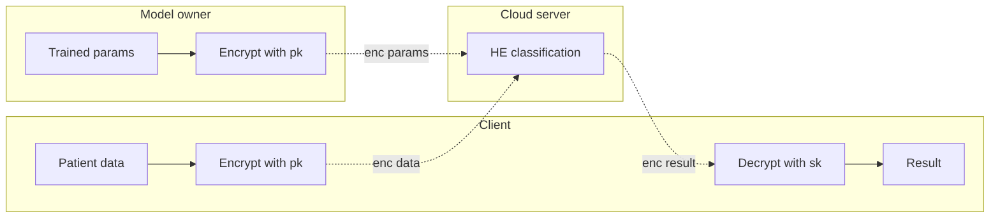
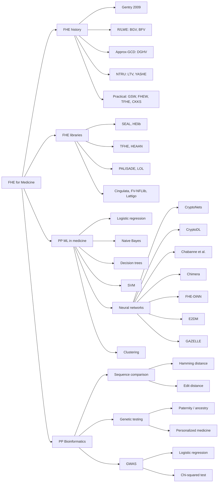
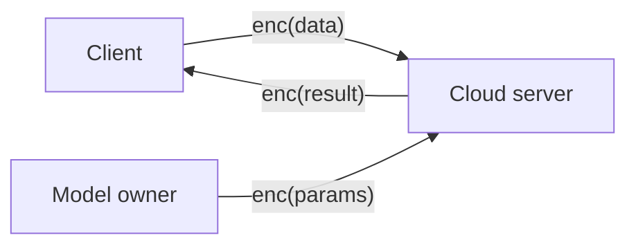

## TL;DR

A broad survey of fully homomorphic encryption (FHE) and its applications to privacy-preserving machine learning and bioinformatics in medicine, covering FHE history, schemes, open-source libraries, and HE-friendly implementations of logistic regression, Naive Bayes, decision trees, neural networks, clustering, sequence comparisons, genetic testing, and GWAS [§1, §7].

## Problem and motivation

Medical and genomic data are highly sensitive and subject to laws such as HIPAA and GDPR, which limit free sharing for analysis [§1, p. 70:2]. FHE enables arbitrary computation on encrypted data and offers a path to privacy-preserving outsourced ML over medical/genomic data [§1]. The survey targets clinicians, computer scientists, engineers, and graduate students seeking entry into the FHE-for-medicine field [§1, p. 70:2]. Threat models discussed include private outsourced computation, private prediction (no client/server collusion assumed), and private training [§4, p. 70:10].

## Key contributions

- High-level introduction to FHE history and terminology, from Gentry's 2009 breakthrough through current "three models" (Boolean circuits, modular arithmetic, approximate arithmetic) [§2].
- Detailed comparison of open-source FHE libraries (SEAL, HElib, TFHE, HEAAN, PALISADE, LOL, Cingulata, FV-NFLlib, Lattigo) with languages and licenses [§3, Table 1].
- Review of privacy-preserving ML on medical data: logistic regression, Naive Bayes, decision trees, SVM, neural networks (CryptoNets, CryptoDL, Chimera, FHE-DiNN, E2DM, GAZELLE, Chabanne et al.), unsupervised clustering [§4, §5, Table 2].
- Review of FHE for bioinformatics: Hamming and edit distance, paternity/ancestry testing, personalized medicine, GWAS via logistic regression and chi-squared tests [§6].

## FHE setup

- **Scheme(s):** Survey covers PHE (RSA, ElGamal, Paillier), SHE (BGN), and FHE: Gentry's ideal-lattice scheme, BGV, BFV/FV, GSW, DGHV, NTRU-like (LTV, YASHE), FHEW, TFHE, CKKS/HEAAN, plus RNS variants and Chimera [§2.1–2.4].
- **Library / implementation:** SEAL, HElib, TFHE, HEAAN, PALISADE, LOL, Cingulata, FV-NFLlib, Lattigo, plus wrappers (Pyfhel, PySyft) and GPU variants (cuFHE, NuFHE) [§3, Table 1].
- **Parameters:** Not specific to one paper; the survey notes the 2018 Homomorphic Encryption Standard with recommended security parameters [§2.4, p. 70:7].
- **Bootstrapping used:** Discussed throughout; introduced by Gentry, with later improvements such as FHEW sub-second NAND bootstrapping and CKKS/TFHE bootstrapping refinements [§2.1, §2.4].
- **Packing / encoding strategy:** SIMD batching via Smart-Vercauteren ciphertext packing, slot permutation, RNS variants for speed [§2.1, §2.4, Fig. 2].

## ML setup

- **Task:** Survey of inference and training across multiple ML methods: logistic regression, Naive Bayes, decision trees, SVM, neural networks (private classification and private training), and k-means / mean-shift clustering [§4, §5].
- **Model architecture:** Not a single architecture; reviews layer types used in NNs (convolutional, activation, pooling, fully connected) and discusses HE-friendly variants [§4.4.1].
- **Activation handling:** Discusses square activation (CryptoNets) [§4.4.2], low-degree polynomial approximations of ReLU with batch normalization (Chabanne et al.) [§4.4.2], Chebyshev polynomial approximations of sigmoid/tanh and antiderivative-of-gradient for ReLU (CryptoDL), trigonometric polynomials (Chimera), sign activation (FHE-DiNN), and garbled-circuit non-linear evaluation (GAZELLE) [§4.4.2, Table 2].
- **Operates on:** Various: encrypted data + plaintext model (CryptoNets); both encrypted (E2DM); hybrid with garbled circuits (GAZELLE) [§4.4.2, Table 2].
- **Training vs inference:** Both reviewed; private training discussed as more challenging due to high multiplicative depth and the need to be "effective on the first try" [§4.4.3, p. 70:20].

## Datasets

| Dataset | Task | Size (train/test) | Modality | Notes |
|---|---|---|---|---|
| Not reported | Survey paper | N/A | Various: medical records, imaging, VCF/DNA, GWAS SNP data | The survey describes application domains (personalized medicine, paternity testing, ancestry, GWAS, osteoarthritis classification example) without running its own experiments [§4–6] |

## Pipeline diagram

The survey's reference privacy-preserving classification model (Fig. 3, p. 70:11) [§4]:

### Pipeline steps (text)

1. Patient encrypts her private medical data under public key pk [§4, p. 70:11].
2. Researchers / model owner encrypt trained model parameters under the same pk and upload to cloud [§4, p. 70:11].
3. Cloud server homomorphically evaluates the classifier on the encrypted inputs [§4, p. 70:11].
4. Encrypted result is returned to the patient [§4, p. 70:11].
5. Patient decrypts with her private key sk to view the classification [§4, p. 70:11].

## Architecture diagram

The survey's taxonomy of FHE for medicine and bioinformatics [§1.0.1, §2–6]:

## Results

The survey does not present new experimental results. It catalogs and compares prior systems qualitatively [§4.4.2, Table 2; §3, Table 1].

| Metric | This paper | Baseline | Hardware |
|---|---|---|---|
| New results | None (survey) | N/A | N/A |
| Library catalog | 9 libraries (Table 1) | N/A | N/A |
| NN frameworks catalog | 7 frameworks (Table 2) | N/A | N/A |
| Reported per-system metrics | Not aggregated quantitatively | N/A | N/A |

The survey notes specific qualitative findings, e.g. CryptoNets' square activation can be unstable on networks deeper than 10 layers [§4.4.2, p. 70:19]; Jaschke and Armknecht's HE k-means takes over 25 days on a 2D, 400-point dataset [§5, p. 70:21]; an early Gentry-Halevi FHE implementation takes up to 30 minutes per bootstrap [§2.1, p. 70:5].

## Limitations and assumptions

- Survey is dated August 2020 and explicitly notes that FHE research is moving fast; many new techniques have appeared since prior surveys [§1].
- Authors note FHE remains hard for non-experts: parameter selection, noise management, and plaintext/ciphertext conversions are non-trivial [§3, p. 70:8].
- Most reviewed private-training methods carry "high computation and communication costs" [§4.4.3, p. 70:20].
- Many GWAS HE protocols (e.g. SAFETY) are only secure against semi-honest queriers [§6.3, p. 70:26].
- The privacy-preserving classification model in Fig. 3 assumes no collusion between client and server [§4, p. 70:10].

## Related work it compares against

Prior surveys: Acar et al. (general FHE) [1], Armknecht et al. (FHE guide) [11], Martins et al. (engineering view) [148], Aziz et al. (genomic) [15, 158], Aguilar-Melchor et al. (signal processing) [3, 136], Peikert (theory) [166] [§1, p. 70:2]. Systems catalogued include CryptoNets, CryptoDL, Chimera, FHE-DiNN, E2DM, GAZELLE, MiniONN, nGraph-HE, and iDASH competition winners (Kim et al., Blatt et al., Carpov et al., Bonte et al.) [§4.4.2, §6.3].

## Code and artifacts

Not released (survey paper). The libraries it surveys are open-source and linked in §3 (SEAL, HElib, TFHE, HEAAN, PALISADE, LOL, Cingulata, FV-NFLlib, Lattigo) [§3, Table 1].

## Extra diagrams (optional)

### Threat model

The survey's standard private-prediction setup with non-colluding client and server [§4, p. 70:10–70:11]:

## Open questions

- The survey does not report quantitative end-to-end accuracy or latency numbers in a unified table for the NN frameworks (Table 2 only lists activation/pooling choices) [§4.4.2].
- No specific recommendation among the schemes for medical practitioners; choice is left implicit [§7].
- Section numbering anomaly: text references "Section 6" for bioinformatics from the §1.0.1 organization paragraph, but §5 is Clustering and §6 is Bioinformatics in the body [§1.0.1, §5, §6].
