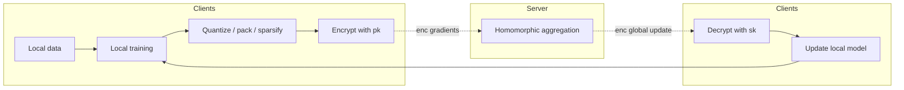
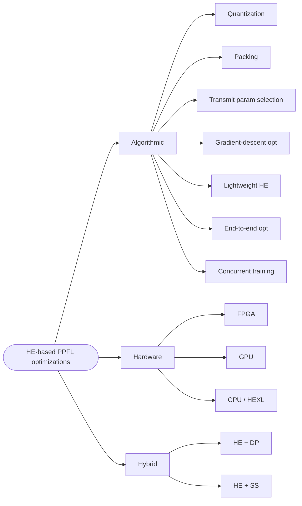
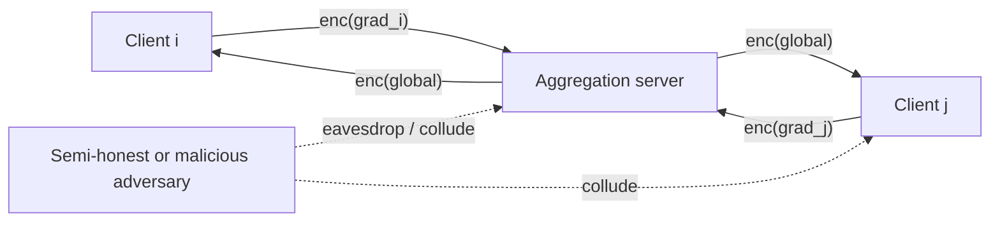
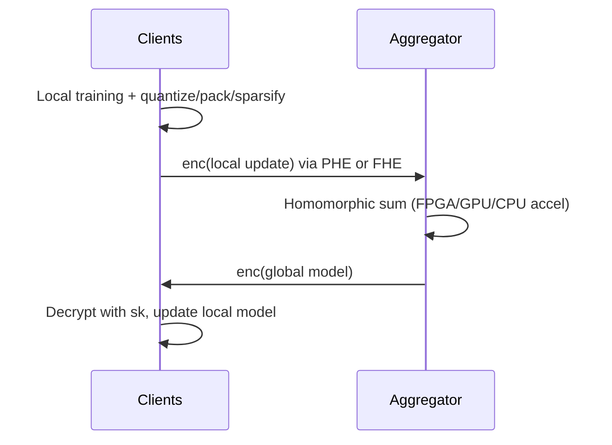

## TL;DR

A brief survey that taxonomises efficiency optimization techniques for HE-based privacy-preserving federated learning (PPFL), grouping them into algorithmic, hardware, and hybrid categories with discussion of limitations on edge/IoT deployments [§I, §III–§V].

## Problem and motivation

Federated learning (FL) leaks information through uploaded local models, enabling membership-inference, gradient-inversion, and attribute-extraction attacks [§I]. Among privacy defenses (MPC, DP, HE), HE offers post-quantum-safe end-to-end ciphertext computation without trusted setup or noise-induced accuracy loss, but suffers severe efficiency overhead — e.g., Paillier increases training time 96x–135x and data transfer for FMNIST/CIFAR vs plaintext [§II-D]. Prior PPFL surveys cover construction and attacks but not efficiency optimization specifically for HE [§I, Table I]. Threat model: semi-honest and malicious adversaries, individually or colluding, including curious server and malicious clients [§II-F].

## Key contributions

- Detailed overview of HE-based PPFL covering FL background, HE primitives, DP/MPC alternatives, and threat models [§I, §II].
- Taxonomy (Fig. 1) of HE-based PPFL optimizations across algorithmic, hardware, and hybrid axes, with strengths/weaknesses per class [§I, §III–§V].
- Algorithmic taxonomy with seven sub-classes mapped to FL phases: quantization, packing, transmitted parameter selection (TPS), gradient-descent optimization (GDO), lightweight HE, end-to-end optimization, and concurrent training [§III].
- Hardware taxonomy across FPGA, GPU, and CPU (HEXL) acceleration paths, identifying NTT/FFT as core bottleneck [§IV].
- Hybrid taxonomy combining HE with DP or secret-sharing (SS) for robustness against collusion and dropout [§V].
- Identification of open directions: end-to-end FHE practicality, FHE-based robustness, dynamic per-scenario privacy tuning [§VI].

## FHE setup

- **Scheme(s):** Survey covers Paillier (PHE), BGV, BFV, CKKS (word-wise second/fourth-generation FHE), and FHEW, TFHE (bit-wise third-generation FHE), plus multi-key HE (xMK-CKKS) and symmetric HE (SHE) [§II-C].
- **Library / implementation:** Discusses Intel HEXL (AVX-512/IFMA52) for CPU acceleration [§IV-C, p. 24577]; no single library is prescribed.
- **Parameters:** Not reported in detail — survey notes most FHE schemes rely on RLWE hardness [§II-C].
- **Bootstrapping used:** Referenced (e.g., Jung et al. report 100x faster GPU bootstrapping [113]) but no single setting [§IV-B].
- **Packing / encoding strategy:** Surveys batch encoding (Batchcrypt [63]), zero-padding [28], CRT packing [75], polynomial packing (VF2Boost [76], ESAFL [77]), CKKS SIMD encoding [§III-A2].

## ML setup

- **Task:** Federated training (horizontal and vertical FL), aggregation, and some end-to-end training — survey of methods, not a single implementation [§II-B, §III].
- **Model architecture:** N/A (survey). Reviewed systems span logistic regression (SPINDLE, CAESAR, ACCEL, HAFLO), federated XGBoost / GBDT (SecureBoost+, eHE-SecureBoost, VF2Boost, CryptoBoost, FEDXGB), neural networks (Phong et al. [28], POSEIDON, FHE-DiNN, TAPAS), and matrix factorization [§III, §V].
- **Activation handling:** Polynomial approximations for sigmoid, softmax, ReLU under FHE in end-to-end systems (SPINDLE, POSEIDON) [§III-D1, p. 24576]; binarized/ternarized networks via TFHE (FHE-DiNN, TAPAS, EaSTFLy) [§III-A1, p. 24574].
- **Operates on:** Encrypted gradients / encrypted local models aggregated by server; some end-to-end systems keep global model encrypted across rounds [§II-D, §III-D1].
- **Training vs inference:** Primarily federated training across multiple rounds [§II-D, §III].

## Datasets

| Dataset | Task | Size (train/test) | Modality | Notes |
|---|---|---|---|---|
| FMNIST | Classification (cited Batchcrypt benchmark) | Not reported | Images | Used to quantify Paillier 96x training-time overhead [§II-D, p. 24572] |
| CIFAR | Classification (cited Batchcrypt benchmark) | Not reported | Images | Paillier 135x training-time overhead vs plaintext [§II-D, p. 24572] |
| Multiple (other) | Various | Not reported | Tabular / vision / medical | Survey aggregates results across many primary works without re-reporting datasets |

## Pipeline diagram

### Pipeline steps (text)

1. Each client trains a local model on private data [§II-D1].
2. Client applies algorithmic optimizations (quantization, packing, TPS sparsification, GDO with extra local rounds) before encryption [§III-A, §III-B].
3. Client encrypts updates with the shared public key using PHE (Paillier) or FHE (BGV/BFV/CKKS/TFHE), optionally accelerated by FPGA/GPU/CPU (HEXL) [§II-D, §IV].
4. Server homomorphically aggregates encrypted updates without seeing plaintext [§II-D1].
5. Server returns encrypted (or sometimes decrypted, in HE+DP designs) aggregate to clients [§II-D, §V-A].
6. Clients decrypt with private key, update local models, and proceed to next round [§II-D1].
7. Optional hybrid path: secret-sharing protocols handle ops that pure HE cannot do efficiently (Pivot, CAESAR, FEDXGB) [§V-B].

## Architecture diagram

Because the paper is a survey of optimization techniques (no single model), the diagram below depicts the taxonomy of optimizations rather than an NN architecture [§III–§V, Fig. 1].

## Results

The survey reports comparative claims from primary works rather than running new experiments [§III–§V].

| Metric | This paper | Baseline | Hardware |
|---|---|---|---|
| Paillier training-time overhead (FMNIST) | 96x vs plaintext FL [63] | plaintext FedAvg | Not specified [§II-D, p. 24572] |
| Paillier training-time overhead (CIFAR) | 135x vs plaintext FL [63] | plaintext FedAvg | Not specified [§II-D] |
| GDO speedup (Wei et al.) | >10x vs FedAvg [88] | FedAvg | Not specified [§III-B1] |
| HE-based backprop (Zhang & Zhu) | >100x speedup vs CryptoNets [89] | CryptoNets [90] | Not specified [§III-B1] |
| GPU FHE logistic regression (Jung et al.) | 40x vs 8-threaded CPU [113] | 8-threaded CPU [115], [116] | GPU vs CPU [§IV-B, p. 24577] |
| GPU bootstrapping (Jung et al.) | >100x faster bootstrapping [113] | Prior FHE bootstrapping | GPU (memory-centric) [§IV-B] |

## Limitations and assumptions

- Survey scope only — no new system, no fresh measurements, no released code [§I, §VI].
- Quantization sub-section notes dequantization needs knowledge of number of aggregated values, awkward under flexible synchronization, and overflow risk on positive-integer batched additions [§III-A1, p. 24574].
- Sparsification (TPS) struggles with downlink (server-to-client) sparsification because the server cannot inspect encrypted aggregates [§III-A3].
- Lightweight HE via symmetric encryption sacrifices public-key security guarantees and worsens key management for cross-device FL [§III-C1, p. 24576].
- End-to-end FHE is acknowledged as "considerably slow and not yet practical for widespread use" [§VI, p. 24578].
- GPU acceleration helps short-number tensor ops but is poor at pipelining HE ops over 2048-bit integers [§IV-B, p. 24577].
- xMK-CKKS multi-key HE is explicitly out of scope, even though it addresses key-collusion risks of shared-key HFL [§II-D1].
- Threat model excludes deeply malicious server-client collusion in some discussions [§II-F, §V-B].

## Related work it compares against

Surveys positioned against: Lyu et al. [40], Yin et al. [41], Liu et al. [42], Yang et al. [43], Mansouri et al. [44], Liu et al. [45], Jiang et al. [46], Juvekar et al. (GAZELLE) [47], Boemer et al. (nGraph-HE2) [48], Phong et al. [28] — all noted as not covering HE-efficiency optimization in PPFL specifically [Table I, §I].

Primary systems catalogued include: Batchcrypt [63], SecureBoost+ [66], eHE-SecureBoost [67], EaSTFLy [69], FHE-DiNN [71], TAPAS [73], FLZip [80], AVFL [81], CE-VFL [82], FLARE [35], FedML-HE [86], FeDBCD [87], VPFL [92], ACCEL [93], Hao et al. [94], SPINDLE [97], POSEIDON [98], CryptoBoost [96], HAFLO [99], CARM [100], FLASH [102], FPGA accelerator [101], HEXL [118], Pivot [106], PrivFL [34], CAESAR [107], FEDXGB [119], CryptoNets [90] [§III–§V].

## Code and artifacts

Not released — survey paper. No companion repo cited.

## Extra diagrams (optional)

### Threat model

Threats include semi-honest server, malicious clients, and collusion (server with subset of clients) [§II-F, p. 24573].

### Federated round

## Open questions

- Concrete latency/throughput numbers for end-to-end FHE PPFL on realistic deep models are not consolidated in one place — survey lists speedup ratios but not absolute times on standard hardware.
- Trade-off frontier between quantization bit-width and aggregation overflow risk is qualitatively discussed but not quantified [§III-A1].
- No table reconciling security level (e.g., 128-bit) vs polynomial degree vs per-round latency across cited systems.
- How dynamic privacy adjustment [§VI] would interact with bootstrapping schedules is left open.
- The exclusion of multi-key HE (xMK-CKKS) [§II-D1] limits coverage of the realistic cross-silo collusion threat.
