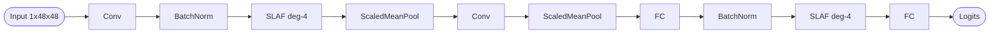
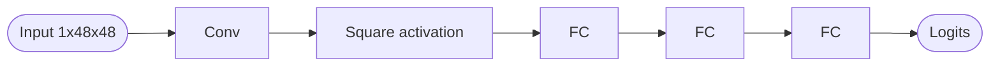
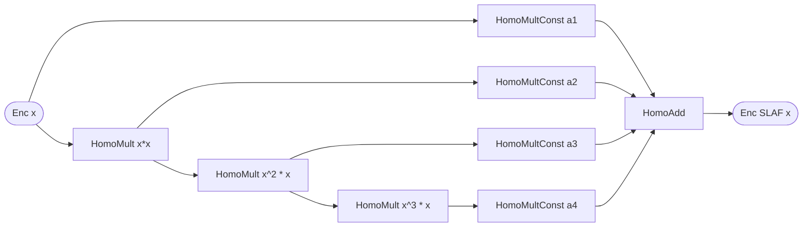

## TL;DR

The paper introduces SLAF, a self-learnable polynomial activation whose coefficients are trained jointly with a CKKS-friendly CNN, and shows it improves face-attribute classification accuracy over square activations by 0.88–3.15% on UTKFace while keeping single-image inference at ~0.778 s for the lightweight SNN model [§Abstract, §4.5].

## Problem and motivation

Privacy-preserving ML over FHE is constrained by the fact that CKKS only supports homomorphic addition/multiplication, forcing networks to replace ReLU/sigmoid/tanh with low-degree polynomial substitutes (often the square function) that hurt accuracy and risk gradient explosion [§1.2, §3.3]. The work addresses biometric authentication ("fine-grained access control" on facial images) where the cloud-server threat model is implicit (semi-honest server processing encrypted facial features) [§1, §4]. Goal: deeper networks with better accuracy under FHE without blowing up multiplicative depth or runtime [§1.3].

## Key contributions

- A "Self-Learnable Activation Function" (SLAF) of the form a0·x^0 + a1·x^1 + … + an·x^n whose coefficients are learned during plaintext training and then evaluated homomorphically [§3.3].
- HE-friendly linear-layer construction using im2col-based convolution and the Halevi–Shoup diagonal method for vector-matrix multiplication [§3.1, §3.2].
- Two CNN variants: SLAFNN-10 (high-precision, 10 layers) and SNN (rapid-response, 1 conv + square + 3 FC) [§3.4].
- Empirical accuracy gains of 0.88–3.15% over square-activation models and 4.87–9.67% over CryptoNets on UTKFace [§Abstract, §4.4].
- Hierarchical folding of consecutive linear layers (à la CryptoNets) to deepen the network at low multiplicative-depth cost [§3.4].

## FHE setup

- **Scheme(s):** CKKS (leveled, no bootstrapping) [§2.1, §2.2]
- **Library / implementation:** TenSEAL (Python wrapper over Microsoft SEAL) [§2.1]
- **Parameters:** 128-bit security level; multiplicative depth = 6 for SNN, 10 for SLAFNN; scalability tested for depths 6–14 [§5]. Polynomial-degree / ciphertext-modulus values not explicitly reported.
- **Bootstrapping used:** No (leveled-FHE) [§2.1]
- **Packing / encoding strategy:** SIMD-style ciphertext rotations with Halevi–Shoup diagonal method for vector-matrix multiplications; im2col flattening for convolutions reducing them to a single ciphertext-plaintext multiplication [§3.1, §3.2]

## ML setup

- **Task:** Inference — facial-attribute classification (age 3-way, gender 2-way, ethnicity) and MNIST digit classification [§4, §4.1]
- **Model architecture:** SLAFNN-10 = Conv → BatchNorm → SLAF → ScaledMeanPool → Conv → ScaledMeanPool → FC → BatchNorm → SLAF → FC; folded variant SLAFNN-5 collapses linear blocks. SNN = Conv → square activation → FC → FC → FC [§3.4, Table 2].
- **Activation handling:** SLAF expressed as polynomial of degree n (best at n=4); coefficients trained via backprop on plaintext model; normalization x_hat = (x − mean) / sqrt(var + eps) applied before basis evaluation [§3.3]. Square activation kept for the rapid SNN.
- **Operates on:** Plaintext model weights + encrypted data (weights remain unencrypted throughout) [§3.2].
- **Training vs inference:** Training in plaintext; only inference is performed under CKKS [§3.2, §3.4].

## Datasets

| Dataset | Task | Size (train/test) | Modality | Notes |
|---|---|---|---|---|
| MNIST | digit classification | 60,000 / 10,000 | 28×28×1 grayscale | Used for CryptoNets comparison [§4] |
| UTKFace | age / gender / ethnicity | 18,964 / 4,741 (8:2 split) | 48×48×1 face crops | Age binned into {0–15, 16–20, 21–116} [§4.1] |

## Pipeline diagram

```mermaid
flowchart LR
    subgraph Client
        A[Face image] --> B[im2col reshape]
        B --> E[CKKS encrypt]
    end
    subgraph Server
        F[Conv via plaintext mult] --> G[BatchNorm]
        G --> H[SLAF poly deg-4]
        H --> I[ScaledMeanPool]
        I --> J[Folded linear layers]
        J --> K[SLAF poly deg-4]
        K --> L[FC output]
    end
    subgraph ClientDec [Client]
        M[Decrypt] --> N[Argmax label]
    end
    E -. ciphertext .-> F
    L -. ciphertext .-> M
```

### Pipeline steps (text)

1. Client preprocesses face to 48×48×1 and applies im2col flattening [§3.1].
2. Client encrypts the flattened ciphertext vector under CKKS public key [§2.2].
3. Server performs convolution as a single HomoMultConst against the plaintext kernel matrix [§3.1].
4. Server applies batch-norm scaling (plaintext constants) and computes SLAF: power-tower x, x², …, x⁴ via HomoMult, then weighted sum via HomoMultConst + HomoAdd [§3.3].
5. Server runs ScaledMeanPool (linear, free under FHE) and folded linear layers via Halevi–Shoup diagonal method [§3.2, §3.4].
6. Server returns the encrypted logits to the client [§3.4].
7. Client decrypts with secret key and takes argmax for the predicted attribute label [§4.1].

## Architecture diagram

### SLAFNN-10

### SNN (rapid-response)

## Results

Per-task accuracy and time (full UTKFace test set) and MNIST single-prediction time [§4.5, Tables 3 & 5]:

| Metric | This paper | Baseline | Hardware |
|---|---|---|---|
| MNIST accuracy (ciphertext) | 99.12% (SLAFNN), 97.98% (SNN) | CryptoNets 98.95% | Apple M1 Pro CPU (8 cores), 16 GB |
| MNIST single prediction time | 34.91 s (SLAFNN), 0.64 s (SNN) | CryptoNets 250 s (YASHE) / 30.22 s (reimplemented CKKS) | Apple M1 Pro CPU (8 cores), 16 GB |
| UTKFace gender accuracy (ciphertext) | 88.07% (SLAFNN), 84.89% (SNN) | CryptoNets 83.72%, SLNN10-x² 85.78% | Apple M1 Pro CPU |
| UTKFace age accuracy (ciphertext) | 89.16% (SLAFNN), 90.07% (SNN) | CryptoNets 86.57%, SLNN10-x² 90.56% | Apple M1 Pro CPU |
| UTKFace ethnicity accuracy (ciphertext) | 76.54% (SLAFNN), 72.01% (SNN) | CryptoNets 66.87%, SLNN10-x² 73.39% | Apple M1 Pro CPU |
| UTKFace SNN single image (gender) | 0.778 s reported in text; 3515.73 s total over 4741 images → ~0.741 s/image (derived) | — | Apple M1 Pro CPU, 16 GB |
| UTKFace SLAFNN single image | "approximately 1 min" reported; ~65 s/image derived from 307,293 s / 4741 | — | Apple M1 Pro CPU, 16 GB |

Gains vs. ReLU plaintext: only 0.45–0.84% drop on gender/age and +0.96% on ethnicity [§4.4].

## Limitations and assumptions

- Training is done in plaintext; only inference is encrypted, so the threat model implicitly trusts the model owner with training data [§3.2, §3.4].
- High-precision SLAFNN-10 needs ~1 min per encrypted image — borderline for interactive use [§5].
- Reported "single inference" for UTKFace is per-image but cumulative test-set timings (e.g., 307,293 s) suggest no batching/throughput optimization beyond CryptoNets-style folding [Table 5].
- Polynomial degree fixed at 4 by empirical sweep; degree 5 already overfits, so SLAF is sensitive to a single hyperparameter [§4.2].
- Multiplicative-depth budget reported (≥6 for SNN, ≥10 for SLAFNN) but exact CKKS ring/modulus parameters are not given [§5].
- Communication cost between client and server is not analysed [§5].
- GPU implementation is left as future work [§5].

## Related work it compares against

CryptoNets, CryptoNets-ReLU, CryptoNets-AQ, Faster CryptoNets (ReLU-AQ), CryptoDL, SEALion, HCNN, BAYHENN, CHET, TensorHE, JUNGHYUN LEE et al. (minimax polynomial), PEGASUS, CHIMERA [§1.2, Table 1, §4.5].

## Code and artifacts

Not released. Data: "Data will be made available on request" [§Data availability].

## Extra diagrams (optional)

### Activation approximation

SLAF is defined as f(x) = a0·x^0 + a1·x^1 + a2·x^2 + … + an·x^n with the coefficients {a_i} learned by backprop alongside the convolutional/FC weights, after input normalization x_hat = (x − mean(x)) / sqrt(var(x) + ε) [§3.3]. The authors evaluate n = 2, 3, 4, 5 and select n = 4 as the best accuracy/depth trade-off — degree-5 overfits and inflates multiplicative depth [§4.2]. Under CKKS this becomes: build x² via HomoMult(x,x), x³ via HomoMult(Enc(x²), x), x⁴ via HomoMult(Enc(x³), x), scale each by plaintext a_i via HomoMultConst, then accumulate with HomoAdd — exactly 3 ciphertext-ciphertext multiplications of multiplicative depth per activation [§3.3]. See Figs. 4, 5, 8 in paper for plotted comparisons against ReLU / square / ReLU-AQ.

## Open questions

- What exact CKKS polynomial-modulus degree and coefficient-modulus chain were used? Only the multiplicative depth is reported [§5].
- Are the BatchNorm parameters folded into adjacent linear layers under FHE, or evaluated as separate scalar HomoMultConst/HomoAdd ops? [§3.4]
- How is the SLAF input range bounded at inference time given training-time normalization stats? Stability of higher powers (x^4) is sensitive to range.
- The SNN model surprisingly *beats* SLAFNN on UTKFace age accuracy (90.07% vs 89.16%); the paper attributes CryptoNets-style square-activation models to gradient-explosion training instability, but the SNN/SLAFNN gap is not discussed [Table 5].
- No reported single-image latency for SLAFNN-10 beyond "approximately 1 min"; the cumulative numbers in Table 5 imply ~65 s per image, but this is derived not stated [§5, Table 5].

